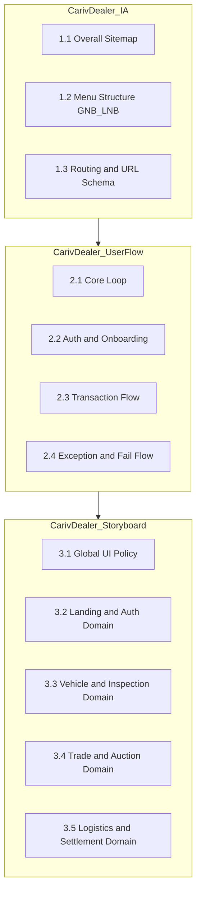

# CarivDealer Service Design Specification 플랜

## 1. SSOT 원칙


| SSOT                                                      | 용도                            |
| --------------------------------------------------------- | ----------------------------- |
| [CarivDealer_VID.md](docs/CarivDealer_VID.md) §4          | 라우트·페이지·import 경로 (실제 코드 기준)  |
| [FSD_IA_NODEID_SSOT.md](docs/figma/FSD_IA_NODEID_SSOT.md) | nodeId 43개, IA 라벨, 페이지·라우트 매핑 |


**나머지 문서**(IA_SITEMAP_SPEC_IPOE, SITEMAP_IMPLEMENTATION_STATUS 등)는 **실제 코드베이스 기준 대응 검증**이 필수. SSOT와 불일치 시 SSOT 우선.

---

## 2. 산출물 구조 (3문서)




| 파일                               | 역할               | 의존성                                   |
| -------------------------------- | ---------------- | ------------------------------------- |
| `docs/CarivDealer_IA.md`         | 시스템 뼈대·네비게이션 구조  | SSOT만 참조                              |
| `docs/CarivDealer_UserFlow.md`   | 사용자 동선·핵심 로직     | CarivDealer_IA 참조                     |
| `docs/CarivDealer_Storyboard.md` | 레이아웃·인터랙션·데이터 정책 | CarivDealer_IA·UserFlow 참조, FSD 구조 반영 |


---

## 3. CarivDealer_IA (Information Architecture)

**파일**: `docs/CarivDealer_IA.md`

### 3.1 Overall Sitemap (사이트맵)

- 전체 서비스 조감도 (Tree 구조)
- 서비스 영역 구분: Landing / Auth / Admin / MyPage
- **출처**: VID §4, router.tsx 실제 Route

### 3.2 Menu Structure & GNB/LNB

- **GNB (Global Navigation Bar)**: 상단 메뉴 구성, 권한별 노출 정책
- **LNB (Local Navigation Bar)**: 좌측 사이드바(Sidebar) 뎁스, 접힘/펼침 동작
- **Mobile Navigation**: 모바일 뷰 메뉴 처리 (현재 구현 여부 반영)

### 3.3 Routing & URL Schema

- **Page ID & URL Map**: Page Name ↔ URL Path ↔ Component File Name 매핑 테이블 (VID §4 기반)
- **Parameter Policy**: URL Query Parameter 정의 (예: `?stage=logistics`, `?tab=active`, `?page=1`)

---

## 4. CarivDealer_UserFlow (Service Scenarios)

**파일**: `docs/CarivDealer_UserFlow.md`

**의존성**: CarivDealer_IA 참조. 라우트·페이지 ID는 IA 정의 사용.

### 4.1 Core Loop (핵심 시나리오)

차량 등록 → 검수 → 경매 진행 → 낙찰/유찰 → 탁송 → 정산 완료 (End-to-End Flow)

### 4.2 Auth & Onboarding Flow

- 회원가입 (Step 1~5) 프로세스
- 로그인 및 비밀번호 찾기
- 계정 승인 대기 및 반려 시나리오

### 4.3 Transaction Flow (거래 로직)

- **Bidding**: 입찰 시도 → 유효성 검증 → 실시간 가격 갱신 → 입찰 성공/실패
- **Settlement**: 매각 확정 → 계좌 입력 → 세금계산서 발행 → 입금 확인

### 4.4 Exception & Fail Flow (예외 처리)

- 네트워크 에러 시 재시도 로직
- 데이터 없음(Empty State) 화면 처리
- 권한 없음(403) 및 페이지 없음(404) 처리

---

## 5. CarivDealer_Storyboard (UI Specifications)

**파일**: `docs/CarivDealer_Storyboard.md`

**의존성**: CarivDealer_IA·UserFlow 참조. FSD 구조(app→pages→widgets→features→entities→shared) 반영.

### 5.1 Global UI Policy (공통 정책)

- Layout System: Grid, Spacing, Breakpoints (반응형 기준)
- Typography & Color System: 폰트 스타일, 컬러 팔레트 (Design Token)
- Common Interaction: 로딩(Spinner), 토스트(Toast), 모달(Modal) 호출 규칙

### 5.2 Landing & Auth Domain

- Landing Page (Hero, Feature, CTA)
- Login / Signup Forms (Validation Rules 포함)

### 5.3 Admin: Vehicle & Inspection Domain

- 차량 목록 (필터링, 정렬, 페이지네이션 규칙)
- 차량 상세 (정보 노출 우선순위, 이미지 갤러리 동작)
- 검수 요청 및 결과 리포트 화면

### 5.4 Admin: Trade & Auction Domain

- 경매 리스트 (남은 시간 카운트다운 로직)
- 입찰 컨트롤러 (금액 입력 단위, 버튼 활성/비활성 조건)

### 5.5 Admin: Logistics & Settlement Domain

- 탁송 현황 조회 및 스케줄링
- 정산 내역 및 계좌 관리

---

## 6. 노드 인덱스 매핑표 (확장)

**위치**: CarivDealer_Storyboard 또는 별도 부록. FSD_IA_NODEID_SSOT §4 기반.

**추가 컬럼 2개**:


| 기존 컬럼                              | 추가 컬럼 1    | 추가 컬럼 2   |
| ---------------------------------- | ---------- | --------- |
| nodeId, 타입, IA 라벨, 라우트, 페이지, 코드 참조 | **사용 페이지** | **사용 영역** |
|                                    |            |           |


- **사용 페이지**: 해당 nodeId가 실제로 렌더되는 페이지 컴포넌트 (예: `TradeDetailPage`)
- **사용 영역**: 해당 페이지 내에서 노드가 어디에 사용되는지 (예: `메인 컨텐츠·SaleMethodCards`, `사이드바·ProgressSidebar`, `모달·InspectionDetailModal`)

**예시**:


| nodeId     | IA 라벨            | 사용 페이지                   | 사용 영역                                              |
| ---------- | ---------------- | ------------------------ | -------------------------------------------------- |
| 794-3704   | 판매방식선택           | GeneralSaleAnalyzingPage | 메인 컨텐츠·SaleMethodCards 일부                          |
| 1302-27289 | 검차 상세내역 모달       | TradeDetailPage          | 모달·InspectionDetailModal (onInspectionDetail 클릭 시) |
| 1425-8153  | 나의매물목록_회원가입유도/전체 | VehicleListPage          | 메인 컨텐츠·MainLandingSidebar 필터 + VehicleListCard     |


**작성 방법**: `mcp_outputs` metadata_raw.txt, `src/pages`·`src/widgets` 코드 참조로 페이지·위젯 사용처 역추적.

---

## 7. 실행 순서

```
1. CarivDealer_IA 작성 (SSOT: VID §4, FSD_IA_NODEID_SSOT)
   → router.tsx, GnbListLayout, MainLandingSidebar 실제 코드 확인

2. CarivDealer_UserFlow 작성 (CarivDealer_IA 참조)
   → routeManager, ProtectedRoute, 플로우 실제 코드 확인

3. CarivDealer_Storyboard 작성 (CarivDealer_IA·UserFlow 참조, FSD 구조 반영)
   → 각 페이지별 위젯·레이아웃·인터랙션 코드 확인

4. 노드 인덱스 매핑표 확장
   → FSD_IA_NODEID_SSOT §4 + 사용 페이지·사용 영역 컬럼

5. 코드베이스 대응 검증
   → router.tsx Route 수 = CarivDealer_IA 페이지 수
   → mcp_outputs 43개 = 노드 인덱스 행 수
```

---

## 8. 파일·참조 매핑


| 산출물                    | SSOT 참조                                        | 코드 검증 대상                                                             |
| ---------------------- | ---------------------------------------------- | -------------------------------------------------------------------- |
| CarivDealer_IA         | VID §4, FSD_IA_NODEID_SSOT §1·§2               | router.tsx, src/pages, src/widgets/GnbListLayout, MainLandingSidebar |
| CarivDealer_UserFlow   | CarivDealer_IA                                 | routeManager.ts, AuthContext, routeManager.getVehicleDetailRoute     |
| CarivDealer_Storyboard | CarivDealer_IA·UserFlow, FSD_IA_NODEID_SSOT §4 | src/pages/*, src/widgets/*, mcp_outputs/*                            |
| 노드 인덱스                 | FSD_IA_NODEID_SSOT §4                          | mcp_outputs, 각 페이지 import·JSX                                        |


---

## 9. 예상 작업량


| 단계                     | 예상 소요    |
| ---------------------- | -------- |
| CarivDealer_IA         | 40분      |
| CarivDealer_UserFlow   | 30분      |
| CarivDealer_Storyboard | 60~90분   |
| 노드 인덱스 확장              | 30분      |
| 검증                     | 15분      |
| **합계**                 | **~3시간** |


