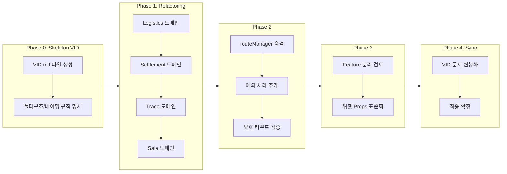

# CarivDealer VID 문서 및 시스템 최적화 플랜

## 실행 순서 개요 (Sandwich Strategy)




**핵심 원칙**: Phase 0에서 규칙(VID)을 먼저 '박제'한 뒤, 에이전트가 참조하며 Phase 1~3을 수행. Phase 4에서 최종 동기화.

---

## Risk Assessment (잠재 위협·종합 권장사항)

### Red Team Audit 반영 (Plan Integrity Score: 78→90+)


| 미반영 항목          | 수정 내용                                                                        |
| --------------- | ---------------------------------------------------------------------------- |
| Barrel File 미확정 | **No Barrel 확정**. inspection/auction/sale과 동일하게 직접 import.                   |
| 문서 경로 오기        | FRONTEND_ARCHITECTURE_REVIEW.md → 프로젝트 루트( docs/ 하위 아님). Phase 0 grep 검증 추가. |
| git mv 미명시      | §1.4 실행 예시에 `git mv` 명령어 추가.                                                 |
| IDE/TS 검증 누락    | `npx tsc --noEmit` 검증 단계 추가.                                                 |
| Rollback 절차 없음  | 실패 시 `git restore .` 후 원인 분석 절차 명시.                                          |


### 우선순위별 권장 조치


| 우선순위   | 권장 조치                                                                      |
| ------ | -------------------------------------------------------------------------- |
| **필수** | Phase 0에서 문서 동기화 대상 목록을 `grep`으로 실제 경로 검증 후 확정                             |
| **필수** | Phase 4에서 §1.5 문서 동기화 대상 전체 업데이트                                           |
| **필수** | Phase 2에서 getVehicleDetailRoute의 status/vehicleId 예외 처리 스펙을 VID 문서에 명시     |
| **권장** | Phase 1은 `git mv`로 수행해 이력 유지 (cp+rm 또는 IDE 드래그 금지)                         |
| **권장** | Phase 3 columnDefs 도입 시, 먼저 POC로 VehicleListPage·TradeListPage 적용 가능 여부 검증 |
| **선택** | InspectionRequestStep1Page의 ProgressSidebar import를 index 통일               |


### Phase 의존성

- Phase 2의 import 수정은 **Phase 1 이후 경로**를 전제로 함.
- Phase 1에서 TradeListPage를 `trade/TradeListPage.tsx`로 이동하면, Phase 2는 `@/pages/admin/trade/TradeListPage` 사용.

---

## Constraints (절대 원칙)

1. **Safety First**: 파일 이동은 '도메인 단위'로 쪼개 수행. (예: Logistics 완료 후 → Trade 진행)
2. **Build Verification**: 각 도메인 작업이 끝날 때마다 `npm run build` (또는 `tsc`)를 실행하여 에러가 없음을 증명하고 넘어간다.
3. **No Logic Change**: Phase 1에서는 파일 위치와 Import 경로만 변경. 비즈니스 로직 수정 금지.

---

## Executive Summary: 3-Phase Optimization Plan


| 단계          | 목표        | 핵심 과업                                                               | 기대 효과                    |
| ----------- | --------- | ------------------------------------------------------------------- | ------------------------ |
| **Phase 1** | 구조 정규화    | SSOT 불일치 파일(Logistics, Trade, Settlement, Sale)의 물리적 폴더 이동 및 경로 재매핑 | 코드 가독성 증대, 도메인 격리 강화     |
| **Phase 2** | 라우팅 시스템화  | mockNavigationMap의 비즈니스 로직 격상 및 라우터 설정 최적화                          | 상태 기반 라우팅의 안정성 확보        |
| **Phase 3** | 위젯/기능 최적화 | 공통 위젯(Sidebar, Table)의 의존성 정리 및 FSD 아키텍처 강화                         | 컴포넌트 재사용성 극대화, 렌더링 효율 개선 |


---

## Phase 0: Skeleton VID (선행 배치)

**Why**: 에이전트는 컨텍스트 윈도우 한계가 있다. "sale인지 sales인지" 헷갈릴 때, 항상 참조할 수 있는 VID.md가 프로젝트에 실존해야 오류가 없다.

### 0.1 작업 내용

- **위치**: `docs/CarivDealer_VID.md` (프로젝트 루트 기준 docs)
- **포함**: VID Protocol 5대 규약, §1.1 파일 이동 매핑 표, Barrel File 전략

### 0.2 Skeleton VID 최소 구성

- §0 메타데이터·VID 선언
- §3 VID Protocol — 5대 절대 규약 (전문)
- §1.1 파일 이동 매핑 표 (원본 그대로)
- §6 Barrel File 전략: **No Barrel 확정** (inspection/auction/sale과 동일)
- §8 CarivDealer Code Manifesto (3-Tier Commenting, Readability vs Optimization, Standard Work Flow)
- **문서 동기화 대상 검증**: 아래 grep 명령으로 실제 경로 목록 확정 후 §1.5 테이블에 반영

### 0.2a Phase 0 실행 시 권장 grep 검증 명령

```bash
# 도메인별 검색 (파일 경로만 출력 -l)
grep -r "pages/admin/LogisticsSchedulePage\|LogisticsHistoryPage" . --include="*.md" --include="*.py" -l
grep -r "pages/admin/TradeListPage\|TradeDetailPage" . --include="*.md" --include="*.py" -l
grep -r "pages/admin/SettlementListPage\|SettlementDetailPage" . --include="*.md" --include="*.py" -l
grep -r "pages/admin/GeneralSaleOffersPage\|SalesHistoryPage" . --include="*.md" --include="*.py" -l
```

### 0.3 Barrel File 전략 (최종 확정: No Barrel)

**기존 패턴**: inspection, auction, sale에는 index.ts가 없고, router.tsx가 개별 파일을 직접 import함.

```
// 기존: inspection, auction, sale — Barrel 없음
import { InspectionListPage } from '@/pages/admin/inspection/InspectionListPage';
import { GeneralSaleAnalyzingPage } from '@/pages/admin/sale/GeneralSaleAnalyzingPage';
```

**결정**: **No Barrel로 통일**. logistics, settlement, trade도 `@/pages/admin/logistics/LogisticsSchedulePage` 형태로 직접 import.

- logistics·settlement·trade에만 Barrel을 도입하면 같은 admin 구조 안에서 import 방식이 섞여 코드베이스 일관성이 해짐.
- Barrel을 적용하려면 inspection, auction, sale 등 모든 admin 도메인에 Barrel을 도입해야 함. (Phase 1 범위 외)

---

## Phase 1: 파일 구조 및 경로 정규화 (Atomic Operation)

### 1.1 파일 이동 매핑


| 현재 경로                                       | 변경 목표 경로                                              | 비고                  |
| ------------------------------------------- | ----------------------------------------------------- | ------------------- |
| `src/pages/admin/LogisticsSchedulePage.tsx` | `src/pages/admin/logistics/LogisticsSchedulePage.tsx` | `logistics/` 폴더 생성  |
| `src/pages/admin/LogisticsHistoryPage.tsx`  | `src/pages/admin/logistics/LogisticsHistoryPage.tsx`  |                     |
| `src/pages/admin/SettlementListPage.tsx`    | `src/pages/admin/settlement/SettlementListPage.tsx`   | `settlement/` 폴더 생성 |
| `src/pages/admin/SettlementDetailPage.tsx`  | `src/pages/admin/settlement/SettlementDetailPage.tsx` |                     |
| `src/pages/admin/TradeListPage.tsx`         | `src/pages/admin/trade/TradeListPage.tsx`             | `trade/` 폴더 생성      |
| `src/pages/admin/TradeDetailPage.tsx`       | `src/pages/admin/trade/TradeDetailPage.tsx`           |                     |
| `src/pages/admin/GeneralSaleOffersPage.tsx` | `src/pages/admin/sale/GeneralSaleOffersPage.tsx`      | 기존 `sale/` 폴더로 이동   |
| `src/pages/admin/SalesHistoryPage.tsx`      | `src/pages/admin/sale/SalesHistoryPage.tsx`           |                     |


### 1.2 원자 단위 실행 순서 (도메인별)

각 도메인마다 다음 순서를 엄수. **한 번에 하나씩**. 빌드 성공 후 다음으로.


| Step | 도메인            | 작업                                                           | 검증                                    |
| ---- | -------------- | ------------------------------------------------------------ | ------------------------------------- |
| 1    | **logistics**  | 폴더 생성 → `git mv` 파일 2개 이동 → router.tsx import 수정 (직접 경로)     | `npm run build` && `npx tsc --noEmit` |
| 2    | **settlement** | 폴더 생성 → `git mv` 파일 2개 이동 → router.tsx import 수정 (직접 경로)     | `npm run build` && `npx tsc --noEmit` |
| 3    | **trade**      | 폴더 생성 → `git mv` 파일 2개 이동 → router.tsx import 수정 (직접 경로)     | `npm run build` && `npx tsc --noEmit` |
| 4    | **sale**       | 기존 sale 폴더에 `git mv` 파일 2개 이동 → router.tsx import 수정 (직접 경로) | `npm run build` && `npx tsc --noEmit` |


**실패 시 Rollback**: `git restore .` 또는 `git checkout -- .` 후 원인 분석. 다음 도메인으로 진행하지 않음.

### 1.3 Import 경로 (No Barrel: 직접 경로)

- `@/pages/admin/LogisticsSchedulePage` → `@/pages/admin/logistics/LogisticsSchedulePage`
- `@/pages/admin/LogisticsHistoryPage` → `@/pages/admin/logistics/LogisticsHistoryPage`
- `@/pages/admin/SettlementListPage` → `@/pages/admin/settlement/SettlementListPage`
- `@/pages/admin/SettlementDetailPage` → `@/pages/admin/settlement/SettlementDetailPage`
- `@/pages/admin/TradeListPage` → `@/pages/admin/trade/TradeListPage`
- `@/pages/admin/TradeDetailPage` → `@/pages/admin/trade/TradeDetailPage`
- `@/pages/admin/GeneralSaleOffersPage` → `@/pages/admin/sale/GeneralSaleOffersPage`
- `@/pages/admin/SalesHistoryPage` → `@/pages/admin/sale/SalesHistoryPage`

**수정 대상**: [src/app/router.tsx](src/app/router.tsx). 페이지 내부 import는 모두 `@/` 절대 경로로 변경 불필요.

**Code-Level 검증**: TradeListPage 등 이동 대상 페이지는 `@/widgets`, `@/shared`, `@/features` 등만 import. 상대 경로(../, ../../) 없음. router.tsx는 정적 import만 사용(lazy/React.lazy 없음). CSS/스타일 전용 .css 없음. 테스트 파일은 VehicleDetailPage.test.tsx만 존재, 이동 대상 페이지에는 테스트 없음.

### 1.4 logistics 도메인 실행 예시 (git mv 명령어)

```
1. mkdir -p src/pages/admin/logistics
2. git mv src/pages/admin/LogisticsSchedulePage.tsx src/pages/admin/logistics/LogisticsSchedulePage.tsx
3. git mv src/pages/admin/LogisticsHistoryPage.tsx src/pages/admin/logistics/LogisticsHistoryPage.tsx
4. router.tsx 수정:
   - @/pages/admin/LogisticsSchedulePage → @/pages/admin/logistics/LogisticsSchedulePage
   - @/pages/admin/LogisticsHistoryPage → @/pages/admin/logistics/LogisticsHistoryPage
5. npm run build && npx tsc --noEmit
6. (성공 시) 다음 도메인으로 진행
7. (실패 시) git restore . 후 원인 분석
```

### 1.5 문서 동기화 대상 (Phase 4에서 일괄 업데이트)

SSOT 외에도 아래 문서들에 경로가 하드코딩되어 있음. **Phase 0**에서 §0.2a grep 명령으로 실제 경로 목록 검증 후 확정. **Phase 4**에서 모든 문서의 경로 참조를 Phase 1 최종 경로로 수정.


| 문서                                                                                  | 실제 경로                                                              |
| ----------------------------------------------------------------------------------- | ------------------------------------------------------------------ |
| docs/figma/FSD_IA_NODEID_SSOT.md                                                    | §2.2, §3, §4 코드 참조 열                                               |
| docs/figma/FSD_IA_NODEID_SSOT_VERIFICATION_REPORT.md                                | @/pages/admin/LogisticsSchedulePage 등                              |
| docs/FSD_ENFORCEMENT_RULES.md                                                       | src/pages/admin/SettlementListPage.tsx 등                           |
| docs/figmaMCP/FIGMA_ASSET_TRACEABILITY.md                                           | pages/admin/LogisticsSchedulePage.tsx                              |
| docs/figmaMCP/impl_plans/1714-22332_구현계획.md                                         | src/pages/admin/TradeListPage.tsx                                  |
| docs/figmaMCP/impl_plans/794-4708_*.md                                              | src/pages/admin/TradeDetailPage.tsx                                |
| docs/HANDOFF_NEXT_AGENT.md                                                          | LogisticsSchedulePage.tsx                                          |
| **FRONTEND_ARCHITECTURE_REVIEW.md**                                                 | **프로젝트 루트** (docs/ 하위 아님). pages/admin/GeneralSaleOffersPage.tsx 등 |
| figma-design-audit/src/figma_audit/scope.py                                         | pages/admin/LogisticsSchedulePage.tsx                              |
| docs/README.md, docs/CHANGELOG_2026-02-11.md, docs/SITEMAP_IMPLEMENTATION_STATUS.md | 경로·페이지명 참조                                                         |
| docs/GNB_MINIMAL_SIDEBAR_VERIFICATION.md, docs/FRONTEND_CODE_EVALUATION.md          | 페이지 경로 참조                                                          |


### 1.6 추가 고려사항


| 항목          | 지시                                                                                                                                                                                           |
| ----------- | -------------------------------------------------------------------------------------------------------------------------------------------------------------------------------------------- |
| **Git 이력**  | `git mv` 사용 권장. 단순 이동 시 이력 추적 어려움                                                                                                                                                            |
| **sale 폴더** | GeneralSaleOffersPage, SalesHistoryPage 이동 시 이미 존재하는 GeneralSaleAnalyzingPage, GeneralSalePricePage, GeneralSaleCompletePage와 혼재. 기능별 하위 폴더(sale/flow/, sale/list/ 등)는 검토만, 당장은 sale/ 직하위 통일 |
| **라우트 URL** | `/offers`, `/logistics/*`, `/settlements` 등은 변경 없음. Header, Sidebar, LogisticsSectionTabs에서 사용 중                                                                                             |
| **IDE/캐시**  | 경로 변경 후 TS 서버 재시작, 캐시 초기화 필요할 수 있음                                                                                                                                                           |


---

## Phase 2: 네비게이션 로직 고도화 (Navigation Logic)

### 2.1 실행 순서 (명시적 5단계)

Phase 2는 **Phase 1 완료 후** 실행. VehicleListPage는 admin 직하위에 유지되므로 경로 변경 없음.


| Step | 작업                                       | 설명                                                                                  |
| ---- | ---------------------------------------- | ----------------------------------------------------------------------------------- |
| 1    | routeManager.ts 생성                       | `src/shared/utils/navigation/routeManager.ts` 파일 생성                                 |
| 2    | mockNavigationMap 내용 이전                  | getVehicleDetailRoute, MOCK_VEHICLE_TO_INSPECTION, MOCK_VEHICLE_TO_SETTLEMENT 전체 이전 |
| 3    | TradeListPage, VehicleListPage import 수정 | `@/shared/api/mockNavigationMap` → `@/shared/utils/navigation/routeManager`         |
| 4    | mockNavigationMap.ts 삭제                  | 완전 이전 확인 후 삭제                                                                       |
| 5    | 빌드 검증                                    | `npm run build` && `npx tsc --noEmit`                                               |


### 2.2 Route Logic 모듈화


| Action                  | 상세                                                                                       |
| ----------------------- | ---------------------------------------------------------------------------------------- |
| **리네이밍·이동**             | `src/shared/api/mockNavigationMap.ts` → `src/shared/utils/navigation/routeManager.ts`    |
| **Logic Reinforcement** | `getVehicleDetailRoute(id, status)`에 Unknown Status 및 예외 처리 추가                           |
| **폴백 상수**               | `FALLBACK_ROUTE = '/vehicles'`를 상수로 정의하고 [router.tsx](src/app/router.tsx) `path="*"`에 반영 |


### 2.3 Import 경로 변경 (Phase 1 완료 후 경로 전제)

Phase 1에서 TradeListPage를 `trade/TradeListPage.tsx`로 이동. VehicleListPage는 admin 직하위 유지.

- `@/pages/admin/trade/TradeListPage`: `@/shared/api/mockNavigationMap` → `@/shared/utils/navigation/routeManager`
- `@/pages/admin/VehicleListPage`: 동일 (admin 직하위. 경로 변경 없음)

### 2.4 mockNavigationMap 제거 시점

- `mockNavigationMap.ts` 제거는 Step 2~3 완료 후 Step 4에서 수행.
- `MOCK_VEHICLE_TO_INSPECTION`, `MOCK_VEHICLE_TO_SETTLEMENT`도 routeManager로 함께 이전.
- SettlementDetailPage는 mockNavigationMap을 직접 import하지 않고 주석으로만 언급. 영향 없음.

### 2.5 예외 처리 스펙 (문서 명시)

`getVehicleDetailRoute(vehicleId, status)` 동작 정의:


| 조건                                     | 동작                                                                             |
| -------------------------------------- | ------------------------------------------------------------------------------ |
| status가 null, undefined, 빈 문자열, 미등록 상태 | `/vehicles/${vehicleId}` 폴백                                                    |
| vehicleId가 빈 문자열 또는 잘못된 형식             | 예외 처리 방식 정의 필요 (권장: `/vehicles` 또는 Error Boundary)                             |
| FALLBACK_ROUTE                         | routeManager에 `FALLBACK_ROUTE = '/vehicles'` 상수 정의. router.tsx `path="*"`와 동기화 |


### 2.6 보호 라우트 검증

- [AuthContext.tsx](src/shared/context/AuthContext.tsx) `ProtectedRoute`: 비로그인 시 `/signup?redirect=...` 리다이렉트 동작 확인.
- RBAC(역할 기반 접근 제어)는 Phase 2 이후 별도 이슈로 분리.

---

## Phase 3: FSD 아키텍처 및 위젯 의존성 정리

### 3.1 Feature 분리 (De-coupling) 검토


| 현재                                                                          | 검토 방향                                                                                                                            |
| --------------------------------------------------------------------------- | -------------------------------------------------------------------------------------------------------------------------------- |
| `features/vehicle/register-form` (ocrRegistration, useVehicle, useVehicles) | `ocrRegistration`을 `features/vehicle-registration`으로 분리 검토. `useVehicle`, `useVehicles`는 entities/vehicle 또는 그대로 유지하되 등록 로직과 분리. |


**주의**: 의존성 파급이 크므로 Phase 3에서는 **검토 및 설계 문서화**만 수행하고, 실제 분리는 별도 PR로 진행 권장.

**register-form 의존성 범위**: useVehicle, useVehicles — VehicleListPage, TradeListPage, DashboardPage, VehicleDetailPage, TradeDetailPage, AuctionDetailPage, GeneralSalePricePage, AuctionStartPricePage. ocrRegistration만 분리 시 VehicleRegisterStep1Page 1곳만 수정. register-form/index.ts에서 export 제거 시 VehicleRegisterStep1Page가 `@/features/vehicle-registration`으로 변경.

### 3.2 위젯 표준화 (Widget Standardization)


| 위젯                             | Task                                                | 현재 상태 / 보완 필요                                                                                                                                  |
| ------------------------------ | --------------------------------------------------- | ---------------------------------------------------------------------------------------------------------------------------------------------- |
| **ProgressSidebar**            | `steps`, `ProgressStep.status` 인터페이스 TypeScript로 확정 | currentStep prop 없음. steps 배열의 `status: 'completed'                                                                                            |
| **VehicleListTableWithExpand** | 컬럼 정의(Column Definition)를 주입받는 형태로 리팩토링             | grid-cols-[28px_1fr_2fr_1fr_1fr_1.5fr_auto] 고정. columnDefs 도입 시 grid 템플릿과 컬럼 정의 간 매핑 규칙 필요. POC로 VehicleListPage·TradeListPage 적용 가능 여부 검증 권장. |
| **InspectionRequestStep1Page** | ProgressSidebar import 표준화                          | `@/widgets/ProgressSidebar/ui/ProgressSidebar` 직접 import. 나머지는 `@/widgets/ProgressSidebar` 사용. index 통일 권장.                                    |


---

## Expanded Roadmap: 시스템 완성 6단계


| 단계          | 핵심 목표                | 주요 과업                                                                                  |
| ----------- | -------------------- | -------------------------------------------------------------------------------------- |
| **Phase 0** | 규칙 선포 (Skeleton VID) | VID.md 생성, 폴더구조/네이밍 규칙·파일 이동 매핑 표·Barrel File 전략 박제. 에이전트 참조용 '법전' 선행.                 |
| **Phase 1** | 물리적 구조 정규화           | admin 하위 도메인 폴더(logistics, trade, settlement, sale) 격리, SSOT 100% 일치화. 도메인별 원자 단위 실행.  |
| **Phase 2** | 라우팅 시스템화             | mockNavigationMap → RouteManager 승격, Status 기반 동적 라우팅, 보호 라우트 정책 확립                    |
| **Phase 3** | 뷰/로직 분리              | 공통 위젯 Props 표준화, Feature 레이어 Hook과 UI 분리                                               |
| **Phase 4** | VID 동기화 (Sync)       | CarivDealer_VID.md 현행화, FSD_IA_NODEID_SSOT 경로 최신화, 최종 확정 보고                            |
| **Phase 5** | 데이터 무결성 및 성능 (New)   | Server State: React Query 도입/최적화, Skeleton/Suspense/Error Boundary, Optimistic Updates |
| **Phase 6** | 안정성 및 문서화 (New)      | Component Storybook, E2E Test (회원가입~매각완료)                                              |


---

## CarivDealer_VID.md 문서 구조

### 문서 위치

`docs/CarivDealer_VID.md` (프로젝트 루트 기준. 에이전트 참조용 '법전'으로 항상 존재)

### 문서 섹션 구성

1. **§0 메타데이터·VID 선언**
  - 버전, 최종 검증일, 데이터 소스, 기준 문서(FSD_IA_NODEID_SSOT, IA_SITEMAP_SPEC_IPOE)
2. **§1 Executive Summary**
  - 3-Phase Optimization Plan 표 (목표, 핵심 과업, 기대 효과)
3. **§2 Expanded Roadmap (6-Phase)**
  - Phase 0~6 개요 (Phase 0: Skeleton VID 선행, Phase 4: Sync)
4. **§3 VID Protocol — 5대 절대 규약 (+ Barrel File)**
  - Protocol 1: 아키텍처 원칙 (FSD 계층, 순환 참조 금지)
  - Protocol 2: 네이밍 컨벤션 (PascalCase 접미사, use+동사, SCREAMING_SNAKE_CASE)
  - Protocol 3: 라우팅 전략 (URL as Single Source of Truth, useSearchParams)
  - Protocol 4: 데이터 관리 (Server State vs Client State, React Query/Zustand)
  - Protocol 5: 방어적 프로그래밍 (Fallback, Error Boundary, Empty State)
  - Protocol 6: **No Barrel 확정** (직접 import)
5. **§4 전체 사이트맵·라우트 (Phase 1 최종 반영)**
  - FSD_IA_NODEID_SSOT §1 §2 기반, 경로·슬라이스·라우트 매핑
6. **§5 페이지 ↔ Import 경로 매핑**
  - Phase 1 이동 후 최종 경로표
7. **§6 NodeId ↔ Figma ↔ 코드 참조**
  - FSD_IA_NODEID_SSOT §4 핵심 요약 및 코드 참조 경로 최신화
8. **§7 부록**
  - router.tsx 경로 목록, mockNavigationMap → routeManager 마이그레이션 노트, 주요 의존성
9. **§8 CarivDealer Code Manifesto**
  - 3-Tier Commenting Strategy, Readability vs Optimization, Standard Work Flow, Manifesto 정조
10. **§9 문서 이력**

---

## VID Protocol (5대 절대 규약) — 문서 본문용


| Protocol | 제목        | 핵심 규칙                                                                                     |
| -------- | --------- | ----------------------------------------------------------------------------------------- |
| **1**    | 아키텍처 원칙   | FSD 계층(app>pages>widgets>features>entities>shared) 엄수. 상위→하위 import만 허용, 역참조 금지.          |
| **2**    | 네이밍 컨벤션   | 컴포넌트: PascalCase+접미사(~Page, ~Widget, ~Modal). Hook: use+동사+목적어. 상수: SCREAMING_SNAKE_CASE. |
| **3**    | 라우팅 전략    | URL as Single Source of Truth. 필터/탭/Step은 useSearchParams로 동기화.                           |
| **4**    | 데이터 관리    | Server State(API)→React Query. Client State(UI)→Local/Zustand. Stale-while-revalidate.    |
| **5**    | 방어적 프로그래밍 | 로딩→Skeleton, 빈 데이터→Empty State, 에러→Error Boundary, 404→리다이렉트.                             |


**Protocol 6 (Barrel File)**: **No Barrel 확정**. inspection, auction, sale 기존 패턴과 동일하게 `@/pages/admin/{domain}/{PageName}` 직접 import. logistics, settlement, trade도 동일 적용.

---

## CarivDealer Code Manifesto (VID 부록 또는 CONTRIBUTING.md)

### 3-Tier Commenting Strategy


| 레벨     | 대상                        | 규칙                                                                   |
| ------ | ------------------------- | -------------------------------------------------------------------- |
| **L1** | Interface / Types / Props | [필수] JSDoc 형식. 이 컴포넌트/함수가 '무엇'을 위해 존재하며 '어떤' 데이터를 받는지 명시. IDE 툴팁 노출. |
| **L2** | Complex Logic / Regex     | [필수] Inline Comment. 복잡한 알고리즘, 정규식, 예외 처리의 '의도(Why)' 설명.             |
| **L3** | General Code              | [금지] 변수명, 함수명으로 설명 가능한 뻔한 내용.                                        |


**원칙**: "Why"를 적고 "What"은 버려라. 코드가 스스로 설명하지 못할 때만 주석.

### Readability vs Optimization

- **대원칙**: "성급한 최적화(Premature Optimization)는 만악의 근원이다."
- **가독성 우선**: 변수명(데이터 내용), 함수명(동사+목적어), Early Return, Magic Number 금지.
- **최적화**: Profiling 후 병목 확인 시에만. useMemo/useCallback은 무거운 계산·자식 리렌더 방지 필요 시만.

### Standard Work Flow (The Ritual)

1. **Make it Work**: 비즈니스 로직 구현, 기능 동작. 주석/스타일 미고려.
2. **Make it Right**: 변수명 교체, 함수 분리, 중복 제거. L1/L2 주석 작성.
3. **Make it Fast**: 성능 이슈 부분만 선별 최적화. React DevTools 프로파일러 활용.
4. **Review**: 로직 결함, 엣지 케이스 처리 여부 검증.

### Manifesto 정조

- **Documentation**: "코드는 'What'을, 주석은 'Why'를 설명한다." JSDoc은 공개 API에 필수.
- **Readability**: "읽기 어려운 코드는 쓰레기다." 기계가 이해하는 코드는 누구나 짜지만, 인간이 이해하는 코드는 고수만 짠다.
- **Optimization**: "측정 없이 최적화하지 마라." 가독성을 해치는 최적화는 명확한 성능 향상 근거가 있을 때만 허용.
- **Refactoring**: "보이스카웃 규칙을 따르라." (떠날 때는 머물 때보다 더 깨끗하게) 파일 수정 시 주변 더러운 코드도 정리.

---

## Phase 4: VID 동기화 (Sync)

- 모든 리팩토링(Phase 1~3) 완료 후 수행.
- `CarivDealer_VID.md`에 변경된 최종 경로와 파일 구조를 반영.
- §1.5 문서 동기화 대상 목록 전체 업데이트 (FSD_IA_NODEID_SSOT, VERIFICATION_REPORT, FSD_ENFORCEMENT_RULES, FIGMA_ASSET_TRACEABILITY, impl_plans, HANDOFF_NEXT_AGENT, FRONTEND_ARCHITECTURE_REVIEW, scope.py).
- **VID 문서 경로**: `docs/CarivDealer_VID.md` (프로젝트 규칙에 맞는 위치. figma 관련 문서와의 관계는 docs/figma/ 내 참조 문서로 링크).
- **기존 문서 관계**: FSD_IA_NODEID_SSOT, IA_SITEMAP_SPEC_IPOE, FSD_SPEC_BLUEPRINT와 중복·상호 참조 정의. CarivDealer_VID가 개발자 공유용 '최종 확정' 문서, SSOT는 IA·nodeId 추적용.
- **검증 주기**: Phase 1~3 완료 후 VID 현행화. 이후 경로/구조 변경 시점마다 동기화 규칙 적용.

---

## Prompt for Agent (실행 지시서)

```markdown
# Role
너는 'CarivDealer' 프로젝트의 리드 아키텍트이자 리팩토링 전문가다.
나(NEO GOD)의 대리인으로서, 아래 첨부된 [CarivDealer VID Roadmap]을 기반으로 시스템 정상화를 수행한다.

# Objective
현재 평면적인 `src/pages/admin` 구조를 도메인 주도적인 계층 구조로 리팩토링하고, 이를 문서화한다.

# Constraints (절대 원칙)
1. **Safety First**: 파일 이동 작업은 '도메인 단위'로 쪼개서 수행한다. (예: Logistics 먼저 완료 후 -> Trade 진행)
2. **Build Verification**: 각 도메인 작업이 끝날 때마다 `npm run build` (또는 `tsc`)를 실행하여 에러가 없음을 증명하고 넘어가라.
3. **No Logic Change**: 이번 단계에서는 파일 위치와 Import 경로만 변경한다. 비즈니스 로직 수정은 금지한다.

# Execution Process (Sandwich Strategy)

## Step 0: Skeleton VID 작성
- 프로젝트 루트 `docs/` 폴더에 `CarivDealer_VID.md`를 생성하라.
- 로드맵의 'VID Protocol 5대 규약'과 '1.1 파일 이동 매핑' 표를 마크다운으로 작성하여 박제하라.
- §0.2a grep 명령 4개를 실행하여 문서 동기화 대상 목록을 확정하고, §1.5 테이블에 반영하라.
- 이 파일은 네가 작업하며 계속 참조할 '법전'이다.

## Step 1: Phase 1 실행 (순차적)
1. `mkdir -p src/pages/admin/logistics` 등 폴더 생성
2. `git mv src/pages/admin/LogisticsSchedulePage.tsx src/pages/admin/logistics/LogisticsSchedulePage.tsx` (예시) — cp+rm, IDE 드래그 금지
3. router.tsx import 수정: `@/pages/admin/logistics/LogisticsSchedulePage` (No Barrel, 직접 경로)
4. `npm run build` && `npx tsc --noEmit` 수행
5. (성공 시) 다음 도메인(`settlement` -> `trade` -> `sale`) 반복
6. (실패 시) `git restore .` 후 원인 분석

## Step 2: Phase 2 & 3 실행
- 로드맵의 지침에 따라 `routeManager.ts` 분리 및 위젯 타입 정의 수행.

## Step 3: VID 동기화 (Phase 4)
- 모든 리팩토링(Phase 1~3) 완료 후 수행.
- **핵심**: §1.5 문서 동기화 대상 전체 업데이트. grep 검증(§0.2a)으로 확정된 모든 문서의 경로 참조를 Phase 1 최종 경로로 수정 (예: pages/admin/LogisticsSchedulePage → pages/admin/logistics/LogisticsSchedulePage).
- `CarivDealer_VID.md` §4~§6 현행화, FSD_IA_NODEID_SSOT §2.2·§3·§4 코드 참조 열 업데이트.
- 최종 확정 보고.

# Action
지금 즉시 [Step 0]부터 시작하고, 완료되면 보고하라.
```

---

## 참조 문서 및 웹 검색 결과

- **IEEE 1012**: Software Verification and Validation 표준. VID 문서의 "Verification" 의미는 설계·구현 일치성 검증에 부합.
- **VID 문맥**: 본 프로젝트에서는 "Verification & Integration Document"로서, IA·FSD·코드베이스 간 추적성 및 통합 규약을 정의하는 개발자 참조 문서로 사용.

---

## 실행 순서 (권장)

1. **Phase 0**: `docs/CarivDealer_VID.md` Skeleton 생성 (VID Protocol 5대 규약, 파일 이동 매핑 표, Barrel File 전략)
2. **Phase 1**: 도메인별 원자 단위 실행 — logistics → settlement → trade → sale. 각 도메인마다: 폴더 생성 → 파일 이동 → import 수정 → `npm run build` → (성공 시) 다음 도메인
3. **Phase 2**: routeManager 생성 → mockNavigationMap 제거 → import 경로 수정 → ProtectedRoute 검증
4. **Phase 3**: ProgressSidebar/VehicleListTableWithExpand 인터페이스 설계 및 문서화 (리팩토링은 선택)
5. **Phase 4**: CarivDealer_VID.md 현행화 → FSD_IA_NODEID_SSOT 경로 최신화 → 최종 확정 보고

