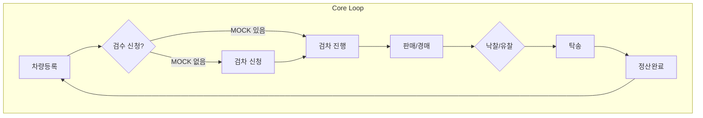

# CarivDealer User Flow (Service Scenarios)

**목적**: CarivDealer 핵심 사용자 시나리오·플로우 정의. CarivDealer_IA 참조. **상태 전이 규칙·예외 시나리오·에러 UX**는 코드베이스 분석 기반.

---

## §0 메타데이터·선언

| 항목 | 내용 |
|------|------|
| **버전** | 1.1 |
| **최종 검증** | 2026-02-12 |
| **데이터 소스** | routeManager, AuthContext, apiClient, features, pages |
| **검증 방법** | grep, read_file (코드베이스 Fact) |
| **의존성** | [CarivDealer_IA.md](CarivDealer_IA.md) |

---

## §1 Core Loop (핵심 시나리오)

차량 등록 → 검수 → 판매/경매 설정 → 낙찰/유찰 → 탁송 → 정산 완료 (End-to-End Flow)



### 1.1 단계별 라우트

| 단계 | 라우트 | 페이지 |
|------|--------|--------|
| 1. 차량등록 | `/vehicles/new` → `/vehicles/new/step1` → `step2` → `/vehicles/:vehicleId/complete` | VehicleRegisterEntryPage → VehicleRegisterStep1Page → Step2Page → VehicleRegistrationCompletePage |
| 2. 검수 | `/inspections/request` → `request/step1` → `step2` | InspectionRequestLandingPage → InspectionRequestStep1Page → InspectionRequestStep2Page |
| 2. 검수 진행 | `/inspections/:inspectionId/progress` (?stage=matching, en_route) | InspectionProgressPage |
| 2. 검수 완료 | `/inspections/:inspectionId/complete` | InspectionCompletePage |
| 3. 판매방식 선택 | `/vehicles/:vehicleId/sale/analyzing` | GeneralSaleAnalyzingPage |
| 3. 일반판매 | `/vehicles/:vehicleId/sale/price` → `/sale/complete` | GeneralSalePricePage → GeneralSaleCompletePage |
| 3. 경매 | `/vehicles/:vehicleId/auction`, `auction/start-price`, `duration`, `complete` | AuctionDetailPage → AuctionStartPricePage → AuctionDurationPage → AuctionCompletePage |
| 4. 거래상세 | `/vehicles/:vehicleId/trade` | TradeDetailPage |
| 5. 탁송 | `/logistics/schedule`, `/logistics/history` | LogisticsSchedulePage, LogisticsHistoryPage |
| 6. 정산 | `/settlements`, `/settlements/:settlementId`, `/sales/history` | SettlementListPage, SettlementDetailPage, SalesHistoryPage |

### 1.2 routeManager 상태 기반 라우팅 — Pre-condition & 분기

**코드**: `src/shared/utils/navigation/routeManager.ts`

| status | Pre-condition | 이동 경로 | 예외 |
|--------|---------------|----------|------|
| `draft` | vehicleId 존재 | `MOCK_VEHICLE_TO_INSPECTION[vehicleId]` 있으면 `/inspections/:inspectionId/progress`, **없으면** `/inspections/request?vehicleId={vehicleId}` | inspectionId 없으면 검차 신청 페이지로 |
| `inspection` | 동일 | 검차 진행/신청 (draft와 동일) | |
| `active_sale` | vehicleId 존재 | `/vehicles/:vehicleId/trade` | |
| `bidding` | vehicleId 존재 | `/vehicles/:vehicleId/auction` | |
| `sold` | vehicleId 존재 | `/logistics/schedule?vehicleId={vehicleId}` | |
| `pending_settlement` | vehicleId 존재 | `MOCK_VEHICLE_TO_SETTLEMENT[vehicleId]` 있으면 `/settlements/:settlementId`, **없으면** `/settlements` | settlementId 없으면 정산 목록 |
| `completed` | vehicleId 존재 | settlementId 있으면 `/settlements/:id`, 없으면 `/vehicles/:vehicleId` | |

**vehicleId 예외**:
- `vehicleId` 빈 문자열·null·잘못된 형식 → `FALLBACK_ROUTE` (`/vehicles`)
- `status` null/undefined/빈 문자열/미등록 → `/vehicles/:vehicleId` (차량 상세)

**MOCK 매핑** (현재 하드코딩):
- `MOCK_VEHICLE_TO_INSPECTION`: `v-1`→`insp-1`, `v-2`→`insp-2`
- `MOCK_VEHICLE_TO_SETTLEMENT`: `v-t6`→`settle-003`, `v-t7`→`settle-001`

### 1.3 Core Loop Mermaid (분기·루프 반영)

```mermaid
flowchart TD
    Start[카드/리스트 클릭] --> CheckV[vehicleId 유효?]
    CheckV -->|No| Fallback[/vehicles]
    CheckV -->|Yes| CheckS{status?}
    CheckS -->|draft,inspection| CheckI{inspectionId?}
    CheckI -->|Yes| Progress[/inspections/:id/progress]
    CheckI -->|No| Request[/inspections/request?vehicleId=...]
    CheckS -->|active_sale| Trade[/vehicles/:id/trade]
    CheckS -->|bidding| Auction[/vehicles/:id/auction]
    CheckS -->|sold| Logistics[/logistics/schedule?vehicleId=...]
    CheckS -->|pending_settlement,completed| CheckSet{settlementId?}
    CheckSet -->|Yes| Settlement[/settlements/:id]
    CheckSet -->|No| SettlementList[/settlements] or Vehicle[/vehicles/:id]
    CheckS -->|null/미등록| Vehicle
```

---

## §2 Auth & Onboarding Flow

### 2.1 회원가입 (Step 1~5)

```mermaid
flowchart TD
    A[/signup] --> B[/signup/step1]
    B --> C[/signup/step2]
    C --> D[/signup/step3]
    D --> E[/signup/step4]
    E --> F[/signup/step5]
    F --> G{필수 약관 동의?}
    G -->|No| F
    G -->|Yes| H[/signup/pending]
    H --> I[/signup/complete]
```

**검증 실패**: SignupStep5Page — `showToast('필수 약관에 모두 동의해주세요.', 'error')` (Toast)

### 2.2 로그인 및 비밀번호 찾기

| 플로우 | 라우트 | 페이지 |
|--------|--------|--------|
| 로그인 | `/login` | LoginPage |
| 비밀번호 찾기 | `/forgot-password` | ForgotPasswordPage |

### 2.3 인증 가드 및 Redirect Back

**코드**: `AuthContext.tsx` ProtectedRoute, `LoginPage.tsx`, `SignupEntryPage.tsx`

| 상황 | 처리 | Redirect Back |
|------|------|---------------|
| 비로그인 + 보호 라우트 접근 | `Navigate to="/signup?redirect={encodeURIComponent(pathname+search)}" replace` | **예** |
| SignupEntryPage "이미 회원이라면? 로그인" | `navigate(redirect ? /login?redirect=... : /login)` | redirect 파라미터 **유지** |
| LoginPage 로그인 성공 | `navigate(redirectTo.startsWith('/') ? redirectTo : /${redirectTo}, { replace: true })` | **redirectTo로 복귀** |
| redirect 없음 | `redirectTo = '/vehicles'` | 기본 `/vehicles` |

**Redirect Back 흐름**:
1. `/vehicles/123` (비로그인) → `/signup?redirect=%2Fvehicles%2F123`
2. "로그인" 클릭 → `/login?redirect=%2Fvehicles%2F123`
3. 로그인 성공 → `navigate('/vehicles/123', { replace: true })`

**Gap**: "딜러로 시작하기" → `/signup/step1` 시 redirect **미전달**. 회원가입 완료 후 복귀 경로 없음.

### 2.4 계정 승인 대기 및 반려 시나리오

- 승인대기: `/signup/pending` 표시
- 반려 시: (현재 구현 미확인)

---

## §3 Transaction Flow (거래 로직)

### 3.1 Bidding (경매 입찰)

**코드 분석**: `AuctionDetailPage` — **입찰 폼 미연결**. `useBid`, `useBuyNow` 훅은 존재하나 **어떤 페이지에서도 사용하지 않음**. 현재 UI는 고정 카드("구매 제안" 수락/거절)만 표시.

| 시나리오 | 코드 구현 | UI 피드백 |
|----------|----------|-----------|
| 내 입찰가 < 현재가 | useBid 훅만 존재, UI 미연결 | (미구현) |
| 경매 시간 종료 | 타이머 26:13:02 하드코딩, 종료 로직 없음 | (미구현) |
| 입찰 최고가(Winning) | — | (미구현) |
| 입찰 성공/실패 | useBid onSuccess → 쿼리 무효화. onError **미처리** | (미구현) |

**입찰 시나리오 테이블 (현재 코드 기준)**:

| 조건 | 예상 처리 | 실제 구현 |
|------|----------|----------|
| 입찰가 < 현재가 | 에러 메시지 | apiClient.auction.bid → 400 시 throw. **호출 페이지 없음** |
| 경매 종료 | 버튼 비활성 또는 결과 페이지 | 없음 |
| Winning | Toast 또는 실시간 갱신 | 없음 |
| API 실패 | Toast/Modal | useBid에 onError 미설정 — **에러 UI 없음** |

### 3.2 Settlement (정산)

| 단계 | 설명 | 처리 |
|------|------|------|
| 매각 확정 | 낙찰/거래 완료 | status → pending_settlement |
| 계좌 입력 | `/mypage/settlement-account` | SettlementAccountPage |
| 세금계산서 발행 | (정산 상세 내) | SettlementDetailPage |
| 입금 확인 | 정산 완료 처리 | status → completed |

---

## §4 Exception & Fail Flow (예외 처리)

### 4.1 API 에러 처리 UX

**코드**: `apiClient.ts`, `errorHandler.ts`, `formFeedback.ts`, 각 페이지 try-catch

| 계층 | 처리 | 사용자 피드백 |
|------|------|---------------|
| **apiCall** | 타임아웃/네트워크 에러 시 mockFallback 있으면 Mock 반환 + `_isMockData` | 없음 (호출자에서 처리) |
| **apiCall** | mockFallback 없으면 `throw new Error(apiError.message)` | 호출자 catch 필요 |
| **analyzeError** | NETWORK_ERROR, TIMEOUT_ERROR, VALIDATION_ERROR, AUTH_ERROR, SERVER_ERROR, UNKNOWN_ERROR | `getUserFriendlyMessage()` → 한글 메시지 |
| **useFormFeedback** | showValidationError(msg) | **Toast(error)** |
| **useFormFeedback** | showValidationWarning(msg) | **Toast(warning)** |
| **useFormFeedback** | showSuccess(msg) | **Toast(success)** |

**에러 타입별 메시지** (errorHandler.ts):
- NETWORK_ERROR: "네트워크 연결을 확인해주세요."
- TIMEOUT_ERROR: "요청 시간이 초과되었습니다. 잠시 후 다시 시도해주세요."
- AUTH_ERROR (401/403): "인증이 필요합니다. 다시 로그인해주세요."
- VALIDATION_ERROR (400): "입력 정보를 확인해주세요." 또는 서버 message
- 404: "요청한 리소스를 찾을 수 없습니다."
- SERVER_ERROR (5xx): "서버 오류가 발생했습니다. 잠시 후 다시 시도해주세요."

### 4.2 페이지별 에러 UX (코드 검증)

| 페이지 | 에러 상황 | UI 피드백 |
|--------|----------|----------|
| VehicleRegisterStep1Page | 차량번호 미입력 | **Toast(error)** "차량번호를 입력해주세요" |
| VehicleRegisterStep1Page | OCR 실패 | **Toast(error)** "OCR 처리에 실패했습니다" |
| SignupStep5Page | 필수 약관 미동의 | **Toast(error)** "필수 약관에 모두 동의해주세요." |
| InspectionRequestStep1Page | 검증 실패 | **Toast(error)** (formFeedback onValidationError) |
| InspectionRequestStep2Page | 평가사 미선택 | **Toast(error)** "평가사를 선택해주세요." |
| LogisticsSchedulePage | 날짜/시간 미선택 | **Toast(warning)** "날짜와 시간을 선택해주세요." |
| LogisticsSchedulePage | 탁송 예약 실패 | **Toast(error)** "탁송 예약에 실패했습니다." |
| LogisticsHistoryPage | PIN 미입력 | **Toast(warning)** "6자리 PIN을 입력해주세요." |
| LogisticsHistoryPage | 인계 승인 실패 | **Toast(error)** "인계 승인에 실패했습니다." |
| GeneralSaleOffersPage | 제안 수락/거절 실패 | **Toast(error)** "제안 수락/거절에 실패했습니다." |
| GeneralSaleOffersPage | 제안 수락/거절 성공 | **Toast(success)** "제안이 수락/거절되었습니다." |

**Modal 사용**: MessageModal — 삭제 확인, 판매방식 변경 확인. Modal — "판매 방식 변경 불가".

### 4.3 네트워크 에러 시 재시도

- **apiCall**: mockFallback 있으면 Mock 반환 (재시도 없음)
- **errorHandler.retryWithBackoff**: 존재하나 apiClient에서 **미사용**
- **isRetryableError**: NETWORK_ERROR, TIMEOUT_ERROR, SERVER_ERROR

### 4.4 데이터 없음 (Empty State)

- VID Protocol 5: 빈 데이터 → Empty State 화면
- 목록 페이지: 0건 시 안내 UI

### 4.5 권한 없음 (403) 및 페이지 없음 (404)

| 케이스 | 처리 |
|--------|------|
| 비로그인 + 보호 라우트 | `/signup?redirect=...` 리다이렉트 |
| 잘못된 vehicleId | `getVehicleDetailRoute` → FALLBACK_ROUTE (`/vehicles`) |
| 미매칭 경로 | router.tsx `path="*"` → `/vehicles` Navigate |

### 4.6 로딩·에러 UI

- 로딩: Skeleton (VID Protocol 5). AuctionDetailPage: "로딩 중..." 텍스트.
- 에러: Error Boundary (`main.tsx`에 래핑)

---

## §5 참조

- **IA**: [CarivDealer_IA.md](CarivDealer_IA.md)
- **routeManager**: [CarivDealer_VID.md](CarivDealer_VID.md) §5
- **AuthContext**: `src/shared/context/AuthContext.tsx`
- **errorHandler**: `src/shared/lib/errorHandler.ts`
- **formFeedback**: `src/shared/lib/formFeedback.ts`
