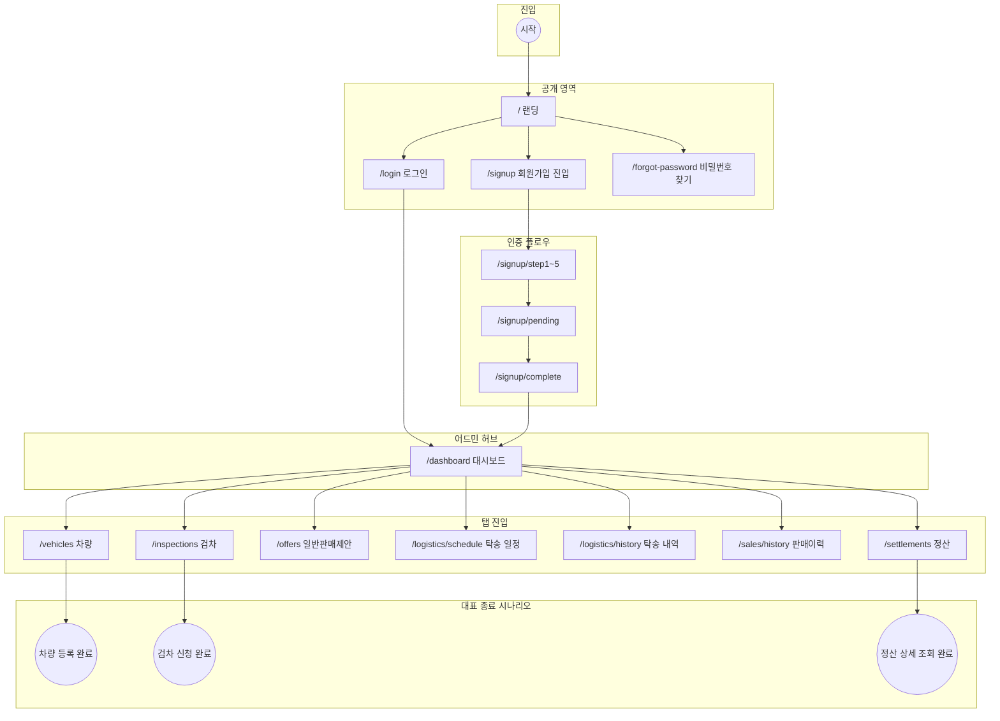

# NEO GOD 전역 유저 플로우 (Global User Flow)

**목적**: 진입부터 최종 종료까지 거시적 흐름. 유저 액션 중심(API·비즈니스 로직 노드 배제).  
**규칙**: 시작/종료 `( )`, 화면 `[ ]`, 결정 `{ }`, 입출력 `[/ /]` `[\ \]`만 사용.

---

## 전역 유저 플로우 (단일 Mermaid)

---

## 레벨 요약

| 레벨 | 설명 |
|------|------|
| 1 | 진입 → 랜딩 → 로그인 / 회원가입 / 비밀번호 찾기 분기 |
| 2 | 로그인 성공 → 대시보드. 회원가입 step1~5 → pending → complete → 대시보드 |
| 3 | 대시보드에서 차량·검차·제안·탁송(일정/내역)·판매이력·정산 탭 분기 |
| 4 | 각 탭의 대표 종료(차량 등록 완료, 검차 신청 완료, 정산 상세 조회 완료) |

---

## 비고

- **인증**: 현재 프로토타입은 인증 미적용. 전역 플로우는 "인증 적용 후" 시나리오로 간주.
- **탭별 상세**: 각 탭 내부(차량 등록 step, 일반판매 analyzing→price→complete, 경매 플로우 등)는 "탭별 상세 유저 플로우" 문서에서 다룸.
