# NEO GOD 탭별 상세 유저 플로우 (Detailed Tab Flow)

**목적**: 각 주요 탭/메뉴별 상세 플로우. 전역 플로우의 시작/종료 노드와 연동.  
**규칙**: 평행사변형(입출력), 마름모(분기) 엄격 준수. 화면 `[ "/path 화면명" ]`.

---

## Flow ID 목록

| Flow ID | 탭/메뉴 | 전역 연동 노드 |
|---------|---------|----------------|
| TAB_LANDING | 랜딩·로그인·비밀번호찾기 | B, C, E → I |
| TAB_SIGNUP | 회원가입 step1~complete | D, F, G, H → I |
| TAB_VEHICLE | 차량 목록·등록·상세·일반판매·경매 | J → T1 |
| TAB_INSPECTION | 검차 목록·신청·진행·내역 | K → T2 |
| TAB_OFFERS | 일반판매 제안 목록 | L |
| TAB_LOGISTICS | 탁송 일정·내역 | M, N |
| TAB_SALES | 판매이력 | O |
| TAB_SETTLEMENTS | 정산 목록·상세 | P → T3 |

---

## TAB_LANDING: 랜딩·로그인·비밀번호찾기

**전역 연동**: 시작 노드 B["/ 랜딩"], C["/login"], E["/forgot-password"]. 종료 노드 I["/dashboard"].

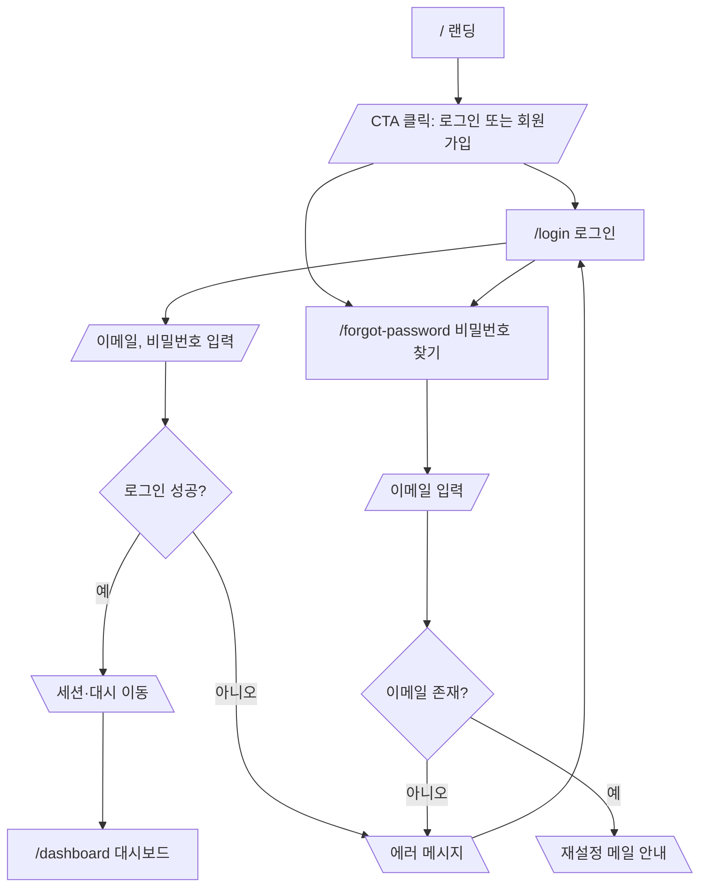

---

## TAB_SIGNUP: 회원가입 step1~complete

**전역 연동**: 시작 D, F~H. 종료 I.

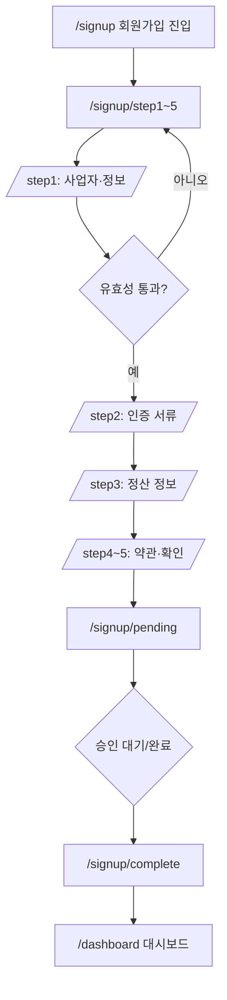

---

## TAB_VEHICLE: 차량 목록·등록·상세·일반판매·경매

**전역 연동**: 시작 J. 종료 T1(차량 등록 완료). 차량 상세에서 판매방식 분기 후 일반판매/경매 각각 완료 노드.

### 차량 등록 (진입 → step1 → step2 → complete)

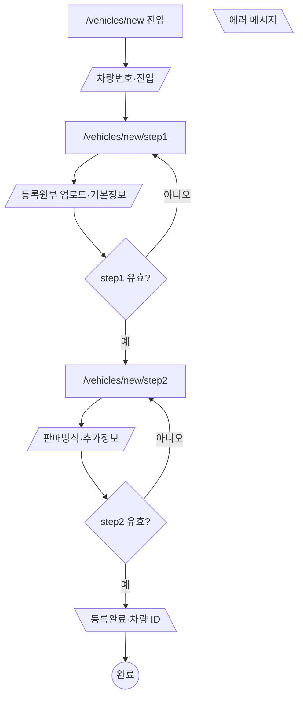

### 차량 상세 → 판매방식 분기

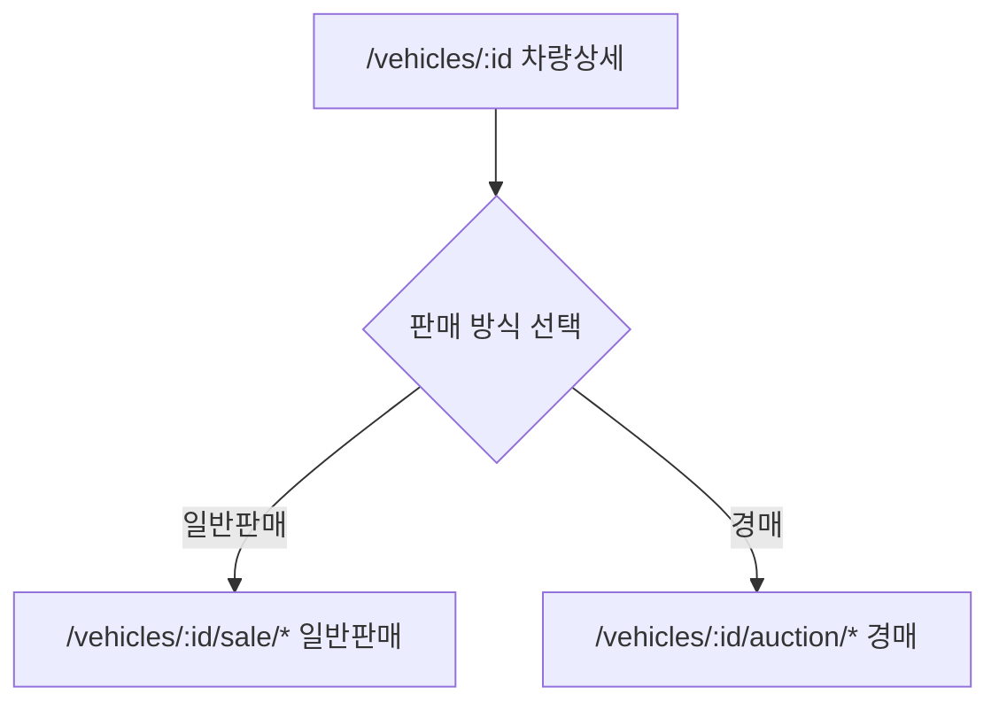

### 일반판매 (analyzing → price → complete)

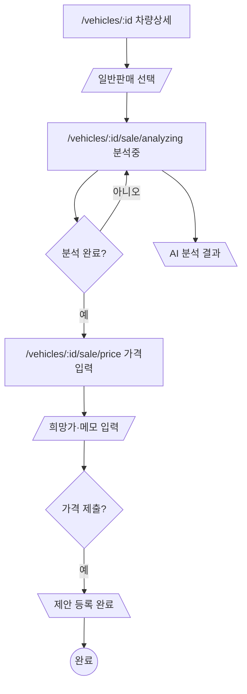

### 경매 (auction → start-price → duration → complete)

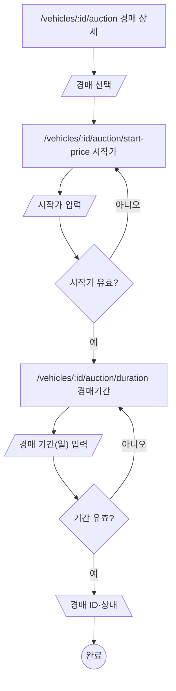

---

## TAB_INSPECTION: 검차 목록·신청·진행·내역

**전역 연동**: 시작 K. 종료 T2(검차 신청 완료).

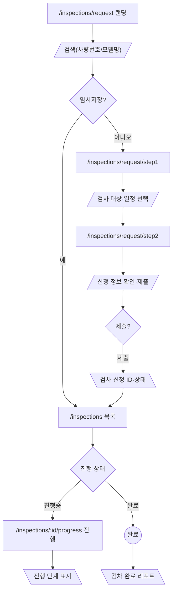

---

## TAB_OFFERS: 일반판매 제안 목록 (수락/거절)

**전역 연동**: 시작 L.

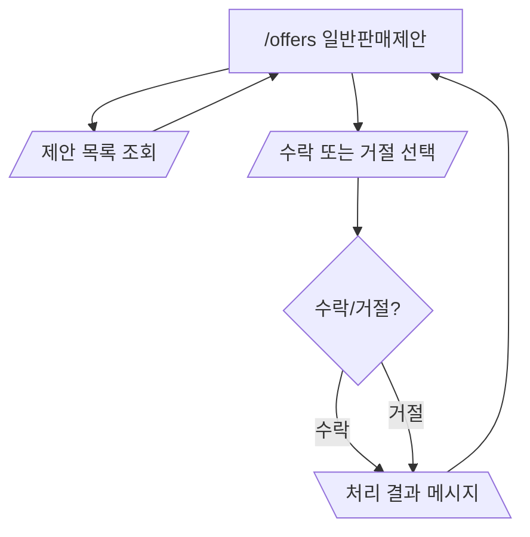

---

## TAB_LOGISTICS: 탁송 일정·내역

**전역 연동**: 시작 M, N.

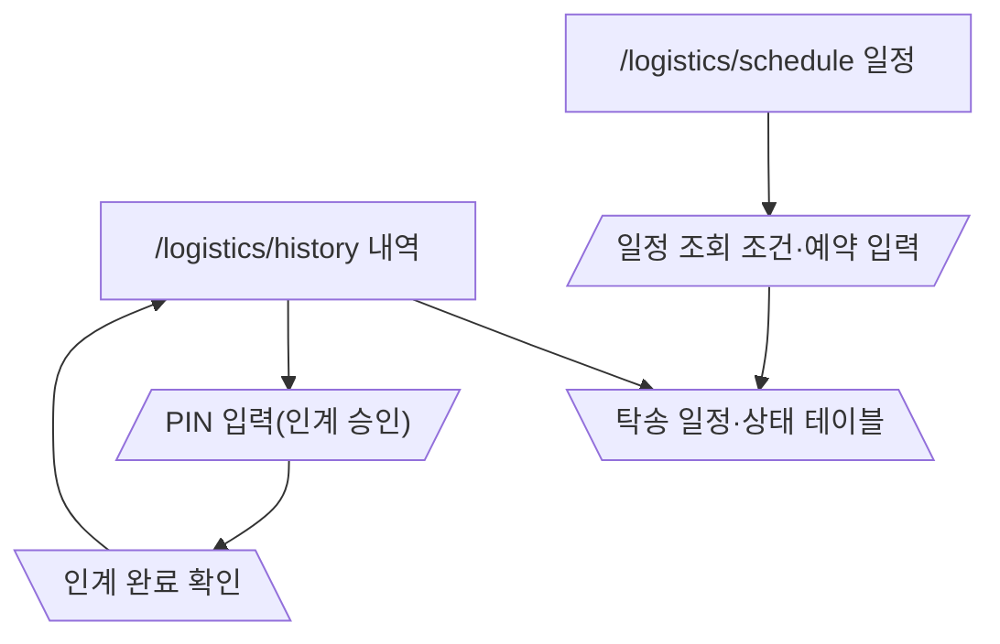

---

## TAB_SALES: 판매이력

**전역 연동**: 시작 O.

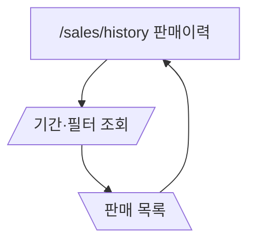

---

## TAB_SETTLEMENTS: 정산 목록·상세

**전역 연동**: 시작 P. 종료 T3(정산 상세 조회 완료).

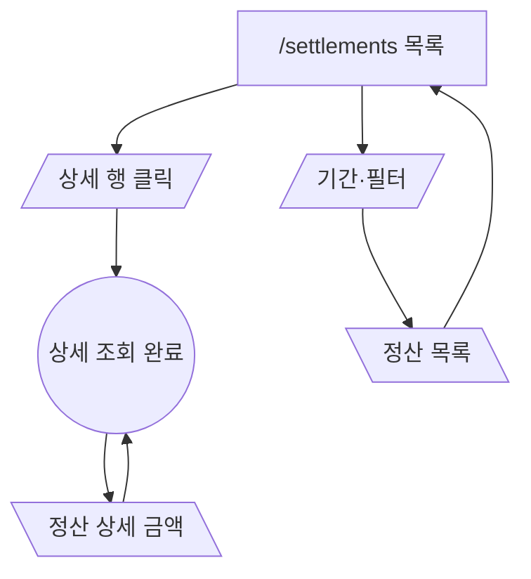
