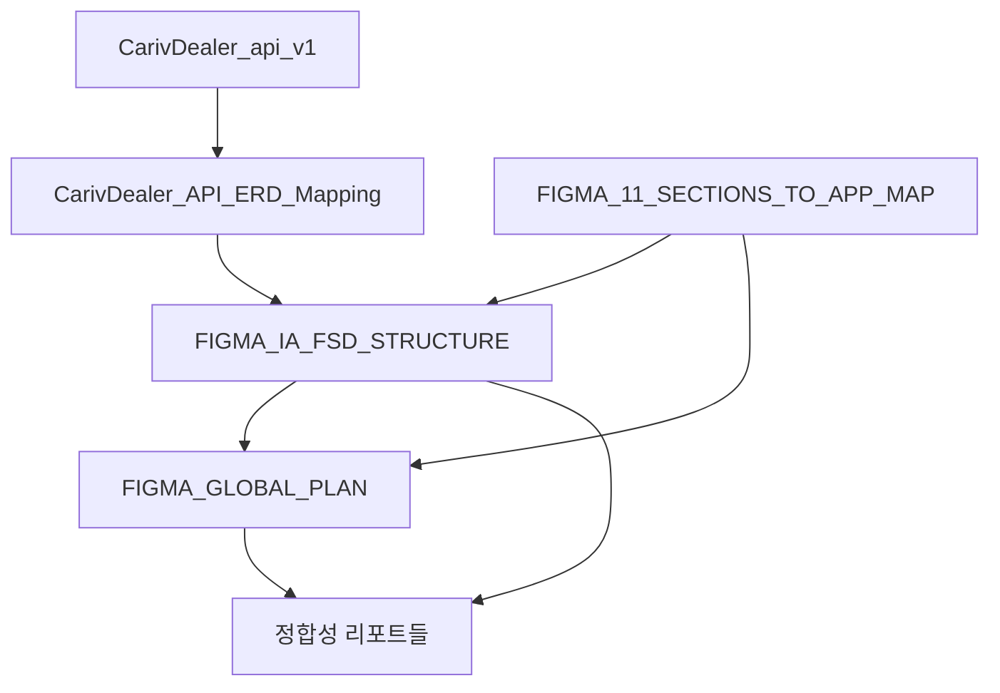
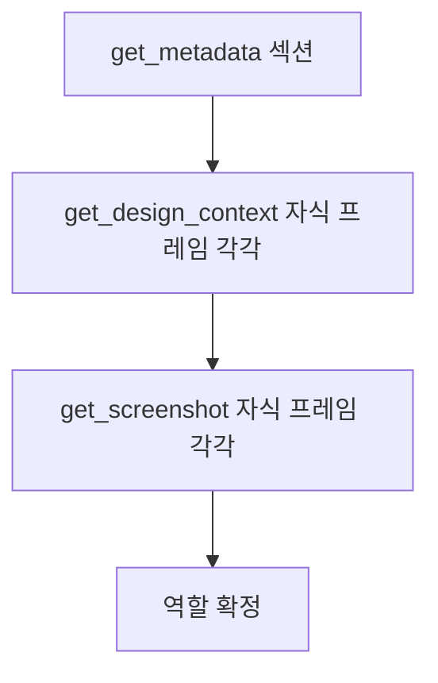
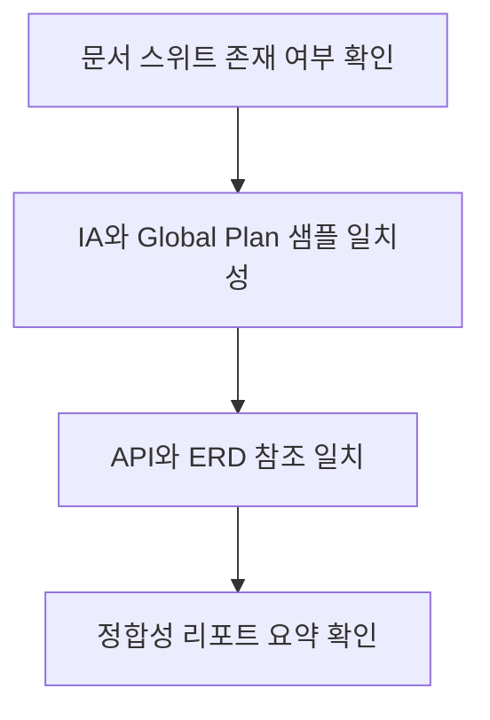

# 핸드오프 인수인계 문서 (AI 에이전트용) — Figma·IA·API·ERD 정합성

**목적**: 다음 AI 에이전트가 이 파일 하나만 읽고, 저장소를 로컬에 클론한 뒤 문서 스위트 점검·일치성 검토를 수행하고, 동일 규칙으로 정합성·무결성 작업을 이어갈 수 있도록 한다.  
**대상**: 다음 세션에서 Figma MCP 및 문서 스위트(ERD, API 스펙, IA, Global Plan)를 사용하는 AI 에이전트.  
**프로젝트 컨텍스트**: [CLAUDE.md](../../CLAUDE.md) 참조(구조, 명령어, FSD).

**PC방/신규 PC**: 각종 패키지 다운로드 후 또는 로컬 푸시 후 **이 .md만 참조**하여 환경 설정부터 정합성 작업까지 진행할 수 있다. 아래 §0 환경 설정을 먼저 수행한 뒤 §6·§7로 이어가면 된다.

---

## 0. 환경 설정 — 이 문서만 참조하여 진행

PC방 또는 신규 PC에서 저장소만 받은 뒤, **이 문서만 보고** 모든 설정을 끝낼 수 있도록 정리했다.

### 0.1 선택: 최소 환경 vs 0208 하이브리드

| 방식 | 용도 | 참조 |
|------|------|------|
| **최소** | Node만으로 프론트/배포·문서 작업 | 아래 0.2 + [PC_ROOM_SETUP.md](PC_ROOM_SETUP.md) |
| **0208 하이브리드** | Node + Python(데이터 분석·ERD 검증)·Git·Cursor 포터블 기지 | 아래 0.3 ~ 0.5 + [0208_PROTOCOL.md](0208_PROTOCOL.md) (Phase 1~5 현장 집행) |

### 0.2 최소 환경 (Node만)

1. Node.js **20.x** LTS 설치 → PATH에 `node`, `npm` 포함 확인.
2. `npm install -g firebase-tools` → `firebase` PATH 확인.
3. 프로젝트 루트에서 `npm install`, `cd functions && npm install`.
4. (선택) E2E: `npx playwright install`. (선택) `.env.local` 복사·수정.

자세한 의존성·PATH·언어 요약은 [PC_ROOM_SETUP.md](PC_ROOM_SETUP.md) 참조.

### 0.3 0208 통합 인프라 레이아웃 (?:/0208)

모든 실행 엔진을 상위 폴더에 격리해 포터블·재현 가능한 기지로 쓴다. `?`는 사용할 드라이브(예: `D` 또는 `C`)로 치환한다.

| 경로 | 용도 | 비고 |
|------|------|------|
| ?:/0208/node | Node.js 20.x (LTS) | 프론트엔드 및 Firebase 런타임 |
| ?:/0208/python | Python 3.12+ (Portable) | 데이터 분석·ERD 검증·고급 자동화 스크립트 |
| ?:/0208/git | Portable Git | 소스 버전 관리 |
| ?:/0208/cursor | Cursor AI Editor | 프로젝트 통합·집도 (선택) |
| ?:/0208/carivdealer | Main Codebase | Vite/React + Firebase + 분석 스크립트 |

**준비 순서**: (1) `?:/0208` 폴더 생성. (2) Node·Python·Git 포터블을 각각 `node`, `python`, `git` 폴더에 풀어 넣기. (3) 저장소를 `?:/0208/carivdealer`에 클론 또는 복사. (4) 아래 0.4 배치 파일 배치·실행. **상세 단계(보급품·기지·기폭·의존성·에이전트)** 는 [0208_PROTOCOL.md](0208_PROTOCOL.md) 참조.

### 0.4 0208 기폭제: 0208_INIT.bat

- **위치**: 저장소에 [0208_INIT.bat](0208_INIT.bat)이 이 폴더(docs/agenthandoff)에 있다. 이 파일을 **0208 상위 폴더**에 복사하여 사용한다.
  - 즉, `carivdealer`가 `?:/0208/carivdealer`에 있다면, `0208_INIT.bat`은 `?:/0208/0208_INIT.bat`에 둔다.
  - 실행 시 런타임 검증은 배치가 위치한 폴더(?:/0208)에서 **cd 없이** PATH만으로 수행되며, CODEBASE 미존재 시에도 경로 오류를 피할 수 있다.
- **역할**: PATH에 Python → Python\Scripts → Node → npm 전역 → Git 순으로 주입하고, `GOOGLE_APPLICATION_CREDENTIALS`(선택), 런타임 버전 확인(cd 없이 PATH 기준 동작) 후 Cursor 실행(경로 있을 때). Cursor 미설치 시 창은 `cmd /k`로 유지된다.
- **실행 방법**
  - **cmd**: `?:/0208`로 이동 후 `0208_INIT.bat` 더블클릭 또는 `call 0208_INIT.bat`.
  - **PowerShell** (배치를 PowerShell에서 호출할 때):  
    `Set-ExecutionPolicy -ExecutionPolicy Unrestricted -Scope Process -Force`  
    후 `cd ?:/0208; .\0208_INIT.bat`  
    (단, .bat은 cmd에서 실행되므로 실행 정책은 .ps1 실행 시에만 필요하다.)

실행 후 터미널에서 `python --version`, `node -v`로 정상 여부 확인.

### 0.5 의존성 관리 (0208 하이브리드)

- **Node**: 프로젝트 루트 및 `functions`에서 `npm install`. 필요 시 `npm install -g firebase-tools`.
- **Python**: 데이터 정합성·ERD/DB 스키마 검증 스크립트를 쓸 경우, `pip install -r requirements.txt`(또는 프로젝트 내 Python 요구 파일)로 환경 구축. 에이전트가 필요 패키지를 스스로 설치하도록 §8 프롬프트에 명시되어 있다.

---

## 1. 개요

이 문서는 **Figma Domestic-Seller 1.0** 기반으로 진행한 **화면 구조(IA)·전역 플랜·코드·API·ERD** 간 정합성·무결성 작업의 현황과 규칙을 정리한 핸드오프용 단일 진입점이다.  
**이 파일만 읽고** 최초 점검(§6)을 수행한 뒤, §7 규칙에 따라 특정 Figma 섹션에 대한 MCP 호출·IA/Global Plan/ERD 보정·정합성 리포트 작성까지 이어갈 수 있다.

---

## 2. 현시점 작업 요약

완료된 정합성 작업은 다음과 같다.

| 영역 | 내용 |
|------|------|
| (1) Figma·11개 섹션 매핑 | [figma/FIGMA_11_SECTIONS_TO_APP_MAP.md](../figma/FIGMA_11_SECTIONS_TO_APP_MAP.md). fileKey `4w3ft8RpGwoho5EtvNO9hQ`, 11개 섹션 node-id ↔ 라우트 ↔ 구현 페이지. |
| (2) IA | [figma/FIGMA_IA_FSD_STRUCTURE.md](../figma/FIGMA_IA_FSD_STRUCTURE.md) §3.1~3.7. 랜딩, 로그인·회원가입, 대시보드, 차량 목록, 차량 등록·상세(판매방식 선택 포함), 검차, 일반 판매. 각 섹션별 메타·프레임 목록·IA 트리·플로우·코드 매핑·갭. |
| (3) Global Plan | [figma/FIGMA_GLOBAL_PLAN.md](../figma/FIGMA_GLOBAL_PLAN.md). 현재 §2.7(일반 거래/차량 목록 1418-15486) 상세 반영. 포함 페이지 표·MCP 실제 결과·IA 참조. §2.1~2.6, 2.8~2.11은 11섹션맵과 IA §3.x로 대응되나 Global Plan에는 상세 블록 미작성 상태일 수 있음. |
| (4) API 명세 | [CarivDealer_api_v1.md](../CarivDealer_api_v1.md). 회원가입·로그인·차량(등록/목록/상세)·검차 관련 REST. GET /vehicles, POST /vehicles/search 등. |
| (5) ERD 매핑 | [CarivDealer_API_ERD_Mapping.md](../CarivDealer_API_ERD_Mapping.md). API 필드 ↔ ERD 테이블·컬럼, API-only/DB-only/계산값, 상태·열거 정합성. Figma IA·라우트 참조(§3.6, §3.7, 차량 목록 필터·정렬, 판매방식 선택, 검차 플로우). |
| (6) 섹션별 정합성 리포트 | [figma/VEHICLE_LIST_SECTION_INTEGRITY_REPORT.md](../figma/VEHICLE_LIST_SECTION_INTEGRITY_REPORT.md), [figma/SALE_MODE_SECTION_INTEGRITY_REPORT.md](../figma/SALE_MODE_SECTION_INTEGRITY_REPORT.md), [figma/INSPECTION_SECTION_36_INTEGRITY_REPORT.md](../figma/INSPECTION_SECTION_36_INTEGRITY_REPORT.md). MCP 수행 결과·화면 역할 표·갭·반영 문서 요약. |

**MCP 수행 이력**: get_metadata(섹션 nodeId), get_design_context(자식 프레임별), get_screenshot(자식 프레임별) 3단계 호출. 랜딩(1368:37200), 로그인·회원가입(1425:7205, 9프레임), 대시보드(1418:25059), 차량 목록(1418:15486, 13프레임), 차량 등록·상세(1418:20497, 14프레임), 판매방식 선택(1368:41153, 2프레임), 검차(1425:9149, 9프레임), 일반 판매(1425:7637, 9프레임) 등에서 호출 완료. 역할·라우트 확정은 get_screenshot 결과를 최종 기준으로 하며, 미반환 시 플랜·문서 기준 적용 후 갭으로 기록.

---

## 3. 문서 스위트 및 의존성

**문서 목록**

| 문서 | 경로 | 역할(1줄) |
|------|------|------------|
| API 명세 | docs/CarivDealer_api_v1.md | 회원가입·로그인·차량·검차 REST 엔드포인트·요청/응답. |
| ERD 매핑 | docs/CarivDealer_API_ERD_Mapping.md | API↔ERD 필드·enum·계산값·Figma IA/라우트 참조. |
| 11섹션 맵 | docs/figma/FIGMA_11_SECTIONS_TO_APP_MAP.md | 11개 섹션 node-id ↔ 라우트 ↔ 구현 페이지. |
| IA | docs/figma/FIGMA_IA_FSD_STRUCTURE.md | §3.1~3.7 섹션별 IA·프레임 목록·플로우·코드 매핑·갭. |
| Global Plan | docs/figma/FIGMA_GLOBAL_PLAN.md | 섹션별 포함 페이지·라우트·MCP 결과·IA 참조. |
| 정합성 리포트 | docs/figma/*_INTEGRITY_REPORT.md, *_REPORT.md | 섹션별 MCP 결과·역할 표·갭·반영 문서. |

**읽는 순서 / 의존 관계**



- ERD 매핑은 API 명세를 전제로 한다. IA·Global Plan은 11섹션맵과 라우트를 기준으로 하며, ERD 매핑 문서에서 Figma IA·라우트(§3.x)를 참조한다. 정합성 리포트는 해당 섹션의 IA·Global Plan·갭을 요약한다.

---

## 4. MCP Figma 호출 규칙

**fileKey**: `4w3ft8RpGwoho5EtvNO9hQ` (Domestic-Seller 1.0).

**nodeId 형식**

- **API/도구 호출 시**: 콜론 사용. 예: `1418:15486`, `1425:7205`.
- **URL/문서 표기 시**: 하이픈 사용. 예: `1418-15486`, `1425-7205`.
- 문서 내 표에서 "nodeId" 컬럼은 콜론, "node-id" 컬럼은 하이픈으로 구분해 기재해 두었다.

**호출 순서(필수)**

1. **get_metadata(fileKey, nodeId)** — 대상 **섹션** nodeId. 섹션 타입·자식 프레임 구조 확인.
2. **get_design_context(fileKey, nodeId)** — 해당 섹션의 **자식 프레임** nodeId 각각에 대해 호출. 레이아웃·컴포넌트·텍스트 구조 수집(참고용).
3. **get_screenshot(fileKey, nodeId)** — 위와 동일한 **자식 프레임** nodeId 각각에 대해 호출. **최종 역할·라우트·상태는 이 결과로 확정.**



**역할 확정 기준**: get_screenshot 결과를 최종으로 사용한다. get_design_context나 get_metadata만 반환되거나 "IMPORTANT" 메시지만 오면, 스크린샷 해석으로 보정하고, 스크린샷이 아예 미반환되면 "플랜·문서 기준 역할"로 적용한 뒤 **갭**으로 기록한다.

**가져올 프레임**

- **섹션**: 11개. [FIGMA_11_SECTIONS_TO_APP_MAP.md](../figma/FIGMA_11_SECTIONS_TO_APP_MAP.md) 표의 nodeId(콜론 형식) 사용.
- **자식 프레임**: 섹션별로 [FIGMA_IA_FSD_STRUCTURE.md](../figma/FIGMA_IA_FSD_STRUCTURE.md) 또는 해당 섹션 정합성 리포트에 열거된 node-id 목록 사용. 예: 차량 목록 1418:15486 자식 13개 — 1418:15487, 1418:15695, 1418:15903, 1418:15565, 1418:17357, 1418:20145, 1418:16327, 1418:16111, 1418:16860, 1418:16684, 1418:17629, 1418:17036, 1418:17196.

**의존성**: 스크린샷 미반환 시 "플랜·문서 기준 역할" 적용 후, 문서(IA·Global Plan)에 "(Figma MCP get_screenshot 기반 검증)" 문구와 함께 "스크린샷 미반환으로 플랜·문서 기준 적용" 또는 "갭"을 명시한다. Figma 프로토타입 링크/배치로 인해 자식 프레임이 해당 섹션과 다른 플로우 화면을 보여 줄 수 있음 — 그 경우 "MCP 실제 결과" 표와 "갭"으로 남긴다(예: §3.4 차량 목록 3.4.2b).

---

## 5. Figma 섹션·프레임 참조표

11개 섹션과 MCP 검증 완료 여부·자식 수·대표 nodeId. 상세 프레임 목록은 IA 또는 해당 정합성 리포트 참조.

| # | IA § | 섹션 명 | nodeId(콜론) | node-id(URL) | 자식 수 | 대표 자식 nodeId | MCP 검증 |
|---|------|---------|--------------|--------------|--------|------------------|----------|
| 1 | 3.1 | 랜딩 | 1368:37200 | 1368-37200 | 3 | 1368:37201, 37364, 43715 | 완료 |
| 2 | 3.2 | 로그인·회원가입 | 1425:7205 | 1425-7205 | 9 | 1425:7280, 7613, 7309, 7445, 7514, 7496, 7505 등 | 완료 |
| 3 | 3.3 | 대시보드 | 1418:25059 | 1418-25059 | — | 1418:25059 | 완료 |
| 4 | 3.4 | 차량 목록 | 1418:15486 | 1418-15486 | 13 | 1418:15487~17196 | 완료(갭: 목록 2건·비목록 11건) |
| 5 | 3.5 | 차량 등록·상세 | 1418:20497 | 1418-20497 | 14 | 1418:20498, 23705, 23880, 20576, 21868, 22630, 24679 등 | 완료 |
| — | 3.5.8 | 판매방식 선택 | 1368:41153 | 1368-41153 | 2 | 1368:41154, 41309 | 완료 |
| 6 | 3.6 | 검차 | 1425:9149 | 1425-9149 | 9 | 1425:9445, 9661, 9875, 10137, 10663, 10813, 10285, 10443 등 | 완료 |
| 7 | 3.7 | 일반 판매 | 1425:7637 | 1425-7637 | 9 | 1425:8153, 8420, 12046, 8636, 8842, 7638, 8107, 7684, 7918 | 완료 |
| 8 | — | 일반 판매 제안 목록 | 1418:36765 | 1418-36765 | — | — | 11섹션맵만 |
| 9 | — | 경매 | 1425:7205 | 1425-7205 | — | — | 11섹션맵·IA §3.9 참조 |
| 10 | — | 탁송 | 1444:7927 | 1444-7927 | — | — | 11섹션맵만 |
| 11 | — | 정산·판매이력 | 1425:9149 | 1425-9149 | — | 검차와 동일 섹션 내 | 11섹션맵만 |

---

## 6. 최초 점검·검토 절차

다음 에이전트가 **첫 세션**에서 수행할 작업이다. (환경 미구축 시 먼저 §0 환경 설정을 진행한 뒤 아래를 수행한다.)



1. **문서 스위트 존재 여부**
   - [CarivDealer_api_v1.md](../CarivDealer_api_v1.md), [CarivDealer_API_ERD_Mapping.md](../CarivDealer_API_ERD_Mapping.md) 존재 및 최근 갱신 여부.
   - [figma/FIGMA_11_SECTIONS_TO_APP_MAP.md](../figma/FIGMA_11_SECTIONS_TO_APP_MAP.md), [figma/FIGMA_IA_FSD_STRUCTURE.md](../figma/FIGMA_IA_FSD_STRUCTURE.md), [figma/FIGMA_GLOBAL_PLAN.md](../figma/FIGMA_GLOBAL_PLAN.md) 존재.
   - ERD 이미지/스키마(erd/IMG_3923.png 또는 문서 내 참조) 접근 가능 여부. (프로젝트 루트 기준 `erd/IMG_3923.png`)
   - 정합성 리포트 3건 이상: VEHICLE_LIST, SALE_MODE, INSPECTION.

2. **IA §3.x ↔ Global Plan §2.x ↔ 11섹션맵 일치성(샘플)**
   - 한 섹션(예: 차량 목록 §3.4 / §2.7)에 대해 라우트·node-id·역할이 세 문서에서 일치하는지 확인.
   - 11섹션맵의 node-id·라우트와 IA §3.x 섹션 메타·대표 라우트가 불일치하지 않는지 확인.

3. **API/ERD 매핑 문서의 Figma IA·라우트 참조**
   - CarivDealer_API_ERD_Mapping.md 내 "Figma IA·라우트", "§3.6", "§3.7", "차량 목록", "검차" 등 참조 문단이 IA 실제 § 번호·내용과 맞는지 확인.

4. **정합성 리포트 요약**
   - VEHICLE_LIST, SALE_MODE, INSPECTION 리포트에서 MCP 수행 결과·갭·반영 문서가 정리되어 있는지 확인. 필요 시 갭·TODO를 다음 작업 후보로 정리.

---

## 7. 다음 작업 이어가기

**스코프**

- Global Plan에는 현재 **§2.7(일반 거래/차량 목록)** 만 상세 블록이 있고, §2.1~2.6, §2.8~2.11은 11섹션맵·IA §3.x와 대응되나 **상세 Global Plan 미작성**일 수 있다. 해당 섹션에 대한 "포함 페이지 표·MCP 실제 결과·IA 참조" 블록 작성이 후보 작업이다.
- 이미 MCP 검증이 완료된 섹션(§3.4 등)은 **갭 보정**(Figma 재배치 권고, URL 쿼리·sort 연동 등) 또는 ERD/API 문서 보강으로 이어갈 수 있다.

**규칙(섹션별 정합성 작업)**

1. **MCP 3단계 호출**: get_metadata(섹션) → get_design_context(자식 각각) → get_screenshot(자식 각각).
2. **화면 역할·상태 표 작성**: 스크린샷 기준으로 nodeId | 역할 | 라우트 | 상태/변형 | MCP 검증. "(Figma MCP get_screenshot 기반 검증)" 문구 문서 내 최소 1곳 포함.
3. **IA 해당 § 보정**: FIGMA_IA_FSD_STRUCTURE.md 해당 §만 교체·보정(메타, 프레임 목록, IA 트리, 플로우, 코드 매핑, 갭). **전체 파일 덮어쓰기 금지.**
4. **Global Plan 해당 § 보정**: FIGMA_GLOBAL_PLAN.md 해당 §만 교체·보정(라우트, 포함 페이지 표, MCP 결과, IA 참조). **전체 파일 덮어쓰기 금지.**
5. **API/ERD 매핑 갱신**: 해당 섹션에 필드·상태·enum·쿼리 매핑이 필요하면 CarivDealer_API_ERD_Mapping.md에 섹션 추가 또는 이력 갱신.
6. **정합성 리포트**: 동일 형식(수행 결과·역할 표·갭·반영 문서)으로 docs/figma/ 내 리포트 작성(선택). (경로: [../figma/](../figma/).)

**금지**

- IA(FIGMA_IA_FSD_STRUCTURE.md) 또는 Global Plan(FIGMA_GLOBAL_PLAN.md) **전체를 한 번에 덮어쓰지 않는다.** 해당 § 블록만 교체·보정.

---

## 8. AI 에이전트용 프롬프트

다음 에이전트에게 전달할 프롬프트 블록이다. `[대상 섹션]`은 실제 작업할 섹션(예: §2.5 검차, §2.8 차량 등록·상세)으로 치환한다.

### 8.1 기본 (Node·문서·MCP 중심)

```
당신은 Figma MCP(get_screenshot / get_design_context / get_metadata)와 문서 스위트(ERD, API 스펙, Figma IA, Global Plan)를 활용해 정합성·무결성 작업을 이어가는 에이전트다.

반드시 먼저 docs/agenthandoff/HANDOFF_AGENT_FIGMA_IA_INTEGRITY.md 를 읽고, §6 최초 점검·검토 절차를 수행한 뒤, §7 다음 작업 이어가기 규칙에 따라 [대상 섹션] 정합성 작업을 수행하라.

MCP 호출 시 fileKey는 4w3ft8RpGwoho5EtvNO9hQ, nodeId는 콜론 형식(예: 1418:15486)을 사용하고, 호출 순서는 get_metadata(섹션) → get_design_context(자식 프레임 각각) → get_screenshot(자식 프레임 각각)을 준수하라. 역할·라우트 확정은 get_screenshot 결과를 최종 기준으로 하며, 미반환 시 플랜·문서 기준 적용 후 갭으로 기록하라. IA·Global Plan은 해당 § 블록만 교체·보정하고 전체 덮어쓰기를 하지 마라.
```

### 8.2 하이브리드 (Python 포함 — 데이터·ERD 검증)

0208 기지(Node + Python)에서 데이터 정합성·ERD/DB 스키마 자동 검증까지 수행할 때 사용한다.

```
# Role: CarivDealer 시스템 아키텍트 및 데이터/정합성 오퍼레이터
# Context: '?:/0208/carivdealer' 코드베이스 내에서 Figma-IA-API-ERD 및 데이터 무결성 작업을 수행하라.

너는 지금부터 docs/agenthandoff/HANDOFF_AGENT_FIGMA_IA_INTEGRITY.md 를 최우선으로 분석하고, 아래의 통합 개발 환경 가이드를 준수하여 업무를 수행하라.

## 1. 하이브리드 환경 및 기술 스택 인식
- **프론트/배포**: Node.js 20.x / Vite 6 / Firebase
- **데이터/분석**: Python 3.12+ (데이터 정합성 검증 및 대량 데이터 처리 시 적극 활용)
- **인프라**: 상위 폴더 ../node, ../python, ../git 에 엔진이 배치되어 PATH가 확보된 상태다.

## 2. 초기 점검 및 무결성 확인 (핸드오프 §6 준수)
- 문서 스위트 확인: CarivDealer_api_v1.md, CarivDealer_API_ERD_Mapping.md, figma/*.md
- IA ↔ Global Plan ↔ 11섹션맵 간의 정합성을 보고하라.
- **추가 과업**: ERD 매핑 데이터와 실제 DB 스키마 간의 불일치를 Python 스크립트로 자동 검증할 수 있는지 검토하라.

## 3. 정합성 작업 지시 (핸드오프 §7 준수)
- Figma MCP(fileKey: 4w3ft8RpGwoho5EtvNO9hQ)를 호출하라.
- **호출 순서**: get_metadata → get_design_context → get_screenshot.
- 역할 확정은 get_screenshot 기준이며, 문서 보정 시 해당 § 블록만 정밀 수정하라.

## 4. 의존성 관리
- Node 패키지는 npm install, Python 패키지는 pip install 로 필요한 환경을 스스로 구축하라.

지금 바로 docs/agenthandoff/HANDOFF_AGENT_FIGMA_IA_INTEGRITY.md 를 분석하고, Python을 활용한 추가 무결성 검토 계획을 포함한 리포트를 제출하라.
```

### 8.3 0208 세션 가동용

PC방에서 0208_INIT.bat 실행 후 Cursor가 열리면, 에이전트(Ctrl+L)에게 던질 짧은 트리거 프롬프트이다. 핸드오프 문서를 Source of Truth로 강제하고 §6→§7 수행 후 [0208 세션 가동 리포트]를 출력하게 한다.

```
# Role: CarivDealer 시스템 아키텍트 및 정합성 오퍼레이터 (0208 세션)
# Context: '?:/0208/carivdealer' 하이브리드 포터블 기지 (Node + Python)

너는 지금부터 프로젝트 루트에 있는 docs/agenthandoff/HANDOFF_AGENT_FIGMA_IA_INTEGRITY.md 문서를 **절대적인 기준(Source of Truth)**으로 삼아 업무를 수행하라.

### 1. 인프라 및 환경 인식 (0208 Hybrid)
- **런타임**: Node.js 20.x (메인 서비스) + Python 3.12+ (데이터/ERD 검증)
- **상태**: 이미 0208_INIT.bat을 통해 상위 폴더의 엔진들이 PATH에 잡혀있다.
- **제약**: 불필요한 전역 설치를 지양하고, 제공된 포터블 엔진을 최대한 활용하라.

### 2. 최우선 과업: 핸드오프 문서 §6 [최초 점검] 수행
- docs/agenthandoff/HANDOFF_AGENT_FIGMA_IA_INTEGRITY.md 를 정독하라.
- **문서 스위트 점검**: API 명세, ERD 매핑, Figma IA 문서들이 제자리에 있는지 확인하라.
- **샘플 정합성 체크**: IA 문서의 특정 섹션(예: 차량 목록)이 Global Plan 및 11섹션맵과 논리적으로 일치하는지 샘플링 검증 후 보고하라.

### 3. 작업 전개: 핸드오프 문서 §7 [정합성 작업]
- 위 점검이 끝나면, 즉시 Figma MCP(fileKey: 4w3ft8RpGwoho5EtvNO9hQ)를 호출할 준비를 하라.
- 호출 순서(**get_metadata → get_design_context → get_screenshot**)를 엄수하라.

**지금 바로 핸드오프 문서를 분석하고, [0208 세션 가동 리포트]를 출력하라.**
```

---

*문서 버전: 1.1. 최종 갱신: 2026-02-07.*
