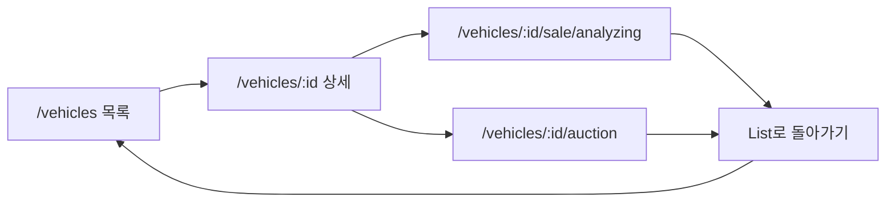
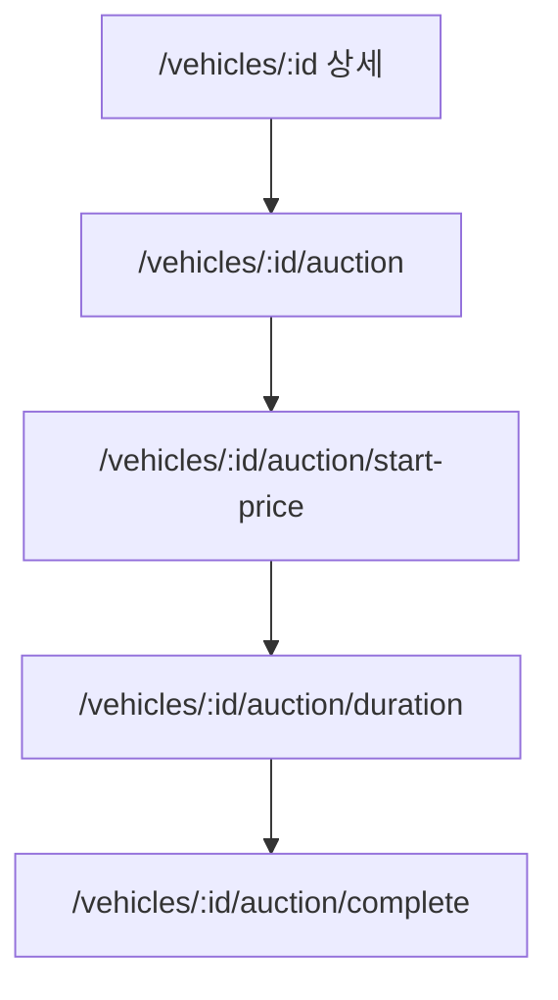
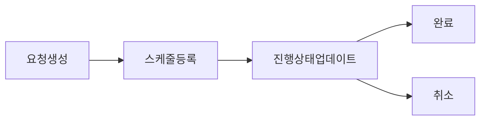

# Figma IA(Information Architecture) + FSD 구조 정의

**Figma 파일**: Domestic-Seller 1.0 — `fileKey`: `4w3ft8RpGwoho5EtvNO9hQ`  
**기준 문서**: [FIGMA_11_SECTIONS_TO_APP_MAP.md](FIGMA_11_SECTIONS_TO_APP_MAP.md), [archive/FIGMA_SCR_ROUTE_MAP.md](../archive/FIGMA_SCR_ROUTE_MAP.md)  
**통합 인덱스·정합성**: 본 문서의 통합 페이지 인덱스(§3 하단)·섹션별 페이지 수·nodeId 범위는 [IA_FSD_COMPLETE_VERIFICATION_20260208.md](IA_FSD_COMPLETE_VERIFICATION_20260208.md)(§2 통합 페이지 인덱스, §3 섹션별 자식 페이지)와 2026-02-08 기준으로 정합됨.

---

## 1. 개요

### 1.1 목적

Figma Domestic-Seller 1.0의 **11개 섹션**을 기준으로, 앱 라우트와 연결된 화면 구조(IA)와 FSD(Feature-Sliced Design) 레이어 후보를 정의한다. 이 문서는 Figma 기준 SSOT로서, 이후 ERD/API/FSD 문서를 정렬할 때 기준점이 된다.

### 1.2 데이터 소스 및 한계

- **사용한 데이터 소스**
  - [FIGMA_11_SECTIONS_TO_APP_MAP.md](FIGMA_11_SECTIONS_TO_APP_MAP.md): 섹션 nodeId ↔ 라우트 ↔ 구현 페이지 매핑
  - [archive/FIGMA_SCR_ROUTE_MAP.md](../archive/FIGMA_SCR_ROUTE_MAP.md): SCR별 화면명·경로·Figma nodeId(프레임)
  - [IA_FSD_COMPLETE_VERIFICATION_20260208.md](IA_FSD_COMPLETE_VERIFICATION_20260208.md): §2 통합 페이지 인덱스, §3 섹션별 자식 페이지 완전 나열(총 87프레임·11섹션). SSOT로 통합 인덱스·nodeId·라우트 패턴 반영.
  - Figma MCP `get_metadata`, `get_screenshot`, `get_design_context`: §3.1~3.11 섹션·자식 노드 및 표본 프레임 호출 완료. 페이지 표·IA·플로우·코드 매핑 무결성 검증에 사용.
  - 코드베이스 [design-tokens.css](../../src/shared/styles/design-tokens.css): 타이포·색상·레이아웃 토큰
- **추출 한계**
  - **섹션 nodeId만 있는 경우**: 자식 nodeId/이름/타입 등 구조 메타는 MCP로 이론상 추출 가능하나, 본 문서 작성 시에는 매핑 문서와 SCR 테이블을 우선 사용. 페이지 프레임 목록은 SCR nodeId로 보완.
  - **프레임 nodeId가 있는 경우에만**: 해당 프레임에 대해 `get_design_context`/`get_screenshot` 호출 시 코드/스타일/에셋 정보를 부분적으로 반영 가능. 본 문서는 SCR에 기재된 프레임 nodeId를 “페이지 프레임 목록”에 반영했으며, 상세 컴포넌트 트리는 추후 design_context 호출로 보완할 수 있음.

---

## 2. 전역 설계 메타

### 2.1 화면 크기 및 레이아웃 패턴

- **대표 화면 크기**: 1440px 기준(가로). 코드 상 `--layout-base-width: 1440px`, 컨테이너 `max-w-[1440px]`.
- **레이아웃 타입**
  - **공개 영역(랜딩/로그인/회원가입)**: 상단 헤더 + 풀폭 Hero/폼/FAQ 등. 단일 컬럼.
  - **어드민(대시보드 이후)**: 상단 GNB(Header) + 좌측 사이드바(MainLandingSidebar) + 우측 메인 콘텐츠. 목록 페이지는 그리드/리스트 + 필터 + 페이지네이션.
  - **스텝 플로우(회원가입 step1~5, 차량 등록 step1~2, 검차 신청 step1~2)**: 2단 폼 레이아웃 또는 단일 폼 + 진행 인디케이터.
- **코드 대응**: [LAYOUT_CLASSES](../../src/shared/config/layout.ts) — `CONTAINER`, `MAIN_PADDING`, `MAIN_LIST`, `MAIN_DETAIL`. [LandingHeader](../../src/widgets/Header/ui/LandingHeader.tsx), [MainLandingSidebar](../../src/widgets/MainLandingSidebar/ui/MainLandingSidebar.tsx).

### 2.2 타이포/색상/토큰 (개념 수준)

- **타이포**: H1(36px Medium), H2(24px Medium), H3(18px Bold), H4(16px Regular), Body(14px), Button(12px), Caption(10px). 폰트 Pretendard. Figma Typography node 1194-7425 기준.
- **색상**: Primary(#2048E5), Accent(#8A38F5), Neutral(gray-50~900). Error/Success 경고·성공 메시지용 토큰 존재.
- **간격/radius**: space-1~24, radius-sm/md/lg/full. 1440px 기준 vw 클램프 적용.
- **역할**: IA/FSD 설계 시 “헤더·버튼·폼·카드” 등 컴포넌트가 어떤 토큰을 쓰는지 개념만 참고. 정밀 스펙은 design-tokens.css 및 Figma design_context 보완 시 반영.

---

## 3. 섹션별 IA 구조 (11개 섹션)

**§3.1~3.7 Figma MCP 검증 요약** (fileKey: 4w3ft8RpGwoho5EtvNO9hQ)

| 섹션 | get_metadata | get_screenshot | get_design_context | 비고 |
|------|---------------|----------------|---------------------|------|
| §3.1 랜딩 | 1368:37200 | 1368:37200, 1368:37201 | 1368:37201 | 랜딩 후 Hero·가이드 5단계·FAQ·문의. 자식 3프레임(37201, 37364, 43715). |
| §3.2 로그인·회원가입 | 1425:7205 | (기존 검증 9프레임) | — | 9프레임 역할·라우트 MCP 검증 반영. |
| §3.3 대시보드 | 1418:25059 | 1418:25059 | — | Figma 내 픽업 등록/신청 플로우 포함. 라우트는 FIGMA_11_SECTIONS·Global Plan §2.3 기준. |
| §3.4 차량 목록 | 1418:15486 | 1418:15487 등 | 1418:15487 | 자식 13프레임. 목록·필터·뷰 변형. |
| §3.5 차량 등록·상세 | 1418:20497 | 1418:20498 등 | — | 자식 14프레임. 등록·상세·경매. |
| §3.6 검차 | 1425:9149 | 9개 자식 전원 | 1444:8198, 1425:9445 | §3.6.2 표·IA·플로우·코드매핑 MCP 정합. |
| §3.7 일반 판매 | 1425:7637 | 9개 자식 전원 | — | §3.7.2 표·IA·플로우·코드매핑 MCP 정합. |
| §3.8 마이페이지/오퍼 | 1418:36765 | 12개 자식 전원 | 12개 일부(6건 DC+SS, 6건 SS-only) | 2026-02-08 재호출 반영. 12자식 전원 마이페이지. |
| §3.9 경매 | 1418:20497 | (§3.5 동일 섹션 14자식 내) | 1418:23705, 23880 등 | §3.5와 동일 섹션, 경매 플로우 하위. |
| §3.10 탁송 | 1418:25059 | 11개 자식 전원 | 11개 OK | get_metadata·get_design_context·get_screenshot 11건 완료. |
| §3.11 정산 | 1418:33275 | 4개 자식 전원 | 4개 OK | get_metadata·get_design_context·get_screenshot 4건 완료. |

**통합 페이지 인덱스** (2026-02-08 IA 완전 정리 — [IA_FSD_COMPLETE_VERIFICATION_20260208.md](IA_FSD_COMPLETE_VERIFICATION_20260208.md) §2·§3와 동기화)

| 섹션 | 페이지 수 | nodeId 범위 | 라우트 패턴 |
|------|-----------|-------------|-------------|
| §3.1 랜딩 | 3 | 1368:37201, 37364, 43715 | `/` |
| §3.2 로그인·회원가입 | 9 | 1425:7280, 7613, 7309, 7445, 7514, 7496, 7505 / 1513:12032, 11607 | `/login`, `/signup`, `/signup/step1`~`step5`, `/signup/pending`, `/signup/complete`, `/forgot-password` |
| §3.3 대시보드 | 1 | 1418:25059 (섹션 단일) | `/dashboard` |
| §3.4 차량 목록 | 13 | 1418:15487, 15695, 15903, 15565, 17357, 20145, 16327, 16111, 16860, 16684, 17629, 17036, 17196 | `/vehicles` + 쿼리 |
| §3.5 차량 등록·상세·경매 | 14 | 1418:20498, 23705, 23880, 20576, 21868, 22630, 24679, 24463, 21690, 21512, 24856, 22153, 22315, 22951 | `/vehicles/new`, `/vehicles/:id`, `/vehicles/:id/auction/*` |
| §3.6 검차 | 9 | 1444:8198, 1425:9445, 9661, 9875, 10137, 10663, 10813, 10285, 10443 | `/inspections`, `/inspections/request`, `/inspections/:id/progress`, `/inspections/:id/complete` |
| §3.7 일반 판매 | 9 | 1425:8153, 8420, 12046, 8636, 8842, 7638, 8107, 7684, 7918 | `/vehicles`, `/vehicles/:id/sale/analyzing·price·complete` (Verification §2 동일) |
| §3.8 마이페이지/오퍼 | 12 | 1418:36766, 37804, 37971, 37042, 37170, 37677, 38264, 38114, 36901, 37298, 37559, 37402 | `/mypage/*`, `/offers` |
| §3.9 경매 | (§3.5 동일 섹션 1418:20497 내) | 1418:23705, 23880, 20576, 24679, 24463, 21690 등 | `/vehicles/:id/auction/*` |
| §3.10 탁송 | 11 | 1418:29145, 28880, 25060, 25219, 27070, 26827, 25400, 25619, 26067, 26325, 26583 | `/logistics/schedule`, `/logistics/history`, `/logistics/:id` |
| §3.11 정산 | 4 | 1418:36405, 27657, 27434, 27952 | `/settlements`, `/settlements/:id`, `/sales/history` |

※ Figma URL: `https://www.figma.com/design/4w3ft8RpGwoho5EtvNO9hQ/Domestic-Seller-1.0?node-id={nodeId 콜론→하이픈}`. 상세 페이지별 nodeId·라우트·MCP 상태는 [IA_FSD_COMPLETE_VERIFICATION_20260208.md](IA_FSD_COMPLETE_VERIFICATION_20260208.md) §3 참고.

**§3.1~3.7 플로우차트 점검** (IA 내 Mermaid flowchart)

| 섹션 | Mermaid 블록 | 문법 | IA·텍스트와 일치 | 비고 |
|------|----------------|------|-------------------|------|
| §3.1 | 없음(텍스트만) | — | ✓ | 3.1.5 텍스트 플로우만 존재. |
| §3.2 | 9개(로그인·회원가입 step·승인·비밀번호찾기) | ✓ | ✓ | Start/Input/Task/Server/Decision/End 노드 사용. |
| §3.3 | 없음(텍스트만) | — | ✓ | 3.3.5 텍스트 플로우만 존재. |
| §3.4 | 2개(목록 유저플로우·상세→판매/경매) | ✓ | ✓ | 필터/검색/클릭/등록 CTA 분기 정합. |
| §3.5 | 1개(차량 등록) | ✓ | ✓ | 진입→step1→step2→complete 선형. |
| §3.6 | 2개(검차 신청·진행·완료) | ✓ | ✓ | 목록→신청 step1·step2·제출 / 목록→progress·complete 분기. |
| §3.7 | 1개(일반 판매) | ✓ | ✓ | 목록→등록하기→analyzing→complete, 카드클릭→상세/price/complete. |

※ Mermaid에서 `:::start` 등 미정의 class는 무시되어 기본 스타일로 렌더링됨. 문법 오류 없음.

---

### 3.1 랜딩

#### 3.1.1 섹션 메타

- Figma 섹션 nodeId: `1368:37200`
- 대표 라우트: `/`
- 구현 페이지: LandingPage.tsx
- 섹션 역할(요약): 웹앱 첫 진입·로그아웃 시 노출. Hero, 사용 가이드(5단계), FAQ, 문의(KakaoTalk), 푸터.

#### 3.1.2 페이지(스크린) 프레임 목록

※ **Figma MCP get_metadata(1368:37200)·get_screenshot(1368:37200, 1368:37201)·get_design_context(1368:37201) 호출 완료**. 앱 라우트 `/` 에 대응하는 랜딩은 섹션 1368:37200(랜딩 후) 자식 3개. Hero·사용 가이드 5단계·FAQ·카카오톡 문의 구조 확인. 랜딩 프로토타입(1444:7927)은 참고용으로 표 하단 별도 구역에 정리.

| 페이지 이름(Figma/역할) | nodeId | 타입 | 라우트(예상/실제) | 설명 |
|------------------------|--------|------|-------------------|------|
| 랜딩 페이지 (로그인 후 — Hero 중심) | 1368:37201 | FRAME | `/` | Hero(환영·지금 시작하기), 사용 가이드 5단계, FAQ, 문의(KakaoTalk). 로그인 후 진입. |
| 랜딩 페이지 (로그인 후 — 동일 구조) | 1368:37364 | FRAME | `/` | Hero·가이드·FAQ·문의. 37201과 동일 또는 스크롤/강조 변형. |
| 랜딩 페이지 (로그인 후 — 알림 노출) | 1368:43715 | FRAME | `/` | Hero·가이드·FAQ·문의 + 알림 팝업 노출 변형. |

**참고: 랜딩 전/후 프로토타입** (Figma 섹션 1444:7927, 앱 라우트와 1:1 미매핑 — 참고용)

| 페이지 이름(Figma/역할) | nodeId | 타입 | 역할 (MCP 스크린샷 검증) |
|------------------------|--------|------|--------------------------|
| 로그인 전 랜딩 프로토타입 — 서비스 소개·회원가입 유도 | 1444:7928 | FRAME | Hero(Cariv for Domestic Sellers), 이메일 입력·회원가입하기, 차량 업로드하기, 간소화된 인증. 로그인/회원가입·매물 등록하기. |
| 로그인 전 랜딩 프로토타입 — 매물 목록 미리보기 | 1444:8018 | FRAME | 나의 매물 목록 블러 + "회원가입하러 가기" 배너. 회원가입 유도. |
| 로그인 후 랜딩 프로토타입 — 차량 목록 빈 상태/등록 진입 | 1444:8079 | FRAME | 홍길동님, 번호판 입력(123가 4567), 비대면 차량등록 유도. 차량 목록 빈 상태 또는 /vehicles/new 진입. |

#### 3.1.3 페이지별 내부 구조 (IA 관점)

```text
[랜딩 페이지] (nodeId: 1194:7481, route: /)
  - Layout
    - Header (LandingHeader)
    - Hero (배경 + CTA "지금 시작하기")
    - 사용 가이드 (5단계 카드 그리드)
    - FAQ (아코디언)
    - 문의 (KakaoTalk CTA)
    - Footer
```

※ SCR nodeId 1194:7481 기준. 상세 컴포넌트/스타일은 design_context 호출 시 보완 가능.

#### 3.1.4 섹션 내 공통 컴포넌트

| 컴포넌트 이름(Figma) | 타입 | 등장 페이지들 | FSD 레이어 후보 | 비고 |
|----------------------|------|----------------|------------------|------|
| LandingHeader | Component/Instance | 랜딩 | widgets/Header | GNB |
| Button (Primary) | Component | 랜딩 | shared/ui | CTA |
| 카드 그리드 | GROUP/FRAME | 사용 가이드 | shared/ui | 5단계 스텝 카드 |

#### 3.1.5 플로우(간단 IA 흐름)

```text
랜딩 → (지금 시작하기) → /vehicles/new/step1 또는 로그인/회원가입
랜딩 → (로그인/회원가입 링크) → /login, /signup
```

---

### 3.2 로그인·회원가입·비밀번호찾기

#### 3.2.1 섹션 메타

- Figma 섹션 nodeId: `1425:7205`
- 대표 라우트: `/login`, `/signup`, `/signup/step1`~`step5`, `/signup/pending`, `/signup/complete`, `/forgot-password`
- 구현 페이지: LoginPage, SignupEntryPage, SignupStep1~5Page, SignupPendingPage, SignupCompletePage, ForgotPasswordPage
- 섹션 역할(요약): 비로그인 사용자의 인증 및 딜러 회원가입 플로우. 사업자·서류·정산·약관 입력 후 승인 대기/완료.

#### 3.2.2 페이지(스크린) 프레임 목록

※ **Figma MCP get_metadata(1425:7205)·get_screenshot(9개 자식) 검증 반영**. 섹션 1425:7205 자식 9개 프레임. 로그인/회원가입 진입·Step1~5·승인 대기/완료 역할·라우트 스크린샷 기준 정정.

| 페이지 이름(역할) | nodeId | 타입 | 라우트(예상/확정) | 설명 |
|------------------|--------|------|-------------------|------|
| 로그인 | 1425:7280 | FRAME | `/login` | 이메일·비밀번호, 회원가입 링크, Google/Kakao/Naver 소셜 로그인. MCP 검증. |
| 회원가입 진입 | 1425:7613 | FRAME | `/signup` | 딜러 가입 개요(3카드: 사업자/중고차매매업/정산), "딜러로 시작하기", "이미 회원이라면? 로그인". MCP 검증. |
| 회원가입 Step1 — 본인인증 | 1513:12032 | FRAME | `/signup/step1` | 신분증 등록, 기본정보(아이디·비밀번호), 본인인증(이메일·휴대폰·인증번호). 6단계 스텝 1. MCP 검증. |
| 회원가입 Step2 — 사업자 정보 입력 | 1425:7309 | FRAME | `/signup/step2` | 사업자 등록 번호·등록증 이미지, 대표자명, 사업장 주소, 업태 종목 등. MCP 검증. |
| 회원가입 Step3 — 중고차 매매업 인증 | 1513:11607 | FRAME | `/signup/step3` | 중고차 매매업 등록증·매매 사원증·매매업 등록증 이미지, 허위매물 근절 서약. MCP 검증. |
| 회원가입 Step4 — 정산 정보 입력 | 1425:7445 | FRAME | `/signup/step4` | 예금주 실명, 정산 계좌번호, 은행명, 1원 입금 인증. MCP 검증. |
| 회원가입 Step5 — 약관 동의 | 1425:7514 | FRAME | `/signup/step5` | 거래약관·개인정보 수집/제3자 제공·마케팅 동의·회원 등록 동의. MCP 검증. |
| 승인 대기 | 1425:7496 | FRAME | `/signup/pending` | "회원가입 신청이 완료되었습니다.", "승인까지 최대 1영업일", "홈으로" 또는 "딜러 승인 대기 중". MCP 검증. |
| 승인 완료 | 1425:7505 | FRAME | `/signup/complete` | "딜러인증이 완료되었습니다." / "회원가입이 완료되었습니다!", "매물 등록하러 가기" 또는 "로그인". MCP 검증. |
| 비밀번호 찾기 | (본 9개 프레임 외) | — | `/forgot-password` | 섹션 오버뷰에 정책/약관 형태 화면 존재. 별도 프레임 또는 모달 추정. |

#### 3.2.3 페이지별 내부 구조 (IA 관점)

**로그인** (nodeId: 1425:7280, route: /login)

```text
[로그인]
  - Layout: 단일 폼 영역(중앙)
  - Form: 아이디, 비밀번호 (표시 토글)
  - Actions: 로그인 버튼(Primary), "계정이 없으신가요? 회원가입" 링크
  - Social: Google / Kakao / Naver 로그인
  - Error: 로그인 실패 시 메시지 영역
```

##### 로그인 플로우차트

- 진입: 랜딩/직접 URL. 액션: 이메일·비밀번호 입력 → 제출 → POST /auth/login (또는 소셜 idToken). 성공 시 nextStep·tokens 반환 → 대시보드. 실패 시 에러 표시 후 재입력.

```mermaid
flowchart TD
  Start([Start]):::start
  Input[/"사용자 입력: 이메일·비밀번호"/]:::input
  Submit[로그인 버튼 클릭]:::task
  APILogin["POST /auth/login (server)"]:::server
  Check{로그인 성공?}:::decision
  ToDash[대시보드로 이동]:::task
  Error[에러 메시지 표시]:::task
  End([End]):::end

  Start --> Input --> Submit --> APILogin --> Check
  Check -->|Yes| ToDash --> End
  Check -->|No| Error --> Input

  %% start/end: 빨간 원, decision: 노란 마름모, input: 평행사변형, server: 태스크 플로우(opacity 30% 의도)
```

**회원가입 진입** (nodeId: 1425:7613, route: /signup)

```text
[회원가입 진입]
  - Layout: 제목 "회원가입" + 안내 문구 + 3카드(사업자 필수 정보 / 중고차 매매업 인증 / 정산 정보) + CTA
  - Actions: "딜러로 시작하기" → /signup/step1, "이미 회원이라면? 로그인" → /login
```

##### 회원가입 진입 플로우차트

```mermaid
flowchart TD
  Start([Start]):::start
  Entry[회원가입 진입 화면]:::task
  Click[회원가입 시작 클릭]:::task
  ToStep1[/signup/step1 이동/]:::input
  End([End]):::end
  Start --> Entry --> Click --> ToStep1 --> End
  %% 유저 플로우만 표현
```

**회원가입 Step1** (nodeId: 1513:12032, route: /signup/step1)

```text
[회원가입 Step1 — 본인인증]
  - Layout: 헤더 "회원가입" + StepProgress(1~6: 본인인증→사업자정보→중고차매매업→정산→약관→승인대기) + 폼
  - Form: 신분증 등록(업로드), 기본정보(아이디·비밀번호·비밀번호 확인), 본인인증(이메일·이름·휴대폰·인증번호 전송)
  - Actions: 이전, 다음(Primary)
```

##### 회원가입 Step1 플로우차트

```mermaid
flowchart TD
  Start([Start]):::start
  Input1[/"사업자·기본정보 입력"/]:::input
  Next[다음 버튼 클릭]:::task
  Validate{유효성 통과?}:::decision
  ToStep2[/signup/step2 이동/]:::input
  Error1[에러 표시]:::task
  End([End]):::end
  Start --> Input1 --> Next --> Validate
  Validate -->|Yes| ToStep2 --> End
  Validate -->|No| Error1 --> Input1
```

**회원가입 Step2** (nodeId: 1425:7309, route: /signup/step2)

```text
[회원가입 Step2 — 사업자 정보 입력]
  - Layout: 헤더 + StepProgress(2/6) + 폼
  - Form: 필수(사업자 등록 번호·사업자등록증 이미지·대표자명·사업장 주소·업태 종목), 선택(부가가치세 과세 유형·사업장 전화번호)
  - Actions: 이전, 다음
```

##### 회원가입 Step2 플로우차트

```mermaid
flowchart TD
  Start([Start]):::start
  Input2[/"사업자 정보 입력"/]:::input
  Next2[다음 버튼 클릭]:::task
  Validate2{유효성 통과?}:::decision
  ToStep3[/signup/step3 이동/]:::input
  Error2[에러 표시]:::task
  End([End]):::end
  Start --> Input2 --> Next2 --> Validate2
  Validate2 -->|Yes| ToStep3 --> End
  Validate2 -->|No| Error2 --> Input2
```

**회원가입 Step3** (nodeId: 1513:11607, route: /signup/step3)

```text
[회원가입 Step3 — 중고차 매매업 인증]
  - Layout: 헤더 + StepProgress(3/6) + 폼
  - Form: 필수(중고차 매매업 등록증·매매 상사명·매매 사원증 번호·사원증 사진·매매업 등록증 이미지·허위매물 근절 서약), 선택(협회/조합 회원 여부)
  - Actions: 이전, 다음
```

##### 회원가입 Step3 플로우차트

```mermaid
flowchart TD
  Start([Start]):::start
  Input3[/"중고차 매매업 인증 입력"/]:::input
  Verify["사업자번호 확인 (server)"]:::server
  Next3[다음 버튼 클릭]:::task
  SubmitDealer["PUT /signup/dealer (server)"]:::server
  ToStep4[/signup/step4 이동/]:::input
  End([End]):::end
  Start --> Input3 --> Verify --> Next3 --> SubmitDealer --> ToStep4 --> End
```

**회원가입 Step4** (nodeId: 1425:7445, route: /signup/step4)

```text
[회원가입 Step4 — 정산 정보 입력]
  - Layout: 헤더 + StepProgress(4/6) + 폼
  - Form: 예금주 실명, 정산 계좌번호, 은행명, 1원 입금 인증(계좌 선택·인증번호 4자리), 선택(계좌 유형)
  - Actions: 이전, 다음
```

##### 회원가입 Step4 플로우차트

```mermaid
flowchart TD
  Start([Start]):::start
  Input4[/"정산 정보 입력"/]:::input
  Next4[다음 버튼 클릭]:::task
  SubmitSettle["PUT /signup/settlement (server)"]:::server
  ToStep5[/signup/step5 이동/]:::input
  End([End]):::end
  Start --> Input4 --> Next4 --> SubmitSettle --> ToStep5 --> End
```

**회원가입 Step5** (nodeId: 1425:7514, route: /signup/step5)

```text
[회원가입 Step5 — 약관 동의]
  - Layout: 헤더 + StepProgress(5/6) + 약관 리스트 + 체크(거래약관·개인정보 수집/제3자·마케팅·회원 등록 동의)
  - Actions: 이전, 가입 완료 제출(Primary)
```

##### 회원가입 Step5 플로우차트

```mermaid
flowchart TD
  Start([Start]):::start
  Input5[/"약관 동의·확인"/]:::input
  Submit5[가입 완료 제출]:::task
  SubmitAPI["POST /signup/dealer/submit (server)"]:::server
  CheckStatus{상태?}:::decision
  ToPending[/signup/pending 이동/]:::input
  ToComplete[/signup/complete 이동/]:::input
  End([End]):::end
  Start --> Input5 --> Submit5 --> SubmitAPI --> CheckStatus
  CheckStatus -->|SUBMITTED| ToPending --> End
  CheckStatus -->|APPROVED 등| ToComplete --> End
```

**승인 대기** (nodeId: 1425:7496, route: /signup/pending)

```text
[승인 대기]
  - Layout: 헤더 + 안내 문구·상태 카드
  - Actions: (대기만, 또는 GET /signup/status 폴링)
```

##### 승인 대기 플로우차트

```mermaid
flowchart TD
  Start([Start]):::start
  Pending[승인 대기 화면 표시]:::task
  Poll["GET /signup/status (server, 선택)"]:::server
  CheckApproval{승인 완료?}:::decision
  ToComplete2[/signup/complete 이동/]:::input
  End([End]):::end
  Start --> Pending --> Poll --> CheckApproval
  CheckApproval -->|Yes| ToComplete2 --> End
  CheckApproval -->|No| Pending
```

**승인 완료** (nodeId: 1425:7505, route: /signup/complete)

```text
[승인 완료]
  - Layout: 헤더 + 완료 메시지
  - Actions: 대시보드 이동(Primary)
```

##### 승인 완료 플로우차트

```mermaid
flowchart TD
  Start([Start]):::start
  Complete[승인 완료 화면]:::task
  ToDash2[대시보드로 이동 클릭]:::task
  End([End]):::end
  Start --> Complete --> ToDash2 --> End
```

**비밀번호 찾기** (nodeId: 확보 필요, route: /forgot-password)

```text
[비밀번호 찾기]
  - Layout: 헤더 + 폼
  - Form: 이메일 입력
  - Actions: 재설정 요청 전송, 로그인으로 돌아가기
```

##### 비밀번호 찾기 플로우차트

```mermaid
flowchart TD
  Start([Start]):::start
  InputEmail[/"이메일 입력"/]:::input
  Send[재설정 요청 클릭]:::task
  APIReset["(비밀번호 재설정 API) (server)"]:::server
  Result{성공?}:::decision
  Message[안내 메시지 표시]:::task
  Error3[에러 표시]:::task
  End([End]):::end
  Start --> InputEmail --> Send --> APIReset --> Result
  Result -->|Yes| Message --> End
  Result -->|No| Error3 --> InputEmail
```

#### 3.2.4 섹션 내 공통 컴포넌트

| 컴포넌트 이름(Figma) | 타입 | 등장 페이지들 | FSD 레이어 후보 | 비고 |
|----------------------|------|----------------|------------------|------|
| StepProgress | Component | step1~5 | shared/ui | 단계 표시 |
| FormField / Input | Component | 로그인·회원가입 | shared/ui | |
| PrimaryButton, SecondaryButton | Component | 전 단계 | shared/ui | |
| PageHeader | GROUP/FRAME | 전 단계 | shared/ui 또는 widgets | |

#### 3.2.5 플로우(간단 IA 흐름)

```text
로그인 → (성공) → /dashboard
로그인 → (회원가입) → /signup → step1 → step2 → step3 → step4 → step5 → pending → complete → /dashboard
로그인 → (비밀번호 찾기) → /forgot-password
```

#### 3.2.6 코드 매핑 및 갭

**페이지 ↔ Figma 매핑** (MCP 스크린샷 검증 반영: 7280=로그인, 7613=회원가입 진입)

| 구현 페이지(파일 경로) | Figma node-id | 라우트 | 비고 |
|------------------------|----------------|--------|------|
| LoginPage | 1425:7280 | `/login` | pages/admin/LoginPage.tsx |
| SignupEntryPage | 1425:7613 | `/signup` | pages/auth/SignupEntryPage.tsx |
| SignupStep1Page | 1513:12032 | `/signup/step1` | pages/auth/SignupStep1Page.tsx |
| SignupStep2Page | 1425:7309 | `/signup/step2` | pages/auth/SignupStep2Page.tsx |
| SignupStep3Page | 1513:11607 | `/signup/step3` | pages/auth/SignupStep3Page.tsx |
| SignupStep4Page | 1425:7445 | `/signup/step4` | pages/auth/SignupStep4Page.tsx |
| SignupStep5Page | 1425:7514 | `/signup/step5` | pages/auth/SignupStep5Page.tsx |
| SignupPendingPage | 1425:7496 | `/signup/pending` | pages/auth/SignupPendingPage.tsx |
| SignupCompletePage | 1425:7505 | `/signup/complete` | pages/auth/SignupCompletePage.tsx |
| ForgotPasswordPage | (확보 필요) | `/forgot-password` | pages/admin/ForgotPasswordPage.tsx |

**갭 정리**

- **Figma와 일치**
  - 라우트 10개와 페이지 컴포넌트 10개 1:1 대응.
  - Step1~5 단계 수, pending/complete 분리 구조와 코드·라우트 일치.
- **부족**
  - 로그인: Figma에 소셜(카카오/구글) 버튼이 있으면 코드에 동일 노출 여부 확인 필요.
  - 비밀번호 찾기: Figma node-id 미확보; API 명세에 재설정 API 미기재 시 기능 갭.
- **추가**
  - 코드에만 있는 필드/버튼(예: 개발용 스킵)이 있으면 Figma와 상이할 수 있음.
- **다른 플로우**
  - nextStep·dealerVerificationStatus에 따른 분기(진입 시 step2로 리다이렉트 등)는 API·백엔드와 일치시키고, Figma 플로우와 다르면 문서에 주석으로 명시.

---

### 3.3 대시보드

※ **Figma MCP get_metadata(1418:25059)·get_screenshot(1418:25059) 호출 완료**. Figma 내 해당 섹션에 픽업 등록/신청 플로우가 포함됨. 앱 라우트·페이지는 [FIGMA_11_SECTIONS_TO_APP_MAP.md](FIGMA_11_SECTIONS_TO_APP_MAP.md)·Global Plan §2.3 기준.

#### 3.3.1 섹션 메타

- Figma 섹션 nodeId: `1418:25059`
- 대표 라우트: `/dashboard`
- 구현 페이지: DashboardPage.tsx
- 섹션 역할(요약): 로그인/회원가입 성공 후 메인 허브. 전체 차량 그리드 + 좌측 사이드바 + 헤더 + 페이지네이션.

#### 3.3.2 페이지(스크린) 프레임 목록

※ **통합 인덱스·Verification 기준**: 대시보드 섹션은 **단일 프레임 1418:25059**. (FIGMA_11_SECTIONS·일부 SCR에서는 1418:25059가 "탁송"으로도 매핑됨 — 동일 nodeId가 대시보드·탁송 섹션 부모로 사용됨. 여기서는 대시보드 = 1페이지만 집계.)

| 페이지 이름(Figma) | nodeId | 타입 | 라우트(예상/실제) | 설명 |
|--------------------|--------|------|-------------------|------|
| 딜러 대시보드 | 1418:25059 | FRAME | `/dashboard` | 통합 인덱스·[IA_FSD_COMPLETE_VERIFICATION_20260208.md](IA_FSD_COMPLETE_VERIFICATION_20260208.md) §3.3 기준. 차량 그리드 + 사이드바. SCR 참고: 1194:7664. |

#### 3.3.3 페이지별 내부 구조 (IA 관점)

```text
[대시보드] (nodeId: 1418:25059, route: /dashboard)
  - Layout
    - Header (variant=main, activeNav=vehicles)
    - Sidebar (MainLandingSidebar: 검색, 메뉴)
    - Main
      - 타이틀 "전체 차량" + 확인 필요차량 버튼
      - VehicleCard 그리드
      - Pagination
```

#### 3.3.4 섹션 내 공통 컴포넌트

| 컴포넌트 이름(Figma) | 타입 | 등장 페이지들 | FSD 레이어 후보 | 비고 |
|----------------------|------|----------------|------------------|------|
| LandingHeader (main) | Component | 대시보드 | widgets/Header | |
| MainLandingSidebar | Component | 대시보드 | widgets/MainLandingSidebar | |
| VehicleCard | Component | 대시보드 | entities/vehicle/ui | |
| Pagination | Component | 대시보드 | shared/ui | |

#### 3.3.5 플로우(간단 IA 흐름)

```text
대시보드 → (차량 탭) → /vehicles
대시보드 → (검차/제안/탁송/판매/정산) → 각 탭 라우트
대시보드 → (차량 등록) → /vehicles/new
```

---

### 3.4 차량 목록

※ **Figma MCP get_metadata(1418:15486)·get_design_context(13개)·get_screenshot(13개) 호출 완료**. **(Figma MCP get_screenshot 기반 검증)**  
스크린샷 기준으로 13개 자식 프레임 중 **목록 화면**은 1418:17357(거래 목록 그리드), 1418:20145(차량목록·판매/거래 그리드) 2건이며, 나머지 11건은 기준 가격 설정·판매 가격 설정·완료 화면·거래 상세 보기·모달 등 **다른 플로우 화면**으로 노출됨. 아래 3.4.2는 **의도된 역할(플랜/앱 기준)**, 3.4.2b는 **MCP 스크린샷 실제 결과 및 갭**.

#### 3.4.1 섹션 메타

- Figma 섹션 nodeId: `1418:15486`
- 대표 라우트: `/vehicles` (쿼리: `filter`, `view`, `q`, `needsAttention`, `page`, `size`, `sort` 등)
- 구현 페이지: VehicleListPage.tsx
- 섹션 역할(요약): 등록 차량 목록 조회·필터(전체/임시저장/등록완료)·검색·그리드/리스트 전환·확인 필요차량·페이지네이션. 행/카드 클릭 시 상세(`/vehicles/:id`) 이동, 차량 등록 CTA 시 `/vehicles/new` 진입.

#### 3.4.2 페이지(스크린) 프레임 목록

※ Figma 섹션 1418:15486 자식 13개 프레임. MCP name 미제공 시 역할 기준 라벨 사용. **nodeId·라우트·MCP 상태 상세**: [IA_FSD_COMPLETE_VERIFICATION_20260208.md](IA_FSD_COMPLETE_VERIFICATION_20260208.md) §3.4 참고.

| 페이지 이름(Figma/역할) | nodeId | 타입 | 역할 | 예상 라우트 |
|------------------------|--------|------|------|--------------|
| 차량 목록 (기본) | 1418:15487 | FRAME | 기본 리스트 화면 | `/vehicles` |
| 차량 목록 (전체 탭) | 1418:15695 | FRAME | 필터: 전체 | `/vehicles` 또는 `/vehicles?filter=all` |
| 차량 목록 (임시저장 탭) | 1418:15903 | FRAME | 필터: 임시저장 | `/vehicles?filter=draft` |
| 차량 목록 (등록완료 탭) | 1418:15565 | FRAME | 필터: 등록완료 | `/vehicles?filter=completed` |
| 차량 목록 (그리드 뷰) | 1418:17357 | FRAME | 그리드/리스트 전환 — 그리드 | `/vehicles?view=grid` |
| 차량 목록 (리스트 뷰) | 1418:20145 | FRAME | 그리드/리스트 전환 — 리스트(테이블) | `/vehicles?view=list` |
| 차량 목록 (검색 적용) | 1418:16327 | FRAME | 검색 결과 상태 | `/vehicles?q=...` |
| 차량 목록 (확인 필요차량) | 1418:16111 | FRAME | 확인 필요차량 체크 적용 | `/vehicles?needsAttention=1` |
| 차량 목록 (Empty state) | 1418:16860 | FRAME | 결과 0건 | `/vehicles` (필터 조합 시 0건) |
| 차량 목록 (페이지네이션) | 1418:16684 | FRAME | 2페이지 등 페이지네이션 상태 | `/vehicles?page=2` |
| 차량 목록 (카드/상태) | 1418:17629 | FRAME | 카드·상태 뱃지 강조 | `/vehicles` |
| 차량 목록 (필터 바) | 1418:17036 | FRAME | 필터 바·탭 영역 강조 | `/vehicles` |
| 차량 목록 (정렬) | 1418:17196 | FRAME | 정렬 적용 상태 | `/vehicles?sort=...` |

#### 3.4.2b MCP get_screenshot 실제 결과 및 갭

※ 2026-02-07 MCP 호출 수행. 13개 프레임 스크린샷 수신. **실제 노출 내용** 기준 역할 below.

| nodeId | 역할(스크린샷 기준) | 라우트(실제 대응) | MCP 검증 | 비고 |
|--------|----------------------|-------------------|----------|------|
| 1418:15487 | 기준 가격 설정 — 시세 분석 로딩 | `/vehicles/:id/sale/analyzing` 등 | get_screenshot OK | 목록 아님 |
| 1418:15695 | 판매 가격 설정 (단일 차량) | `/vehicles/:id/sale/price` 등 | get_screenshot OK | 목록 아님 |
| 1418:15903 | 판매 가격 설정 (동일) | `/vehicles/:id/sale/price` | get_screenshot OK | 목록 아님 |
| 1418:15565 | 판매 상태 전환 완료 | 완료 화면 | get_screenshot OK | 목록 아님 |
| 1418:17357 | **거래 목록** — 탭(전체/일반/경매/완료), 그리드, 카드, 페이지네이션 | `/vehicles` 또는 거래 목록 | get_screenshot OK | **목록 화면** |
| 1418:20145 | **차량목록·판매/거래** — 차량목록 탭 활성, 확인 필요차량, 그리드, 페이지네이션 | `/vehicles` | get_screenshot OK | **목록 화면** |
| 1418:16327 | 거래 상세 보기 (단일 차량) | `/vehicles/:id` | get_screenshot OK | 목록 아님 |
| 1418:16111 | 거래 상세 보기 (동일) | `/vehicles/:id` | get_screenshot OK | 목록 아님 |
| 1418:16860 | 거래 상세 + 보관 확인 모달 | `/vehicles/:id` | get_screenshot OK | 목록 아님 |
| 1418:16684 | 거래 상세 + 삭제 확인 모달 | `/vehicles/:id` | get_screenshot OK | 목록 아님 |
| 1418:17629 | 거래 상세 + "판매 방식 변경 불가" 모달 | `/vehicles/:id` | get_screenshot OK | 목록 아님 |
| 1418:17036 | 거래 상세 + 판매 방식 변경 확인 모달 | `/vehicles/:id` | get_screenshot OK | 목록 아님 |
| 1418:17196 | 거래 상세 + 판매 방식 변경 확인 모달(동의) | `/vehicles/:id` | get_screenshot OK | 목록 아님 |

**갭 요약**: Figma 섹션 1418:15486은 "차량 목록"으로 정의되어 있으나, 자식 프레임의 **프로토타입 링크/배치**로 인해 13개 중 2개만 목록 UI이고 나머지는 거래·판매 플로우·상세·모달. IA·코드·라우트는 **앱 기준 목록 플로우**(3.4.2 표)를 우선하고, Figma 내 재배치 또는 "목록 전용" 프레임만 1418-15486 하위로 정리 시 문서와 시각 일치 권장.

#### 3.4.3 페이지별 내부 구조 (IA 관점)

**메인 리스트 화면** (nodeId: 1418:15487 등, route: /vehicles)

```text
[차량 목록 — 메인]
  - Layout
    - Header (LandingHeader, variant=main, activeNav=vehicles)
    - Sidebar (MainLandingSidebar: 검색, 차량 상태/판매·탁송 단계 링크)
    - Main (flex-1, MAIN_PADDING, MAIN_LIST)
  - Main 영역
    - 제목: "나의 매물 목록"
    - FilterBar
      - SegmentedControl (필터 탭): 전체 | 임시저장됨 | 등록완료 (건수 배지)
      - ViewToggle: 그리드 / 리스트
      - Checkbox: 확인 필요차량
    - SearchForm: 사이드바 검색값 연동 (plateNumber, modelName, manufacturer)
    - Content
      - [그리드 뷰] VehicleCard[] (grid 3열), Pagination
      - [리스트 뷰] VehicleTable (차량번호, 모델명, 연식, 주행, 가격, 상태, 액션), Pagination
    - Empty state: "등록된 차량이 없습니다." (결과 0건 시)
  - API 연동
    - 목록: GET /vehicles (page, size, status, inspectionStatus, sort)
    - 확장 검색: POST /vehicles/search (filters, page, size, sort)
```

#### 3.4.4 섹션 내 공통 컴포넌트

| 컴포넌트 이름(Figma) | 타입 | 등장 페이지들 | FSD 레이어 후보 | 비고 |
|----------------------|------|----------------|------------------|------|
| VehicleCard | Component | 차량 목록 그리드 | entities/vehicle/ui | |
| VehicleTable | Widget | 차량 목록 리스트 | widgets/VehicleTable | 테이블 행·VehicleStatusBadge |
| VehicleStatusBadge | Component | 카드·테이블 | entities/vehicle/ui | shared/ui StatusBadge 래핑 |
| SegmentedControl / Tab | Component | 필터 탭 | shared/ui | 전체/임시저장/등록완료 |
| Pagination | Component | 차량 목록 | shared/ui | |
| Checkbox | Component | 확인 필요차량 | shared/ui | |
| ViewToggle (그리드/리스트) | — | 상단 바 | shared/ui 또는 인라인 | |
| MainLandingSidebar | Widget | 좌측 검색·링크 | widgets/MainLandingSidebar | |
| LandingHeader | Widget | GNB | widgets/Header | |

#### 3.4.5 플로우(간단 IA 흐름)

```text
차량 목록 → (행/카드 클릭) → /vehicles/:id
차량 목록 → (차량 등록 CTA) → /vehicles/new → step1 → ...
차량 목록 → (필터/검색/정렬/페이지 변경) → 동일 라우트 쿼리 반영 → GET /vehicles 또는 POST /vehicles/search
```

#### 3.4.6 유저 플로우차트

**리스트 진입 → 필터/검색 → 상세 이동 또는 판매 플로우 진입 → 뒤로**

- 진입: GNB "차량목록" 또는 `/vehicles` 직접. 목록 로드: GET `/vehicles?page=1&size=20&status=ALL&inspectionStatus=ALL&sort=createdAt,DESC` (또는 POST `/vehicles/search`).
- 필터: 탭(전체/임시저장/등록완료) → status 쿼리 반영. 검색: 사이드바 입력 → q 또는 search 쿼리 반영. 확인 필요차량 체크 → 클라이언트 필터(draft/inspection).
- 뷰 전환: 그리드/리스트 → view=grid|list (선택).
- 카드/행 클릭 → `/vehicles/:id` 이동. 상세에서 "일반 판매" → `/vehicles/:id/sale/analyzing`, "경매" → `/vehicles/:id/auction`.
- 뒤로: 상세/판매/경매 화면에서 "차량 목록" → `/vehicles`.

```mermaid
flowchart TD
  Start([Start]):::start
  Enter["/vehicles 진입"]:::input
  GetList["GET /vehicles (page, size, status, sort)"]:::server
  List[목록 표시]:::task
  Filter{필터/검색/뷰 변경?}:::decision
  UpdateQuery[쿼리 반영·재요청]:::task
  Click{행/카드 클릭?}:::decision
  ToDetail["/vehicles/:id 이동"]:::task
  Register{차량 등록 CTA?}:::decision
  ToNew["/vehicles/new/step1 이동"]:::task
  End([End]):::end

  Start --> Enter --> GetList --> List
  List --> Filter
  Filter -->|Yes| UpdateQuery --> GetList
  Filter -->|No| Click
  Click -->|Yes| ToDetail --> End
  Click -->|No| Register
  Register -->|Yes| ToNew --> End
  Register -->|No| List
```

**상세 → 판매/경매 분기 (참고)**



#### 3.4.7 코드 매핑 및 FSD 제안

**페이지 ↔ Figma 매핑**

| 구현(파일) | Figma node-id | 라우트 | 비고 |
|------------|----------------|--------|------|
| VehicleListPage.tsx | 1418:15487 (기본 리스트) | `/vehicles` | pages/admin/VehicleListPage.tsx. 13개 프레임은 동일 페이지의 상태/뷰 변형. |

**컴포넌트 구조 매핑**

| Figma 역할 | 구현 컴포넌트 | FSD 레이어 |
|------------|----------------|------------|
| 필터 탭 (전체/임시저장/등록완료) | SegmentedControl | shared/ui |
| 그리드/리스트 토글 | 인라인 버튼 (Grid3x3, List) | VehicleListPage 내부 또는 shared/ui ViewToggle |
| 확인 필요차량 | Checkbox | shared/ui |
| 검색 | MainLandingSidebar (searchValue, onSearchChange) | widgets/MainLandingSidebar |
| 카드 그리드 | VehicleCard (variant=mainLanding) | entities/vehicle/ui |
| 리스트 테이블 | VehicleTable | widgets/VehicleTable |
| 상태 뱃지 | VehicleStatusBadge → StatusBadge | entities/vehicle/ui, shared/ui |
| 페이지네이션 | Pagination | shared/ui |
| Empty state | 인라인 문구 "등록된 차량이 없습니다." | VehicleListPage 또는 shared/ui EmptyState |

**FSD 제안**

- **shared/ui**: SegmentedControl, Checkbox, Pagination, Table, StatusBadge, Card. (선택) ViewToggle, EmptyState.
- **entities/vehicle**: VehicleCard, VehicleStatusBadge, types, useVehicles(훅은 features/vehicle에 둘 수 있음).
- **widgets**: VehicleTable (목록 전용 테이블), MainLandingSidebar, LandingHeader.
- **features/vehicle**: useVehicles (GET /vehicles 연동, 필터/페이징 파라미터).
- **pages/admin**: VehicleListPage — Layout + FilterBar + ViewToggle + (VehicleCard 그리드 | VehicleTable) + Pagination.

**갭 정리**

- **Figma와 일치**: 라우트 `/vehicles`, 필터 탭 3종, 그리드/리스트, 확인 필요차량, 페이지네이션, 상세/등록 진입.
- **부족**: URL 쿼리 동기화(`?filter=draft`, `?view=list`, `?page=2`)는 코드에서 state만 사용 중일 수 있음 — 필요 시 useSearchParams 반영. 정렬(sort) UI·쿼리 미구현 가능성.
- **API**: GET `/vehicles` (page, size, status, inspectionStatus, sort) 및 POST `/vehicles/search` 와 동기화 (CarivDealer_api_v1.md §3 참고).

---

### 3.5 차량 등록·상세

※ **Figma MCP get_metadata(1418:20497)·get_design_context(14개)·get_screenshot(14개) 호출 완료 (2026-02-08·재검증 14프레임)**. 자식 14프레임 전원에 대해 스크린샷 기준 역할·라우트·도메인 확정. §3.5.2b에 MCP 실제 결과·갭 반영. 경매 관련 프레임은 §3.9에 분리.

#### 3.5.1 섹션 메타

- Figma 섹션 nodeId: `1418:20497` (차량 등록·상세·경매 통합 섹션. §3.9 경매는 동일 섹션 내 하위 플로우.)
- 대표 라우트: `/vehicles/new`, `/vehicles/new/step1`, `/vehicles/new/step2`, `/vehicles/:id/complete`, `/vehicles/:id`
- 구현 페이지: VehicleRegisterEntryPage, VehicleRegisterStep1Page, VehicleRegisterStep2Page, VehicleRegistrationCompletePage, VehicleDetailPage
- 섹션 역할(요약): 차량 등록 진입(차량번호 입력)·step1(등록원부/OCR·기본정보)·step2(추가정보·제출)·등록 완료, 및 차량 상세(정보 표시·일반판매/경매 선택 CTA).

#### 3.5.2 페이지(스크린) 프레임 목록

※ Figma 섹션 1418:20497 자식 14개 중 등록·상세에 해당하는 프레임. 역할 기준 라벨.

| 페이지 이름(Figma/역할) | nodeId | 타입 | 역할 | 예상 라우트 |
|------------------------|--------|------|------|--------------|
| 차량 등록 진입 | 1418:20498 | FRAME | 등록 진입(차량번호 입력) | `/vehicles/new` |
| 차량 등록 step1 | 1418:23705 | FRAME | 등록 step1 (등록원부·기본정보) | `/vehicles/new/step1` |
| 차량 등록 step1 (OCR/업로드) | 1418:23880 | FRAME | step1 — 업로드·OCR 강조 | `/vehicles/new/step1` |
| 차량 등록 step2 | 1418:20576 | FRAME | 등록 step2 (추가정보·제출) | `/vehicles/new/step2` |
| 차량 등록 step2 (확인) | 1418:21868 | FRAME | step2 — 확인 화면 | `/vehicles/new/step2` |
| 차량 등록 완료 | 1418:22630 | FRAME | 등록 완료 | `/vehicles/:id/complete` |
| 차량 상세 | 1418:24679 | FRAME | 상세 정보 + 판매방식 선택 | `/vehicles/:id` |
| 차량 상세 (일반판매 CTA) | 1418:24463 | FRAME | 상세 — 일반판매 강조 | `/vehicles/:id` |
| 차량 상세 (경매 CTA) | 1418:21690 | FRAME | 상세 — 경매 강조 | `/vehicles/:id` |
| 거래 상세 + 삭제 확인 모달 | 1418:21512 | FRAME | 상세 + 삭제 모달 | `/vehicles/:id` |
| 거래 상세 + 판매방식 변경 불가 모달 | 1418:24856 | FRAME | 상세 + 모달 | `/vehicles/:id` |
| 판매 방식 변경 전 확인 모달 | 1418:22153, 1418:22315 | FRAME | 상세 + 확인 모달 | `/vehicles/:id` |
| 거래/정산 현황 (거래완료 후) | 1418:22951 | FRAME | 상세·정산 | `/vehicles/:id` 등 |

#### 3.5.2b MCP get_screenshot 실제 결과 및 갭 (2026-02-08, 14프레임)

**(Figma MCP get_screenshot 기반 검증)** — get_metadata(1418:20497), get_design_context(14개), get_screenshot(14개) 수행 완료. 스크린샷 기준 14개 자식의 역할·라우트·도메인 확정. 등록 플로우(진입·step1·step2·등록완료) 화면은 0건, 경매 설정 2건·상세·모달·목록·완료 등으로 노출. 앱/IA는 등록·상세·경매 플로우 기준 유지.

| nodeId | 역할(스크린샷 기준) | 라우트(실제 대응) | 도메인 | 상태/변형 | MCP 검증 |
|--------|---------------------|-------------------|--------|-----------|----------|
| 1418:20498 | 기준 가격 설정 — 시세 분석 로딩 | `/vehicles/:id/sale/analyzing` | 일반판매 | 로딩 | get_screenshot OK |
| 1418:23705 | 경매 사전 설정 (시작가·즉시판매가 입력) | `/vehicles/:id/auction/start-price` | 경매 | 초기 설정 | get_screenshot OK |
| 1418:23880 | 경매 사전 설정 (값 입력됨) | `/vehicles/:id/auction/start-price` | 경매 | 폼 | get_screenshot OK |
| 1418:20576 | 판매 상태 전환 완료 | 완료 화면 | 완료 | 완료 | get_screenshot OK |
| 1418:21868 | 거래 목록 — 탭·그리드·카드 | `/vehicles` | 목록 | 목록 | get_screenshot OK |
| 1418:22630 | 판매/거래 목록 — 그리드 | `/vehicles` | 목록 | 목록 | get_screenshot OK |
| 1418:24679 | 거래 상세 보기 (차량정보·판매방식·구매제안) | `/vehicles/:id` | 상세 | 상세 | get_screenshot OK |
| 1418:24463 | 거래 상세 보기 | `/vehicles/:id` | 상세 | 상세 | get_screenshot OK |
| 1418:21690 | 거래 상세 + 보관 확인 모달 | `/vehicles/:id` | 상세 | 상세+모달 | get_screenshot OK |
| 1418:21512 | 거래 상세 + 삭제 확인 모달 | `/vehicles/:id` | 상세 | 상세+모달 | get_screenshot OK |
| 1418:24856 | 거래 상세 + "판매 방식 변경 불가" 모달 | `/vehicles/:id` | 상세 | 상세+모달 | get_screenshot OK |
| 1418:22153 | 판매 방식 변경 전 확인 모달 (동의) | `/vehicles/:id` | 상세 | 모달 | get_screenshot OK |
| 1418:22315 | 판매 방식 변경 전 확인 모달 (동의 체크됨) | `/vehicles/:id` | 상세 | 모달 | get_screenshot OK |
| 1418:22951 | 거래 상세 + 거래 현황판·정산 현황 | `/vehicles/:id` 또는 정산 | 상세/정산 | 거래완료 후 | get_screenshot OK |

- **갭 요약**: 섹션 1418:20497은 "경매 거래/차량 등록·상세·경매" 통합. **14개 자식 중 스크린샷 기준** 등록 진입/step1/step2/등록완료 화면은 0건. 경매 시작가 설정 2건(23705, 23880), 거래 상세·모달 7건(24679, 24463, 21690, 21512, 24856, 22153, 22315), 거래/정산 현황 1건(22951), 목록 2건(21868, 22630), 시세 로딩 1건(20498), 판매 전환 완료 1건(20576). 등록 전용 프레임은 Figma 프로토타입에서 별도 배치 시 문서와 시각 일치 권장.

#### 3.5.3 페이지별 내부 구조 (IA 관점)

**차량 등록 진입** (nodeId: 1418:20498, route: /vehicles/new)

```text
[차량 등록 진입]
  - Layout: Header (activeNav=vehicles) + Main
  - Main: 차량번호 입력, "등록 원부 작성하기" CTA
  - API: GET /vehicles/lookup?vehicleNo=... (기존 데이터 있으면 안내)
  - Actions: step1으로 이동 (plateNumber 쿼리 전달 가능)
```

**차량 등록 Step1** (nodeId: 1418:23705, 1418:23880, route: /vehicles/new/step1)

```text
[차량 등록 Step1]
  - Layout: Header + StepProgress(1/2) + Main (max-w-4xl)
  - Main: 등록원부 업로드 (POST /vehicle/files → fileId), OCR (POST /vehicles/ocr/parse) 또는 수동 입력
  - Form: vehicleNo, vin, brand, modelName, modelYear, mileageKm, fuel, transmission, exteriorColor, interiorColor, firstRegisteredAt 등
  - Actions: 임시저장(POST /vehicles action=DRAFT), 다음(step2)
```

**차량 등록 Step2** (nodeId: 1418:20576, 1418:21868, route: /vehicles/new/step2)

```text
[차량 등록 Step2]
  - Layout: Header + StepProgress(2/2) + Main
  - Main: 추가 정보 확인·입력, 제출
  - Actions: 이전(step1), 등록 완료(POST /vehicles action=SUBMIT 또는 PUT /vehicles/:id) → /vehicles/:id/complete
```

**차량 등록 완료** (nodeId: 1418:22630, route: /vehicles/:id/complete)

```text
[차량 등록 완료]
  - Layout: Header + Main
  - Main: 완료 메시지, "차량 목록 보기" → /vehicles, "차량 상세 보기" → /vehicles/:id
```

**차량 상세** (nodeId: 1418:24679, 1418:24463, 1418:21690, route: /vehicles/:id)

```text
[차량 상세]
  - Layout: Header + Sidebar + Main
  - Main: 차량 정보 카드, VehicleStatusBadge, 일반판매 CTA → /vehicles/:id/sale/analyzing, 경매 CTA → /vehicles/:id/auction, "차량 목록" 뒤로
  - API: GET /vehicles/:id
```

#### 3.5.4 섹션 내 공통 컴포넌트

| 컴포넌트 이름(Figma) | 타입 | 등장 페이지들 | FSD 레이어 후보 | 비고 |
|----------------------|------|----------------|------------------|------|
| ImageUpload / 파일 업로드 | Component | 등록 step1 | shared/ui | 등록원부 |
| StepProgress | Component | 등록 step1~2 | shared/ui | |
| VehicleStatusBadge | Component | 상세 | entities/vehicle/ui | |
| Button (Primary/Secondary) | Component | 전 단계 | shared/ui | |
| FormField, Input | Component | 등록 폼 | shared/ui | |

#### 3.5.5 플로우(간단 IA 흐름)

```text
차량 등록: /vehicles/new → step1 → step2 → /vehicles/:id/complete → (목록) /vehicles 또는 (상세) /vehicles/:id
차량 상세: /vehicles/:id → (일반판매) /vehicles/:id/sale/analyzing | (경매) /vehicles/:id/auction
```

#### 3.5.6 유저 플로우차트 — 차량 등록

- 진입: 목록 또는 GNB "차량 등록" → `/vehicles/new`. 차량번호 입력 후 step1 → GET `/vehicles/lookup`, step1에서 등록원부 업로드 POST `/vehicle/files`, OCR POST `/vehicles/ocr/parse`, 임시저장 POST `/vehicles` action=DRAFT. step2에서 제출 POST `/vehicles` action=SUBMIT(신규) 또는 PUT `/vehicles/:id` → `/vehicles/:id/complete`. 완료 후 목록 또는 상세 이동.

```mermaid
flowchart TD
  Start([Start]):::start
  Entry["/vehicles/new 진입"]:::input
  InputNo[/"차량번호 입력"/]:::input
  Lookup["GET /vehicles/lookup (선택)"]:::server
  ToStep1["/vehicles/new/step1 이동"]:::task
  Upload["POST /vehicle/files (등록원부)"]:::server
  OCR["POST /vehicles/ocr/parse (선택)"]:::server
  Draft["POST /vehicles action=DRAFT (임시저장)"]:::server
  ToStep2["/vehicles/new/step2 이동"]:::task
  Submit["POST /vehicles action=SUBMIT 또는 PUT /vehicles/:id"]:::server
  Complete["/vehicles/:id/complete"]:::task
  End([End]):::end

  Start --> Entry --> InputNo --> Lookup --> ToStep1
  ToStep1 --> Upload --> OCR --> Draft --> ToStep2
  ToStep2 --> Submit --> Complete --> End
```

#### 3.5.7 코드 매핑 및 갭

| 구현(파일) | Figma node-id | 라우트 | 역할(스크린샷 기준) |
|------------|----------------|--------|---------------------|
| VehicleRegisterEntryPage | (의도 1418:20498, 실제 시세 로딩) | `/vehicles/new` | 등록 진입 |
| VehicleRegisterStep1Page | (의도 1418:23705,23880 — 실제 경매 설정) | `/vehicles/new/step1` | 등록 step1 |
| VehicleRegisterStep2Page | 1418:20576, 1418:21868 | `/vehicles/new/step2` | step2·확인 |
| VehicleRegistrationCompletePage | 1418:22630 | `/vehicles/:id/complete` | 등록 완료 |
| VehicleDetailPage | 1418:24679, 24463, 21690, 21512, 24856, 22153, 22315, 22951 | `/vehicles/:id` | 상세·모달·거래/정산 현황 |
| GeneralSaleAnalyzingPage | 1418:20498 | `/vehicles/:id/sale/analyzing` | 시세 분석 로딩 |
| AuctionStartPricePage | 1418:23705, 1418:23880 | `/vehicles/:id/auction/start-price` | 경매 시작가 설정 |
| AuctionDurationPage | (코드만, 동일 섹션) | `/vehicles/:id/auction/duration` | 경매 기간 |
| AuctionCompletePage | 1418:20576 등 | `/vehicles/:id/auction/complete` | 경매 완료 |
| VehicleListPage | 1418:21868, 1418:22630 | `/vehicles` | 거래/판매 목록 |

**갭**: Figma 프로토타입에서 20498·23705·23880 등이 등록 플로우가 아닌 시세/경매 화면으로 노출됨. URL 쿼리(plateNumber), GET /vehicles/lookup·POST /vehicles/ocr/parse 연동 여부. ERD vehicle·vehicle_file·auction 테이블과 API 일치 여부는 CarivDealer_API_ERD_Mapping.md 참고.

---

#### 3.5.8 판매방식 선택 (Figma 섹션 1368:41153)

※ **역할·라우트 확정**: Figma MCP `get_screenshot`(1368:41154, 1368:41309) 기반 검증. 차량 상세와 §3.7 일반 판매·§3.9 경매 사이 **허브**로 정의.

**섹션 메타**

- Figma 섹션 nodeId: `1368:41153`
- 대표 라우트: `/vehicles/:id` (차량 상세 페이지 내부 섹션)
- 역할 요약: 판매방식 선택 허브 — 일반 판매 플로우 또는 경매 플로우 진입 전 선택.

**페이지(스크린) 프레임 목록**

| nodeId     | 역할(스크린샷 기준) | 라우트(예상/확정) | 상태/변형     | MCP 검증            |
| ---------- | ------------------- | ----------------- | ------------- | ------------------- |
| 1368:41154 | 판매방식 선택 — 일반 판매·경매 카드 선택 | `/vehicles/:id`    | 기본(미선택)  | get_screenshot OK   |
| 1368:41309 | 판매방식 선택 — 동일 선택 UI 변형       | `/vehicles/:id`    | 동일 화면 변형 | get_screenshot OK   |

**(Figma MCP get_screenshot 기반 검증)**

**페이지별 IA 트리 (1368:41154 / 1368:41309)**

- Layout: AppLayout (Global Header + Left Sidebar + Main).
- Header: FORWARDMAX 로고, 탭(차량목록·거래·탁송·정산), 검색·알림·프로필(홍길동님), CTA "매물 등록하기".
- Sidebar: "현재 거래 진행상황" — 차량 업로드(완료), 검차 진행(완료), 거래 진행 중(현재), 탁송·완료(대기).
- Main: PageTitle "판매 방식 선택" → SaleModeCards(GeneralSaleCard, AuctionSaleCard).
  - GeneralSaleCard: 아이콘(쇼핑백), "일반 판매", 설명(원하는 가격·가격 제안·조건에 맞을 때 판매).
  - AuctionSaleCard: 아이콘(지갑), "경매", 설명(정해진 기간 최고가·입찰 결과·가격 변동 가능성).

**플로우 요약**

차량 상세 → 판매방식 선택 → 일반 판매 플로우 진입(/vehicles/:id/sale/analyzing) 또는 경매 플로우 진입(/vehicles/:id/auction).

**Mermaid 플로우차트**

```mermaid
flowchart LR
  Start([Start]) --> Detail[/vehicles/:id]
  Detail --> ModeSelect[판매방식 선택]
  ModeSelect --> Choice{선택}
  Choice -->|일반 판매| General[/vehicles/:id/sale/analyzing]
  Choice -->|경매| Auction[/vehicles/:id/auction]
  General --> GeneralFlow[일반 판매 플로우]
  Auction --> AuctionFlow[경매 플로우]
  GeneralFlow --> End([End])
  AuctionFlow --> End
```

- Start/End: 사용자 진입/종료. Detail: 차량 상세. ModeSelect: 선택 화면. Choice: decision. General/Auction: 라우트 진입.

**공통 컴포넌트(해당 시)**

SaleModeCard(GeneralSaleCard, AuctionSaleCard), PrimaryButton(매물 등록하기), NoteBox 없음. 좌측 StepProgress/TransactionStatusSidebar.

**코드 매핑**

| 구현(파일) | Figma node-id | 라우트 |
| ---------- | -------------- | ------ |
| VehicleDetailPage (판매방식 섹션 SCR-0300) | 1368:41154, 1368:41309 | `/vehicles/:id` (동일 페이지 내 섹션) |
| GeneralSaleAnalyzingPage | — | `/vehicles/:id/sale/analyzing` (선택 후 진입) |
| AuctionDetailPage 등 | — | `/vehicles/:id/auction` (선택 후 진입) |

**갭 정리**

- Figma: 카드 설명 문구·아이콘(쇼핑백/지갑)·"현재 거래 진행상황" 사이드바 — 코드에 동일 카피/구성 있음. 카드 클릭 시 네비게이션만 수행.
- 코드: VehicleDetailPage는 "판매 방식을 선택하세요" 섹션에서 일반 판매 → sale/analyzing, 경매 → auction으로 이동. Figma 1368-41154/41309는 **동일 페이지 내 섹션**으로 매핑됨(별도 전용 페이지 아님).
- API: 판매방식 선택 시 전용 PATCH/POST 명세 없음 — 선택은 프론트 라우트 전환만. 필요 시 vehicle.sale_mode 등 도메인 결정 후 API 확장(아래 § 데이터/ERD 메모).

**데이터/ERD/API 메모**

- 현재 API·ERD: 판매방식(sale_mode, sale_type 등) 전용 필드/엔드포인트 없음. 선택은 **네비게이션만** 구현.
- 도메인 결정 필요: 선택 시 `PATCH /vehicles/:id` 등으로 sale_mode 저장 여부. 제안: `vehicle.sale_mode` 또는 `sale_type` enum (GENERAL | AUCTION), UI 라벨 매핑. [CarivDealer_API_ERD_Mapping.md](../CarivDealer_API_ERD_Mapping.md) "판매방식 선택 관련 필드/상태" 소절 참고.

---

### 3.6 검차

※ **Figma MCP 검증**: get_screenshot(1425:9149)로 섹션 내 8+1개 화면 구성을 확인함. 아래 프레임 목록·IA는 해당 스크린샷 기준으로 보정함.

#### 3.6.1 섹션 메타

- Figma 섹션 nodeId: `1425:9149`
- 대표 라우트: `/inspections`, `/inspections/request`, `/inspections/request/step1`, `/inspections/request/step2`, `/inspections/history`, `/inspections/:inspectionId/progress`, `/inspections/:inspectionId/complete`
- 구현 페이지: InspectionListPage, InspectionRequestLandingPage, InspectionRequestStep1Page, InspectionRequestStep2Page, InspectionHistoryPage, InspectionProgressPage, InspectionCompletePage
- 섹션 역할(요약): 검차 목록(상태 필터·검색)·신청 랜딩·신청 step1~2(차량 선택·일정·장소·제출)·진행 상태·내역·완료 조회. API: POST `/vehicles/:vehicleId/inspections`, GET `/vehicles/:vehicleId/inspections/latest` (CarivDealer_api_v1). 검차 목록/상세 전용 REST는 명세 확장 예정.

#### 3.6.2 페이지(스크린) 프레임 목록

※ **Figma MCP get_metadata(1425:9149)·get_screenshot(9개 자식)·get_design_context(1444:8198, 1425:9445) 호출 완료**. 9개 node-id 각각 스크린샷으로 역할·라우트·상태 확정. (Figma MCP get_screenshot 검증)

| nodeId | 역할 | 라우트(예상/확정) | 상태/변형 | MCP 검증 여부 |
|--------|------|-------------------|-----------|----------------|
| 1444:8198 | 검차 신청 Step1 – 기본 정보 입력 | `/inspections/request/step1` | 신청 단계(차량·일정·장소·결제) | get_screenshot OK |
| 1425:9445 | 검차 요청 내역 – 리스트 뷰 (상태 필터) | `/inspections` 또는 `/inspections/history` | 리스트 뷰, 탭 전체/임시저장/검차자 매칭·검차중/검차완료/차량보관 | get_screenshot OK |
| 1425:9661 | 검차 요청 내역 – 완료 탭 리스트 | `/inspections/history?tab=done` (추정) | 완료 탭 또는 완료 상태 필터 | get_screenshot OK |
| 1425:9875 | 검차 요청 내역 – 카드 뷰 | `/inspections/history?view=card` | 카드 뷰, 상태별 카드(진행중/완료/차량보관/임시저장) | get_screenshot OK |
| 1425:10137 | 검차 진행 현황 – 진행중 (검차자 매칭) | `/inspections/:id/progress` | 검차자 매칭중 단계, 진행 바 4단계 | get_screenshot OK |
| 1425:10663 | 검차 진행 현황 – 픽업/이동중 (검차중) | `/inspections/:id/progress` | 검차자 이동중, 픽업·검차 예정 일시·장소 | get_screenshot OK |
| 1425:10813 | 검차 진행 현황 – 완료 상태 요약 | `/inspections/:id/progress` | 검차완료 시 동일 progress 화면, "검차완료! 내용을 확인하세요" | get_screenshot OK |
| 1425:10285 | 검차 결과 요약 | `/inspections/:id/complete` | 차량정보·전체 피드백(양호/경미/주의/불량)·검차자·세부 버튼 | get_screenshot OK |
| 1425:10443 | 검차 결과 상세 리포트 | `/inspections/:id/complete?view=detail` (추정) | 사진·영상 항목별(외관/내부/타이어 등), 아코디언 섹션 | get_screenshot OK |

#### 3.6.3 페이지별 내부 구조 (IA 관점)

※ Figma MCP get_screenshot·get_design_context 검증. 앱 "검차 목록"(/inspections)은 Figma 검차 요청 내역(9445/9661/9875) 탭·뷰와 대응. §3.6.2 표와 nodeId·역할 일치.

**검차 신청 Step1 – 기본 정보 입력** (nodeId: 1444:8198, route: /inspections/request/step1)

```text
[검차 신청 Step1]
  - Layout: Header "검차 신청" + Sidebar(검색) + Main
  - Main: 검차 차량 선택(카드·등록하기), 검차 일정(캘린더·시간 슬롯), 검차 장소(우편번호·주소·상세·기본주소 설정), 검차비 결제(국내결제·공통 설정)
  - Actions: "임시저장", "다음 단계" → step2
```

**검차 요청 내역 – 리스트/완료 탭/카드 뷰** (nodeId: 1425:9445, 1425:9661, 1425:9875, route: /inspections 또는 /inspections/history)

```text
[검차 신청목록]
  - Layout: Header "검차 신청목록" + 탭(전체|임시저장|검차자 매칭·검차중|검차완료|차량보관) + 조회기간·리스트/카드 토글 + 테이블 또는 카드 리스트 + Pagination
  - Main: 상태·일련번호·차량번호·검차 일정·검차 장소; 행/카드 클릭 → progress 또는 complete
  - 뷰: 리스트(9445, 9661) / 카드(9875)
```

**검차 진행 현황** (nodeId: 1425:10137, 1425:10663, 1425:10813, route: /inspections/:id/progress)

```text
[검차 진행상황]
  - Layout: Header "검차 진행상황" + Sidebar(검색·차량 업로드|검차 진행|거래|탁송|완료) + 차량 카드 + 진행 타임라인
  - Main: 단계 바(검차자 매칭중 → 매칭 완료 → 검차중 → 검차완료), 담당 검차원·검차 예정일시·장소, "검차내역 상세보기"
  - 10137: 검차자 매칭중 단계
  - 10663: 검차자 이동중(픽업/검차중) 단계
  - 10813: 검차완료 시 동일 progress 화면("검차완료! 내용을 확인하세요", 전체 단계 완료)
```

**검차 결과 요약·상세** (nodeId: 1425:10285, 1425:10443, route: /inspections/:id/complete)

```text
[검차내역 / 검차 결과]
  - 10285: 요약 — 차량정보, 전체 피드백(양호/경미/주의/불량 개수), 검차자 정보, "세부 검차내역" 버튼
  - 10443: 상세 — 사진·영상 항목별(차량 외관/내부/타이어·유리 등), 항목별 상태, 확장 가능 섹션
```

#### 3.6.4 섹션 내 공통 컴포넌트

| 컴포넌트 이름(Figma) | 타입 | 등장 페이지들 | FSD 레이어 후보 | 비고 |
|----------------------|------|----------------|------------------|------|
| StepProgress | Component | 신청 step1~2 | shared/ui | |
| SegmentedControl | Component | 목록 상태 필터 | shared/ui | |
| InspectionStatusBadge | Component | 목록·진행·내역 | entities/inspection/ui | |
| DatePicker / 일정 선택 | Component | 신청 | shared/ui | |
| Button (Primary/Secondary) | Component | 전 단계 | shared/ui | |

#### 3.6.5 플로우(간단 IA 흐름)

```text
[진입] 검차 신청목록(9445/9661/9875) = /inspections 또는 /inspections/history
  ├─ (검차 신청) → /inspections/request → step1(8198) → step2 → 제출 POST /vehicles/:vehicleId/inspections → 목록 또는 progress
  ├─ (행/카드 클릭·진행중) → /inspections/:id/progress (10137 매칭중 / 10663 이동중 / 10813 완료 상태)
  └─ (행/카드 클릭·완료) → /inspections/:id/complete (10285 요약 / 10443 상세)
```

#### 3.6.6 유저 플로우차트 — 검차 신청

- 진입: 목록 "검차 신청" 또는 /inspections/request. step1: 차량·일정 선택 → step2: 장소·결제·메모 → 제출 POST `/vehicles/:vehicleId/inspections` (inspectionPlace, schedule, payment, memo) → 성공 시 목록 또는 progress.

```mermaid
flowchart TD
  Start([Start]):::start
  List["/inspections 목록"]:::task
  ToRequest["검차 신청 클릭 → /inspections/request"]:::task
  Step1[/"차량·희망 일정 선택 (step1)"/]:::input
  ToStep2["/inspections/request/step2 이동"]:::task
  Step2[/"검차 장소·결제·메모 입력 (step2)"/]:::input
  Submit["제출"]:::task
  API["POST /vehicles/:vehicleId/inspections (server)"]:::server
  Check{성공?}:::decision
  ToProgress["/inspections/:id/progress 또는 목록"]:::task
  Error[에러 표시]:::task
  End([End]):::end

  Start --> List --> ToRequest --> Step1 --> ToStep2 --> Step2 --> Submit --> API --> Check
  Check -->|Yes| ToProgress --> End
  Check -->|No| Error --> Step2
```

#### 3.6.7 유저 플로우차트 — 검차 진행·완료

- 목록(9445/9661/9875)에서 진행 중 항목 클릭 → /inspections/:id/progress (10137 매칭중 / 10663 이동중 / 10813 완료 상태). 완료 항목 클릭 또는 progress에서 "상세보기" → /inspections/:id/complete (10285 요약 / 10443 상세). 상태 조회: GET `/vehicles/:vehicleId/inspections/latest`.

```mermaid
flowchart TD
  Start([Start]):::start
  List["/inspections 목록"]:::task
  Click{행 클릭}:::decision
  Progress["/inspections/:id/progress"]:::task
  Complete["/inspections/:id/complete"]:::task
  Latest["GET /vehicles/:vehicleId/inspections/latest (선택)"]:::server
  ToVehicle["차량 상세 /vehicles/:id"]:::task
  ToList["목록 /inspections"]:::task
  End([End]):::end

  Start --> List --> Click
  Click -->|진행 중| Progress --> Latest --> ToVehicle
  Click -->|완료| Complete --> ToList
  Progress --> ToList
  ToVehicle --> End
  ToList --> End
```

#### 3.6.8 코드 매핑 및 FSD 제안

**페이지 ↔ Figma 매핑** (MCP get_screenshot·§3.6.2 표 기준)

| 구현(파일) | Figma node-id | 라우트 | 비고 |
|------------|----------------|--------|------|
| InspectionRequestStep1Page | 1444:8198 | `/inspections/request/step1` | 검차 신청 Step1 – 기본 정보 입력. MCP 검증. |
| InspectionListPage / InspectionHistoryPage | 1425:9445, 1425:9661, 1425:9875 | `/inspections`, `/inspections/history` | 리스트(9445/9661)·카드(9875). 목록+내역 통합 구현 가능. |
| InspectionRequestLandingPage | (섹션 내 별도 프레임 없음) | `/inspections/request` | step1(8198) 직행 또는 랜딩 추가 시 대응. |
| InspectionRequestStep2Page | (step2 전용 프레임 미확) | `/inspections/request/step2` | 8198 "다음 단계" 후. |
| InspectionProgressPage | 1425:10137, 1425:10663, 1425:10813 | `/inspections/:inspectionId/progress` | 진행중(10137)·픽업/이동중(10663)·완료 상태(10813). |
| InspectionCompletePage | 1425:10285, 1425:10443 | `/inspections/:inspectionId/complete` | 결과 요약(10285)·상세 리포트(10443). |

**FSD 제안**

- **shared/ui**: StepProgress, SegmentedControl, Button, DatePicker/일정 선택, 주소 입력(우편번호 찾기).
- **entities/inspection**: InspectionStatusBadge, types (InspectionStatus 등). ERD inspection.status와 enum 정합 유지.
- **features/inspection**: 검차 신청 제출 훅(POST /vehicles/:vehicleId/inspections), 목록/진행/완료 데이터 훅. API: CarivDealer_api_v1, ERD: [CarivDealer_API_ERD_Mapping.md](../CarivDealer_API_ERD_Mapping.md) 참고.
- **pages/admin/inspection**: 위 7개 페이지.

**갭 정리**

- **일치**: 라우트 7개(목록·신청 step1~2·내역·진행·완료) ↔ 페이지 컴포넌트 7개. Progress stage(matching/en_route/complete) ↔ Figma 10137/10663/10813. InspectionStatusBadge·SegmentedControl 사용.
- **부족**: Step1 페이지에 Figma 대비 차량 선택·캘린더·검차비 결제 UI 미구현(현재 날짜/시간/장소만). 목록에 "임시저장(중복됨)"·"차량보관" 탭/상태 미반영. complete 페이지에 요약/상세(view=detail) 분리·피드백(양호/경미/주의/불량) 카드 미반영. 검차 목록 전용 REST(GET /inspections) 미명세.
- **추가**: 코드에만 있는 DEV:SKIP·mock 목록. ProgressSidebar(차량 업로드|검차 진행|거래|탁송|완료) — Figma 사이드바와 유사.
- **플로우 차이**: 내역(InspectionHistoryPage)이 "완료된 검차만" 필터인 반면 Figma는 목록과 내역이 동일 화면의 탭/뷰 변형(전체·완료·카드)으로 설계됨. URL 쿼리(tab=done, view=card, status) 동기화 권장.
- **API·ERD 정합성**: POST `/vehicles/:vehicleId/inspections` → inspection·inspection_place. GET `/vehicles/:vehicleId/inspections/latest` → inspection 조인. [CarivDealer_API_ERD_Mapping.md](../CarivDealer_API_ERD_Mapping.md) §필드 수준 매핑·상태·열거 정합성 참고.

#### 3.6.9 데이터 상태/ERD/API 메모

| nodeId | 역할 | 관련 엔티티/필드 | 상태/열거값 | API 엔드포인트 |
|--------|------|------------------|-------------|-----------------|
| 1444:8198 | 검차 신청 Step1 | vehicle, inspection_place, inspection(desired_date, desired_time) | — | POST /vehicles/:vehicleId/inspections (제출 시) |
| 1425:9445, 9661, 9875 | 요청 내역 목록 | inspection(status, desired_date, address), vehicle(vehicle_no, model_name) | REQUESTED, MATCHING_*, IN_PROGRESS, COMPLETED, DRAFT, DRAFT_DUPLICATE, STORAGE | GET /vehicles (inspectionStatus 필터) 또는 검차 목록 전용 REST 확장 |
| 1425:10137, 10663, 10813 | 진행 현황 | inspection.status, inspection_place, 담당 검차원 정보 | 검차자 매칭중 → 매칭완료 → 검차중 → 검차완료 | GET /vehicles/:vehicleId/inspections/latest |
| 1425:10285, 10443 | 결과 요약/상세 | inspection 결과, result_summary, 양호/경미/주의/불량 개수, inspection_item·미디어 | status=COMPLETED | GET /vehicles/:vehicleId/inspections/latest 또는 GET /inspections/:id (확장 시) |

**UI 라벨 ↔ 상태 enum 매핑 제안** (CarivDealer_API_ERD_Mapping 보완용)

| UI 라벨(Figma) | API/ERD enum 값 | 비고 |
|----------------|-----------------|------|
| 임시저장 | DRAFT | |
| 임시저장 (중복됨) | DRAFT_DUPLICATE | ERD/API 확장 시 추가 |
| 검차자 매칭 중 | REQUESTED 또는 MATCHING_IN_PROGRESS | |
| 검차자 매칭완료 | MATCHING_COMPLETED | |
| 검차중 | IN_PROGRESS | |
| 검차완료 | COMPLETED | |
| 차량보관 | STORAGE 또는 ARCHIVED | |

---

### 3.7 일반 판매

#### 3.7.1 섹션 메타

- Figma 섹션 nodeId: `1425:7637`
- 대표 라우트: `/vehicles/:id/sale/analyzing`, `/vehicles/:id/sale/price`, `/vehicles/:id/sale/complete`
- 구현 페이지: GeneralSaleAnalyzingPage, GeneralSalePricePage, GeneralSaleCompletePage
- 섹션 역할(요약): 차량 상세에서 일반판매 선택 시 분석 중 → 가격 설정 → 완료 플로우.

#### 3.7.2 페이지(스크린) 프레임 목록

※ **Figma MCP get_metadata(1425:7637)·get_screenshot(9개 자식) 호출 완료**. 섹션 1425:7637(매물 등록 관리 = 일반 판매 플로우) 자식 9개 프레임. analyzing / price / complete 단계 및 목록(필터) 뷰로 해석. §3.7.2~3.7.6 표·IA·플로우·코드매핑 정합.

| 페이지 이름(역할) | nodeId | 타입 | 라우트(예상/실제) | 설명 |
|-------------------|--------|------|-------------------|------|
| 나의 매물 목록 — 전체/상태 요약 | 1425:8153 | FRAME | `/vehicles` 또는 `/vehicles/sale/list` | 전체 34, 검차/거래/탁송/정산 등 상태별 카드. 목록 대시보드. MCP 검증. |
| 나의 매물 목록 — 검차 상태 필터 | 1425:8420 | FRAME | `/vehicles` 또는 `?filter=inspection` | 임시저장·검차자 매칭·검차중/완료 필터. MCP 검증. |
| 나의 매물 목록 — 판매/거래(가격제안) | 1425:12046 | FRAME | `/vehicles` 또는 `?filter=sale` | 일반 거래 필터, 거래중 카드, 가격제안·탁송정보입력 버튼. price 단계 관리 뷰. MCP 검증. |
| 나의 매물 목록 — 탁송 상태 필터 | 1425:8636 | FRAME | `/vehicles` 또는 `?filter=logistics` | 탁송신청·매칭중/완료·탁송완료 필터. MCP 검증. |
| 나의 매물 목록 — 정산 현황 | 1425:8842 | FRAME | `/vehicles` 또는 `?filter=settlement` | 정산 완료/정산 대기 필터. complete 이후 정산 관리 뷰. MCP 검증. |
| 일반 판매 등록 시작 — 차량 번호 입력 | 1425:7638 | FRAME | `/vehicles/sale/register` 또는 `/vehicles/new` | 비대면 차량등록, 차량번호 입력, 중복 시 "이미 등록 또는 거래된 매물" 오류. analyzing 이전 진입. MCP 검증. |
| 일반 판매 완료 요약 | 1425:8107 | FRAME | `/vehicles/:id/sale/complete` | "차량 등록이 완료되었습니다.", 홈으로 돌아가기. MCP 검증. |
| 일반 판매 원부 등록(OCR/입력) | 1425:7684 | FRAME | `/vehicles/:id/sale/analyzing` | 차량 원부 등록, 이미지/직접입력, OCR 안내, 등록원부 (1/2) 폼. analyzing 데이터 수집. MCP 검증. |
| 일반 판매 원부 등록(1/2 검증) | 1425:7918 | FRAME | `/vehicles/:id/sale/analyzing` | 차량 원부 등록 (이미지 등록 탭), OCR 항목 자동 입력, (1/2) 폼. analyzing 입력/검증. MCP 검증. |

#### 3.7.3 페이지별 내부 구조 (IA 관점)

```text
[매물 등록 관리 섹션 1425:7637] — 일반 판매 플로우
  - 목록(5개 프레임): 나의 매물 목록 (Header + Sidebar + Main)
    - 1425:8153 전체/상태 요약, 1425:8420 검차 필터, 1425:12046 판매·가격제안, 1425:8636 탁송 필터, 1425:8842 정산 필터
    - route: /vehicles 또는 /vehicles/sale/list (+ query)
  - 등록 플로우(4개 프레임):
    - 1425:7638 차량 번호 입력 (register/new) → 1425:7684·1425:7918 원부 등록(analyzing) → 1425:8107 완료(complete)
    - route: /vehicles/sale/register → /vehicles/:id/sale/analyzing → /vehicles/:id/sale/complete
  - Layout: Header + Sidebar + Main. Main: 목록(필터·카드·페이지네이션) 또는 폼(번호입력·원부 업로드/폼·완료 메시지).
※ MCP get_screenshot 검증 반영. design_context로 컴포넌트 트리 보완 가능.
```

#### 3.7.4 섹션 내 공통 컴포넌트

| 컴포넌트 이름(Figma) | 타입 | 등장 페이지들 | FSD 레이어 후보 | 비고 |
|----------------------|------|----------------|------------------|------|
| 나의 매물 목록(필터·카드·페이지네이션) | Layout/Frame | 1425:8153~8842 | widgets, pages | 목록 5프레임 공통 |
| 차량 번호 입력·원부 업로드(OCR) | Component | 1425:7638, 1425:7684, 1425:7918 | shared/ui, features | 등록·analyzing |
| StepProgress / 상태 표시 | Component | 분석~완료 | shared/ui | |
| Input (가격·메모·원부 필드) | Component | 가격·원부 | shared/ui | |
| Button (Primary) | Component | 전 단계 | shared/ui | |
| 완료 메시지·홈으로 | Component | 1425:8107 | shared/ui | |

#### 3.7.5 플로우(간단 IA 흐름)

```text
[목록] 나의 매물 목록 (1425:8153/8420/12046/8636/8842) ←→ 필터: 전체/검차/판매·거래/탁송/정산
         │
         ├─ "매물 등록하기" → [시작] 차량 번호 입력 (1425:7638)
         │                            │
         │                            └─ (유효 시) → [분석] 원부 등록 (1425:7684, 1425:7918) → [완료] 1425:8107
         │
         └─ 카드 클릭 → 차량 상세 또는 /vehicles/:id/sale/analyzing|price|complete

플로우 요약: 등록 시작(7638) → analyzing(7684,7918) → complete(8107). price 단계는 목록(12046)에서 "가격제안" 액션으로 진입.
```

##### 일반 판매 플로우차트 (Mermaid)

- 목록 → 등록 시작(차량번호) → 원부 등록(analyzing) → 완료(complete). 목록에서 카드 클릭 시 상세/price/complete 진입.

```mermaid
flowchart TD
  Start([Start]):::start
  List["나의 매물 목록 /vehicles"]:::task
  Filter{필터/카드 클릭?}:::decision
  ToDetail["/vehicles/:id 또는 sale/price|complete"]:::task 
  Register["매물 등록하기"]:::task
  InputNo[/"차량 번호 입력 (7638)"/]:::input
  Analyzing["원부 등록 analyzing (7684,7918)"]:::task
  Complete["완료 8107 /vehicles/:id/sale/complete"]:::task
  End([End]):::end

  Start --> List --> Filter
  Filter -->|카드 클릭| ToDetail --> End
  Filter -->|등록하기| Register --> InputNo --> Analyzing --> Complete --> End
  Filter -->|필터만| List
```

#### 3.7.6 코드 매핑 및 갭 정리

| Figma node-id | 역할 | 예상 라우트 | 구현 페이지(후보) |
|---------------|------|-------------|-------------------|
| 1425:8153~8842 | 나의 매물 목록(필터별) | `/vehicles`, `/vehicles/sale/list` + query | VehicleListPage 또는 SaleListPage |
| 1425:7638 | 등록 시작(차량 번호) | `/vehicles/sale/register`, `/vehicles/new` | VehicleRegisterEntryPage 또는 SaleRegisterPage |
| 1425:7684, 1425:7918 | 원부 등록(analyzing) | `/vehicles/:id/sale/analyzing` | GeneralSaleAnalyzingPage |
| (가격 제안 상세) | 가격 입력/제안 | `/vehicles/:id/sale/price` | GeneralSalePricePage |
| 1425:8107 | 완료 요약 | `/vehicles/:id/sale/complete` | GeneralSaleCompletePage |

**갭 정리**

- **Figma·코드 일치**: 목록 5프레임은 동일 페이지(VehicleListPage)의 필터/뷰 변형으로 구현 가능. 등록 시작(7638)→analyzing(7684,7918)→complete(8107) 라우트 확정 시 GeneralSale* 페이지와 1:1 대응.
- **라우트 정책**: 목록이 `/vehicles`인지 `/vehicles/sale/list`인지 앱 라우팅 정책에 따라 결정. price 단계는 목록 카드 "가격제안" 클릭 시 `/vehicles/:id/sale/price` 진입으로 연결.
- **API·ERD**: 일반 판매(차량 등록·원부 OCR·가격·완료) 전용 REST는 CarivDealer_api_v1 확장 시 [CarivDealer_API_ERD_Mapping.md](../CarivDealer_API_ERD_Mapping.md) vehicle·파생 필드와 정합 유지.
- **부족**: 차량 번호 입력(7638) 전용 라우트(`/vehicles/sale/register` 등) 코드 존재 여부 확인. 원부 OCR 연동 API·Functions 매핑 확인.

---

### 3.8 마이페이지 / 오퍼 관리

**(Figma MCP get_screenshot 기반 검증)** — get_metadata(1418:36765), get_design_context(12개 일부), get_screenshot(12개) 수행 완료(2026-02-08). 섹션 nodeId **1418:36765** 기준. 12자식 전원 마이페이지 하위 화면(프로필·계정·딜러 승인·정산 계좌·알림·문의). 오퍼 목록(/offers)은 코드 GeneralSaleOffersPage만 존재·Figma 12자식 중 동일 프레임 없음.

#### 3.8.1 섹션 메타

- Figma 섹션 nodeId: **`1418:36765`** (Domestic-Seller 1.0 — [Figma 링크](https://www.figma.com/design/4w3ft8RpGwoho5EtvNO9hQ/Domestic-Seller-1.0?node-id=1418-36765&m=dev))
- 대표 라우트: `/offers`, `/offers/:id`(추정·미구현), `/mypage`, `/mypage/profile`, `/mypage/profile/edit`, `/mypage/account/password`, `/mypage/profile/approval`, `/mypage/settlement-account`, `/mypage/profile/business`, `/mypage/notifications`, `/mypage/support`
- 구현 페이지: GeneralSaleOffersPage.tsx(오퍼 목록). 마이페이지·프로필·계정·딜러 승인·정산 계좌·알림·문의 전용 페이지는 **미구현**.
- 섹션 역할(요약): 오퍼 목록 조회·수락/거절(코드) + 마이페이지(프로필·계정 설정·딜러 승인·정산 계좌·알림 센터·문의·지원) — Figma 12프레임은 마이페이지.

#### 3.8.2 페이지(스크린) 프레임 목록

12개 자식 nodeId 전원, MCP 스크린샷 기준 역할·라우트 반영.

| 페이지 이름(Figma/역할) | nodeId | 타입 | 라우트(예상/확정) | 설명·MCP 검증 |
|------------------------|--------|------|-------------------|----------------|
| 내 프로필 | 1418:36766 | FRAME | `/mypage/profile` | 요약 카드·내 정보·수정하기. get_screenshot OK |
| 기본 정보 수정 | 1418:37804 | FRAME | `/mypage/profile/edit` | 이메일·성함·생년월일·국가·휴대폰·사업자 주소. get_screenshot OK |
| 로그인·비밀번호 변경 | 1418:37971 | FRAME | `/mypage/account/password` | 비밀번호 변경 폼. get_screenshot OK |
| 딜러 승인 상태 확인(승인완료) | 1418:37042 | FRAME | `/mypage/profile/approval` | 승인완료 뱃지. get_screenshot OK |
| 딜러 승인 상태 확인(승인대기) | 1418:37170 | FRAME | `/mypage/profile/approval` | 승인대기 뱃지. get_screenshot OK |
| 딜러 승인 상태 확인(반려) | 1418:37677 | FRAME | `/mypage/profile/approval` | 반려·반려 사유. get_screenshot OK |
| 정산 계좌 등록/변경/조회(조회) | 1418:38264 | FRAME | `/mypage/settlement-account` | 조회 뷰·변경하기. get_screenshot OK |
| 정산 계좌 등록/변경/조회(편집) | 1418:38114 | FRAME | `/mypage/settlement-account` | 편집 폼·저장하기. get_screenshot OK |
| 사업자 정보 조회 | 1418:36901 | FRAME | `/mypage/profile/business` | 사업자 구분·등록번호·상호·성명 등. get_screenshot OK |
| 알림 센터/알림 설정 | 1418:37298 | FRAME | `/mypage/notifications` | 토글 목록(검차·경매·계약·정산·구매 제안). get_screenshot OK |
| 알림 센터/알림 설정(변형) | 1418:37559 | FRAME | `/mypage/notifications` | 알림 설정 변형. get_screenshot OK |
| 고객 지원 채팅/FAQ | 1418:37402 | FRAME | `/mypage/support` | FAQ·카카오톡 문의. get_screenshot OK |

#### 3.8.3 페이지별 내부 구조 (IA 관점)

**오퍼 목록** (코드: GeneralSaleOffersPage, route: /offers — Figma 12자식에 동일 프레임 없음)

```text
[오퍼 목록] (route: /offers)
  - Layout: Header + Sidebar + Main
  - Main: FilterBar, OfferList(Table/Card), StatusBadge, 수락/거절 액션, Pagination
```

**마이페이지 — 프로필·계정** (1418:36766, 1418:37804, 1418:37971)

```text
[내 프로필] (nodeId: 1418:36766) — 요약 카드(프로필 사진·이름·인증·사업자 유형), 내 정보(이메일·성함·생년월일·국가·휴대폰·사업자 주소), 수정하기·계정 탈퇴
[기본 정보 수정] (1418:37804) — 동일 필드 편집 폼, 저장하기
[로그인·비밀번호 변경] (1418:37971) — 이메일, 비밀번호·비밀번호 확인, 저장하기
```

**마이페이지 — 딜러 승인·사업자·정산 계좌** (1418:37042, 37170, 37677, 36901, 38264, 38114)

```text
[딜러 승인 상태 확인] (1418:37042, 37170, 37677) — 프로필 카드, 딜러 승인 상태(승인 요청일·승인 상태 뱃지·승인 처리일·반려 시 반려 사유)
[사업자 정보 조회] (1418:36901) — 사업자 구분·등록번호·상호·성명·생년월일·개업연월일·사업 종류·종목·공동 사업자
[정산 계좌 등록/변경/조회] (1418:38264, 38114) — 국가·은행명·계좌번호·예금주, 조회 뷰 또는 편집 폼, 변경하기/저장하기
```

**마이페이지 — 알림·문의** (1418:37298, 1418:37559, 1418:37402)

```text
[알림 센터] (1418:37298, 37559) — 알림 설정(검차 배정·경매 낙찰/유찰·계약 체결·정산 완료·구매 제안 알림 토글)
[문의·지원] (1418:37402) — 고객 지원 채팅/FAQ(FAQ 목록·카카오톡 1:1 문의 CTA)
```

#### 3.8.4 섹션 내 공통 컴포넌트

| 컴포넌트 이름(Figma) | 타입 | 등장 페이지들 | FSD 레이어 후보 | 비고 |
|----------------------|------|----------------|------------------|------|
| Sidebar(마이페이지) | Component | 전 마이페이지 | widgets | 프로필·인증/계정 설정/정산·금융/알림/문의·지원 |
| Table / Card 리스트 | Component | 오퍼 목록 | shared/ui, entities | |
| Pagination | Component | 오퍼 목록 | shared/ui | |
| Badge / StatusBadge | Component | 딜러 승인·오퍼 | shared/ui | 승인완료·승인대기·반려 |
| Form / Input | Component | 프로필·계정·정산 계좌 | shared/ui | |
| Toggle | Component | 알림 설정 | shared/ui | |

#### 3.8.5 플로우(IA 흐름)

**오퍼/마이페이지 유저 플로우(텍스트)**  
차량에 대한 오퍼 생성 → 오퍼 목록(/offers)에서 확인 → 상세에서 수락/거절 → 상태 업데이트 → 정산·물류와 연결. 마이페이지: 프로필 조회/수정, 딜러 승인 확인, 정산 계좌, 알림 설정, 문의·지원.

**Mermaid 플로우차트**


노드 ID·라벨은 Mermaid 규칙 준수.

#### 3.8.6 코드 매핑·갭

| 구현 페이지/컴포넌트 | Figma nodeId | 라우트 | 역할 | 비고 |
|----------------------|--------------|--------|------|------|
| GeneralSaleOffersPage | (12자식 중 없음) | `/offers` | 오퍼 목록 | 코드만 존재. Figma 12프레임은 마이페이지 |
| (미구현) | 1418:36766~37402 | `/mypage/*` | 마이페이지 전반 | 프로필·계정·딜러 승인·정산 계좌·알림·문의 페이지 없음 |

**갭 요약**  
- 오퍼 목록: 코드에만 존재, Figma 1418:36765 자식 12개에는 오퍼 목록 프레임 없음.  
- 마이페이지: 12프레임 전원 마이페이지인데 해당 라우트·페이지 미구현.  
- 상태 필터·액션 버튼: 오퍼 수락/거절(acceptProposalAPI)만 코드 존재.  
- 딜러 승인 상태·정산 계좌·알림 설정·문의 UI는 전부 미구현.

#### 3.8.7 데이터/필드·상태 메모

- 오퍼: status, price, expires_at → offer.status, offer.price, offer.expires_at. OFFER_STATUS(진행중/만료/거절/수락).  
- 마이페이지: 프로필(이메일·성함·생년월일·국가·휴대폰·사업자 주소), 딜러 승인(승인 요청일·상태·처리일·반려 사유), 정산 계좌(국가·은행명·계좌번호·예금주), 알림 토글, FAQ·문의. GET `/me`, GET/PATCH `/dealer/profile`, 정산 계좌·알림·문의 API 제안. CarivDealer_API_ERD_Mapping.md "오퍼/마이페이지 플로우 관련 필드/상태/엔드포인트 (제안)" 참고.

---

### 3.9 경매

**(Figma MCP get_screenshot 기반 검증)** — 섹션 1418:20497 자식 중 경매 관련 프레임 nodeId 확보 완료 (2026-02-08). 경매 플로우는 동일 섹션(1418:20497) 내 하위 플로우로 §3.5와 공유.

#### 3.9.1 섹션 메타

- Figma 섹션 nodeId: `1418:20497` (차량 등록·상세·경매 통합. 경매는 동일 섹션 내 하위 플로우.)
- 대표 라우트: `/vehicles/:id/auction`, `/vehicles/:id/auction/start-price`, `/vehicles/:id/auction/duration`, `/vehicles/:id/auction/complete`
- 구현 페이지: AuctionDetailPage, AuctionStartPricePage, AuctionDurationPage, AuctionCompletePage
- 섹션 역할(요약): 경매 사전 설정(시작가·즉시판매가)·기간 설정·진행·완료.

#### 3.9.2 페이지(스크린) 프레임 목록

| 페이지 이름(Figma) | nodeId | 타입 | 라우트(예상/실제) | 도메인 | MCP 검증 |
|--------------------|--------|------|-------------------|--------|----------|
| 경매 사전 설정 (시작가·즉시판매가) | 1418:23705 | FRAME | /vehicles/:id/auction/start-price | 경매 | get_screenshot OK |
| 경매 사전 설정 (값 입력됨) | 1418:23880 | FRAME | /vehicles/:id/auction/start-price | 경매 | get_screenshot OK |
| 판매 상태 전환 완료 | 1418:20576 | FRAME | 완료 화면 | 완료 | get_screenshot OK |
| 거래 상세(경매)·구매제안 | 1418:24679, 24463, 21690 등 | FRAME | /vehicles/:id | 상세 | §3.5.2b 참조 |

※ 경매 기간 설정·경매 완료 전용 프레임은 1418-20497 자식 14개 중 스크린샷에서 동일 라우트/역할로 추정. duration·complete 페이지는 코드 AuctionDurationPage, AuctionCompletePage와 라우트로 매핑.

#### 3.9.3 페이지별 내부 구조 (IA 관점)

```text
[경매 시작가 설정] (nodeId: 1418:23705, 1418:23880, route: /vehicles/:id/auction/start-price)
  - Layout: Header (activeNav=vehicles) + Sidebar (현재 거래 진행상황) + Main
  - Main: 경매 사전 설정 제목·안내, 차량정보 카드, 전체 피드백 카드, 내차 예상 시세, 경매 시작가 입력, 즉시 판매가 입력, 확인 버튼
  - API: GET /vehicles/:id, (예상) POST/PATCH auction 또는 vehicles/:id/auction
  - Actions: 확인 → /vehicles/:id/auction/duration
```

```text
[경매 플로우 요약] (route: /vehicles/:id/auction/*)
  - auction → start-price → duration → confirm/start → 진행 → complete
  - Layout: Header + Sidebar + Main 공통
  - Main: 입찰/즉시구매 UI, 시작가·기간 입력, 완료 메시지 (AuctionDurationPage, AuctionCompletePage 대응)
```

#### 3.9.4 섹션 내 공통 컴포넌트

| 컴포넌트 이름(Figma) | 타입 | 등장 페이지들 | FSD 레이어 후보 | 비고 |
|----------------------|------|----------------|------------------|------|
| Input (가격·기간) | Component | 시작가·기간 | shared/ui | |
| Button (Primary) | Component | 전 단계 | shared/ui | |
| Card (차량정보·전체 피드백) | Component | 경매 사전 설정 | shared/ui, entities | |

#### 3.9.5 플로우(간단 IA 흐름)

```text
차량 등록 Step1/2 → 등록 완료 → 판매방식 선택 → 경매 진입 → 시작가/기간 설정 → 경매 진행/완료
차량 상세(경매) → /vehicles/:id/auction → start-price → duration → complete
```



---

### 3.10 탁송 / 물류 스케줄·히스토리

**(Figma MCP get_screenshot 기반 검증)** — get_metadata(1418:25059), get_design_context(11개), get_screenshot(11개) 수행 완료(2026-02-08). 섹션 nodeId **1418:25059** 기준. 참고: 11섹션 맵 등에서는 1444:7927이 탁송 관련로 언급된 바 있음.

#### 3.10.1 섹션 메타

- Figma 섹션 nodeId: **`1418:25059`** (Domestic-Seller 1.0 — [Figma 링크](https://www.figma.com/design/4w3ft8RpGwoho5EtvNO9hQ/Domestic-Seller-1.0?node-id=1418-25059&m=dev))
- 대표 라우트: `/logistics/schedule`, `/logistics/history`, `/logistics/:id`(상세)
- 구현 페이지: LogisticsSchedulePage, LogisticsHistoryPage, LogisticsSectionTabs
- 섹션 역할(요약): 물류 스케줄 목록·필터, 탁송 신청/새 탁송 예약(장소·일정·결제), 탁송 신청 완료(기사 방문 확정·타임라인), 탁송 내역·PIN 인계.

#### 3.10.2 페이지(스크린) 프레임 목록

11개 자식 nodeId 전원, MCP 스크린샷 기준 역할·라우트 반영.

| 페이지 이름(Figma/역할) | nodeId | 타입 | 라우트(예상/확정) | 설명·MCP 검증 |
|------------------------|--------|------|-------------------|----------------|
| 물류 스케줄 목록 — 탁송 단계 | 1418:29145 | FRAME | `/logistics/schedule` | 상태 필터(전체/탁송 신청/매칭 중/매칭완료/완료), 확인 필요차량, 차량 카드 목록. get_screenshot OK |
| 탁송 목록 — 그리드/탭 | 1418:28880 | FRAME | `/logistics/schedule` | 상태 탭, 조회기간, 그리드/리스트 뷰, 페이지네이션. get_screenshot OK |
| 탁송 신청 | 1418:25060 | FRAME | `/logistics/request` 또는 schedule 진입 | 차량 정보·검차 피드백·새 탁송 예약 CTA. get_screenshot OK |
| 탁송 신청 완료 | 1418:25219 | FRAME | `/logistics/:id` | 차량 정보·검차 피드백·기사 방문 확정·진행 타임라인(요청→배정→픽업→인계). get_screenshot OK |
| 새 탁송 예약 — 주소 모달(결과) | 1418:27070 | FRAME | `/logistics/schedule` | 탁송 장소·일정·결제 섹션 + 주소 검색 모달(결과 목록). get_screenshot OK |
| 새 탁송 예약 — 주소 모달(검색 예시) | 1418:26827 | FRAME | `/logistics/schedule` | 주소 검색 모달(검색 예시). get_screenshot OK |
| 새 탁송 예약 — 폼 | 1418:25400 | FRAME | `/logistics/schedule` | 탁송 장소(우편/주소/상세)·탁송 일정(날짜/시간)·탁송비 결제. get_screenshot OK |
| 새 탁송 예약 — 일별 달력 | 1418:25619 | FRAME | `/logistics/schedule` | 날짜 선택 일별 달력 팝업. get_screenshot OK |
| 새 탁송 예약 — 월별 달력 | 1418:26067 | FRAME | `/logistics/schedule` | 월별 달력 모달. get_screenshot OK |
| 새 탁송 예약 — 월 선택 | 1418:26325 | FRAME | `/logistics/schedule` | 월 선택 변형. get_screenshot OK |
| 새 탁송 예약 — 시간 선택 | 1418:26583 | FRAME | `/logistics/schedule` | 시간 선택 모달(오전/오후·시·분). get_screenshot OK |

#### 3.10.3 페이지별 내부 구조 (IA 관점)

**스케줄 목록 화면** (1418:29145, 1418:28880)

```text
[물류 스케줄 목록] (nodeId: 1418:29145, 1418:28880, route: /logistics/schedule)
  - Layout: Header (LandingHeader activeNav=logistics) + Sidebar (MainLandingSidebar, 검색·목록) + Main
  - Main: LogisticsSectionTabs(탁송 예약 | 탁송 내역) + 상태 필터/탭(전체, 탁송 신청, 탁송 매칭 중, 탁송 매칭완료, 탁송 완료) + 확인 필요차량 체크박스
  - Main: DateRangePicker/조회기간, 그리드·리스트 뷰 전환, LogisticsScheduleTable 또는 차량 카드 그리드, StatusBadge, Pagination
```

**탁송 신청·신청 완료** (1418:25060, 1418:25219)

```text
[탁송 신청] (nodeId: 1418:25060)
  - Layout: Header + Sidebar(현재 거래 진행상황) + Main
  - Main: 차량 정보 카드, 전체 피드백(검차 요약), 검차 상세내용 확인, + 새 탁송 예약 버튼

[탁송 신청 완료] (nodeId: 1418:25219, route: /logistics/:id)
  - Layout: Header + Sidebar(진행상황) + Main
  - Main: 차량 정보·전체 피드백, 탁송 기사 방문 확정(일시·주소·기사 프로필), 진행 상황 타임라인(탁송요청→기사 배정→픽업 완료→인계 완료)
```

**새 탁송 예약 폼** (1418:25400, 25619, 26067, 26325, 26583, 27070, 26827)

```text
[새 탁송 예약] (nodeId: 1418:25400 등, route: /logistics/schedule)
  - Layout: Header + Sidebar(진행상황) + Main
  - Main: 탁송 장소(우편번호·우편번호 찾기·주소지·상세주소·기본 주소지 설정), 주소 검색 모달(검색·결과·선택)
  - Main: 탁송 일정(날짜 선택·시간 선택), DatePicker/일별·월별 캘린더 모달, 시간 선택 모달
  - Main: 탁송비 결제(공통 결제 설정·국내 결제설정·휴대폰 결제), 완료 버튼
```

**탁송 내역(히스토리)** (코드: LogisticsHistoryPage)

```text
[탁송 내역] (route: /logistics/history)
  - Layout: Header + Sidebar + Main
  - Main: LogisticsSectionTabs + 내역 리스트/테이블, 필터, 상세 패널/모달, PIN 인계 승인 모달
```

#### 3.10.4 섹션 내 공통 컴포넌트

| 컴포넌트 이름(Figma) | 타입 | 등장 페이지들 | FSD 레이어 후보 | 비고 |
|----------------------|------|----------------|------------------|------|
| DateRangePicker / 캘린더 | Component | 스케줄 목록·새 탁송 예약 | shared/ui | 일별·월별·시간 선택 모달 |
| Table / 리스트·카드 그리드 | Component | 스케줄 목록·내역 | shared/ui, entities/logistics | |
| StatusBadge | Component | 목록·카드 | shared/ui | 탁송 신청/매칭 중/매칭완료/완료 등 |
| Modal | Component | 주소 검색·날짜·시간·PIN 인계 | shared/ui | |
| StepProgress / 타임라인 | Component | 탁송 신청 완료 | shared/ui | 요청→배정→픽업→인계 |

#### 3.10.5 플로우(IA 흐름)

**물류 유저 플로우(텍스트)**  
검차/판매 완료 → 탁송 요청/스케줄 생성(탁송 신청 → 새 탁송 예약 폼 제출) → 스케줄 목록 확인(상태 필터·조회기간) → 탁송 신청 완료 화면(기사 방문 확정·타임라인) → 히스토리·PIN 인계 승인.

**Mermaid 플로우차트**



노드 ID·라벨은 Mermaid 규칙 준수(공백 없음, 예약어 회피).

#### 3.10.6 코드 매핑·갭

| 구현 페이지/컴포넌트 | Figma nodeId | 라우트 | 역할 | 비고 |
|----------------------|--------------|--------|------|------|
| LogisticsSchedulePage | 1418:29145, 1418:28880, 1418:25400 등 | `/logistics/schedule` | 스케줄 목록·새 탁송 예약 폼 | 일정/주소/특이사항 폼 구현됨. Figma의 주소 검색 모달·결제 섹션·상태 탭 라벨 보강 가능 |
| LogisticsHistoryPage | (목록·상세·PIN 모달) | `/logistics/history` | 내역 리스트·PIN 인계 | Mock 데이터·PIN 모달 존재 |
| LogisticsSectionTabs | — | — | 탁송 예약 \| 탁송 내역 탭 | 2탭만. Figma 상태 필터(전체/탁송 신청/…)는 스케줄 페이지 내 별도 필터로 확장 |
| entities/logistics (types) | — | — | LogisticsStatus 등 | scheduled, dispatched, in_transit, completed. UI 라벨(탁송 신청/매칭 중/매칭완료/완료) 매핑 문서화 권장 |

**갭 요약**  
- 상태 뱃지 라벨: Figma 한글 라벨 ↔ LogisticsStatus enum 표시 매핑.  
- 타임라인: 탁송 신청 완료(1418:25219)의 4단계 타임라인 UI 컴포넌트화 여부 확인.  
- 필터 항목: 스케줄 목록의 "조회기간·확인 필요차량" 등 Figma와 동일 노출 여부.  
- PIN 모달: History 페이지에 구현됨. Figma 상세와 정합 검토.

#### 3.10.7 데이터/필드·상태 메모

- UI 필드: 배송 상태(요청/진행/완료/취소) → status; 픽업/배송 예정일 → scheduled_date 등; 운송사/기사 → carrier/driver.  
- ERD/API: logistics.status, logistics.scheduled_at, logistics.carrier_id 등. CarivDealer_API_ERD_Mapping.md "물류/탁송 플로우 관련 필드/상태/엔드포인트 (제안)" 참고.

---

### 3.11 정산 / 정산·매출 히스토리

**(Figma MCP get_screenshot 기반 검증)** — get_metadata(1418:33275), get_design_context(4개), get_screenshot(4개) 수행 완료(2026-02-08). 섹션 nodeId **1418:33275** 기준. 참고: 1425:9149는 이전 매핑 문서 등에서 정산·판매이력으로 언급된 바 있음.

#### 3.11.1 섹션 메타

- Figma 섹션 nodeId: **`1418:33275`** (Domestic-Seller 1.0 — [Figma 링크](https://www.figma.com/design/4w3ft8RpGwoho5EtvNO9hQ/Domestic-Seller-1.0?node-id=1418-33275&m=dev))
- 대표 라우트: `/settlements`, `/settlements/:id`, `/sales/history`
- 구현 페이지: SettlementListPage, SettlementDetailPage, SalesHistoryPage
- 섹션 역할(요약): 정산 목록(필터·카드/테이블), 정산 상세·정산 현황(차량 정보·검차 피드백·정산 테이블), 판매 내역 조회.

#### 3.11.2 페이지(스크린) 프레임 목록

4개 자식 nodeId 전원, MCP 스크린샷 기준 역할·라우트 반영.

| 페이지 이름(Figma/역할) | nodeId | 타입 | 라우트(예상/확정) | 설명·MCP 검증 |
|------------------------|--------|------|-------------------|----------------|
| 정산 목록 | 1418:36405 | FRAME | `/settlements` | 필터(전체/정산 완료/정산 대기), 확인 필요차량, 카드 그리드, 페이지네이션. get_screenshot OK |
| 정산 상세 | 1418:27657 | FRAME | `/settlements/:id` | 차량 정보·전체 피드백(검차 요약)·정산 테이블(상태/판매가/검차·탁송비/정산금액/정산일). get_screenshot OK |
| 정산 현황(검차 피드백) | 1418:27434 | FRAME | `/settlements/:id` | 차량 정보·검차 피드백·정산 테이블. get_screenshot OK |
| 정산 현황(진행상황) | 1418:27952 | FRAME | `/settlements/:id` | 현재 거래 진행상황 사이드바·차량정보 카드·정산 상세 테이블. get_screenshot OK |

#### 3.11.3 페이지별 내부 구조 (IA 관점)

**정산 목록 화면** (1418:36405)

```text
[정산 목록] (nodeId: 1418:36405, route: /settlements)
  - Layout: Header (LandingHeader activeNav=settlements) + Sidebar (MainLandingSidebar, 검색·목록) + Main
  - Main: 필터 탭(전체/정산 완료/정산 대기), 확인 필요차량 체크박스
  - Main: DateRangePicker/조회기간(선택), SettlementTable 또는 차량 카드 그리드, StatusBadge, Pagination, SummaryTotals(선택)
```

**정산 상세/정산 현황** (1418:27657, 1418:27434, 1418:27952)

```text
[정산 상세] (nodeId: 1418:27657, route: /settlements/:id)
  - Layout: Header + Sidebar(선택) + Main
  - Header: 정산 ID/상태/금액(선택)
  - Main: 차량 정보 카드, 전체 피드백(검차 요약)·검차 상세내용 확인, 정산 테이블(상태, 판매가, 검차/탁송비, 정산금액, 정산일), 메모/파일(선택), 액션 버튼(다운로드, 문의 등)

[정산 현황 변형] (nodeId: 1418:27434, 1418:27952)
  - 27434: 차량 정보 + 검차 피드백 + 정산 테이블
  - 27952: 현재 거래 진행상황 사이드바 + 차량정보 카드 + 정산 상세 테이블
```

**매출/정산 히스토리** (코드: SalesHistoryPage, route: /sales/history)

```text
[판매 내역] (route: /sales/history)
  - Layout: Header + Sidebar + Main
  - Main: 기간 선택, 요약 카드, 그래프/테이블, 필터(매출 유형 등)
※ Figma 4프레임에는 /sales/history 전용 화면 없음. 정산 목록·상세로 수용.
```

#### 3.11.4 섹션 내 공통 컴포넌트

| 컴포넌트 이름(Figma) | 타입 | 등장 페이지들 | FSD 레이어 후보 | 비고 |
|----------------------|------|----------------|------------------|------|
| Table | Component | 목록·상세 | shared/ui | 정산 테이블(상태/판매가/검차·탁송비/정산금액/정산일) |
| Pagination | Component | 목록 | shared/ui | |
| Badge / StatusBadge | Component | 목록·상세 | shared/ui | 정산 대기/정산 완료/지급 완료 등 |
| DateRangePicker | Component | 목록 | shared/ui | 조회기간 |
| Card (차량 정보·피드백) | Component | 상세 | shared/ui, entities | |

#### 3.11.5 플로우(IA 흐름)

**정산 유저 플로우(텍스트)**  
판매/경매 완료 → 정산 생성 → 정산 목록에서 확인(필터·기간) → 상세 확인/다운로드 → 히스토리로 누적. API/ERD: /settlements, /settlements/:id, /sales/history, settlement, settlement_item, sales_history, settlement_status enum.

**Mermaid 플로우차트**

```mermaid
flowchart LR
  Revenue["매출발생"]
  Prepare["정산준비"]
  Confirm["정산확정지급"]
  List["목록상세히스토리"]
  Revenue --> Prepare --> Confirm --> List
```

노드 ID·라벨은 Mermaid 규칙 준수(공백 없음, 예약어 회피).

#### 3.11.6 코드 매핑·갭

| 구현 페이지/컴포넌트 | Figma nodeId | 라우트 | 역할 | 비고 |
|----------------------|--------------|--------|------|------|
| SettlementListPage | 1418:36405 | `/settlements` | 정산 목록 | 필터 all/completed/pending, Mock 데이터. MainLandingSidebar 미노출 코드 확인 |
| SettlementDetailPage | 1418:27657, 27434, 27952 | `/settlements/:settlementId` | 정산 상세 | 차량 정보·수수료·정산 테이블·상태 뱃지 |
| SalesHistoryPage | (4프레임 중 없음) | `/sales/history` | 매출/정산 히스토리 | 코드만 존재. activeNav="offers" → 정산 탭 정합 검토 |

**갭 요약**  
- 금액/수수료/세금 표시 포맷: Figma "2,850만원" 등 vs 코드 포맷 통일.  
- 상태 뱃지: Figma "정산완료"/"정산 대기" vs SettlementStatus(pending, completed, paid) 라벨 매핑.  
- 필터 항목: Figma 전체/정산 완료/정산 대기 vs 코드 filter 값.  
- 정산 목록 레이아웃: Figma 카드 그리드 vs 코드 테이블/카드 여부.  
- MainLandingSidebar: SettlementListPage/SettlementDetailPage/SalesHistoryPage에 Sidebar 노출 여부 및 activeNav 일치.

#### 3.11.7 데이터/필드·상태 메모

- UI 필드: 정산 상태 → status; 정산 금액/최종금액 → total_amount, final_amount; 정산 대상 기간 → from/to; 매출 유형(일반/경매) → type.  
- ERD/API: settlement.status, settlement.total_amount, settlement.final_amount, settlement.period_start/end, sales_history.sale_type. CarivDealer_API_ERD_Mapping.md "정산/매출 플로우 관련 필드/상태/엔드포인트 (제안)" 참고.

---

## 4. 공통 컴포넌트/레이아웃 & FSD 레이어 후보

### 4.1 전 섹션 공통 컴포넌트

| 컴포넌트 이름 | 등장 섹션 번호 | 대표 용도 | 예상 FSD 레이어 | 비고 |
|---------------|----------------|-----------|------------------|------|
| LandingHeader | 1, 3~11 | GNB·로그아웃·메뉴 | widgets/Header | 랜딩/메인 variant |
| Button (Primary/Secondary) | 1~11 | CTA·제출·취소 | shared/ui | |
| Input / FormField | 2, 5, 6, 7, 9 | 폼 입력 | shared/ui | |
| StepProgress | 2, 5, 6, 7 | 단계 표시 | shared/ui | |
| MainLandingSidebar | 3~11 | 어드민 좌측 메뉴·검색 | widgets/MainLandingSidebar | |
| VehicleCard | 3, 4, 5 | 차량 카드 | entities/vehicle/ui | |
| Pagination | 3, 4, 8, 11 | 목록 페이징 | shared/ui | |
| Table | 4, 8, 10, 11 | 목록 테이블 | shared/ui | |
| Modal / Toast | 2, 5~11 | 알림·확인 | shared/ui | |
| StatusBadge / Badge | 6, 11 | 상태 라벨 | shared/ui | |

### 4.2 레이아웃 템플릿 후보

| 템플릿 이름(제안) | 특징 | 사용되는 섹션/페이지 | 코드에서의 구현 후보 |
|-------------------|------|----------------------|----------------------|
| LayoutWithSidebar | GNB + 좌측 사이드바 + 메인 | 3~11 (어드민 전반) | PageLayout + MainLandingSidebar |
| FullWidthLanding | 헤더 + 풀폭 섹션들 | 1 (랜딩) | LandingPage 레이아웃 |
| StepFormLayout | 단계 인디케이터 + 폼 + 버튼 | 2, 5, 6, 7, 9 | StepProgress + 폼 컨테이너 |
| ListWithFilterPagination | 필터/탭 + 리스트/그리드 + 페이징 | 3, 4, 8, 10, 11 | shared/ui + entities | 

### 4.3 중복/유사 컴포넌트 그룹

| 그룹 ID | 포함 컴포넌트 이름들 | 추정 공통 역할 | 통합 제안 |
|---------|----------------------|----------------|-----------|
| PrimaryCTA | Primary Button, MainCTAButton, SubmitButton | 주 액션 버튼 | shared/ui Button variant="primary" |
| FormField | Input, TextField, FormField | 텍스트 입력 | shared/ui Input |
| CardList | VehicleCard, OfferCard, InspectionCard | 도메인 카드 | entities별 Card (vehicle, offer 등) |
| PageHeader | SectionTitle, PageTitle, Header | 페이지 제목 영역 | shared/ui 또는 widgets |

---

## 5. 추출 한계 및 TODO

- **design_context를 사용하지 못한 페이지(프레임 nodeId 미확보 또는 미호출)**
  - 로그인(SCR-0001), 비밀번호 찾기
  - 차량 상세(SCR-0300)
  - 일반 판매 제안 목록(SCR-0102), 판매 내역(SCR-0103), 정산 내역(SCR-0104), 정산 상세(SCR-0105)
  - 경매 전 단계(SCR-0400, 0401-A~0403-A)
  - 탁송 예약/내역(SCR-0600, 0601)
- **일반 판매(매물 등록 관리 §3.7)**: Figma MCP get_screenshot 검증으로 섹션 1425:7637 자식 9개 프레임 nodeId·역할·라우트 확보 완료. SCR-0301-N~0303-N에 대응하는 analyzing/price/complete 및 목록 뷰 반영됨.
- **상세 구조 미분석**: 위 페이지들은 “페이지 프레임 목록”에 nodeId가 (확보 필요)로 되어 있거나, SCR에만 있고 Figma 자식 트리 미확인. 내부 컴포넌트 트리는 “추정” 또는 비어 있음.

**향후 TODO**

1. 각 섹션에서 “주요 화면” 프레임의 nodeId를 Figma에서 수집해 [FIGMA_SCR_ROUTE_MAP.md](../archive/FIGMA_SCR_ROUTE_MAP.md)에 추가.
2. 해당 프레임 nodeId로 `get_design_context`/`get_screenshot` 호출 후, 디자인 스펙/코드 레벨 정보를 본 문서 §3.N.3 및(또는) 별도 문서(예: FIGMA_DESIGN_SPEC_V2.md)에 보완.
3. 섹션 nodeId에 대해 `get_metadata` 응답의 자식 트리(XML/JSON)를 저장해 두고, “페이지 후보” 자동 식별 및 §3.N.2 표 보강.

---

## 6. 부록

- **통합 인덱스·섹션별 자식 페이지(SSOT)**: [IA_FSD_COMPLETE_VERIFICATION_20260208.md](IA_FSD_COMPLETE_VERIFICATION_20260208.md) — §2 통합 페이지 인덱스, §3 섹션별 nodeId·라우트·MCP 상태 완전 나열(총 87프레임).
- **11개 섹션 ↔ 앱 매핑**: [FIGMA_11_SECTIONS_TO_APP_MAP.md](FIGMA_11_SECTIONS_TO_APP_MAP.md)
- **SCR ↔ 경로 ↔ nodeId**: [archive/FIGMA_SCR_ROUTE_MAP.md](../archive/FIGMA_SCR_ROUTE_MAP.md)
- **라우트·IA 계층**: [NEO_GOD_IA_Sitemap.md](../NEO_GOD_IA_Sitemap.md)
