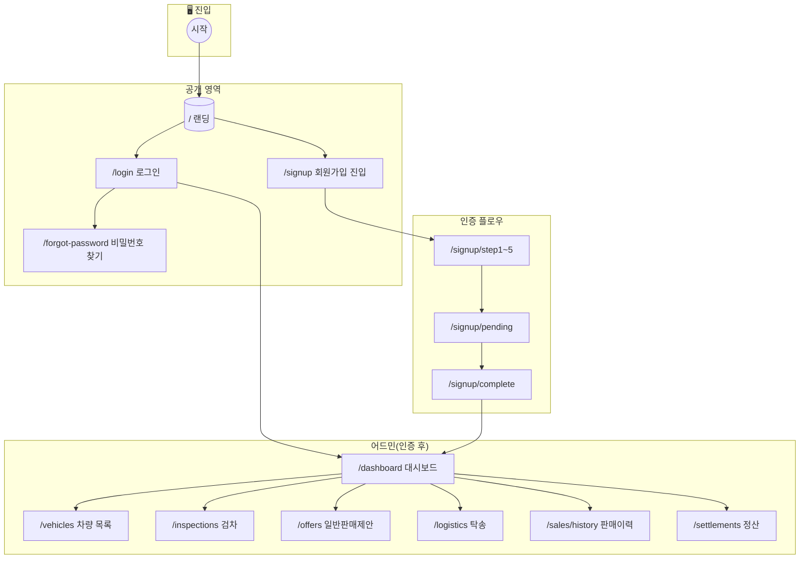
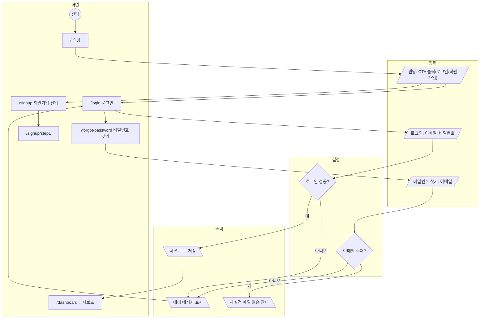
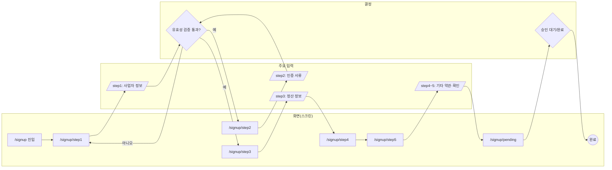
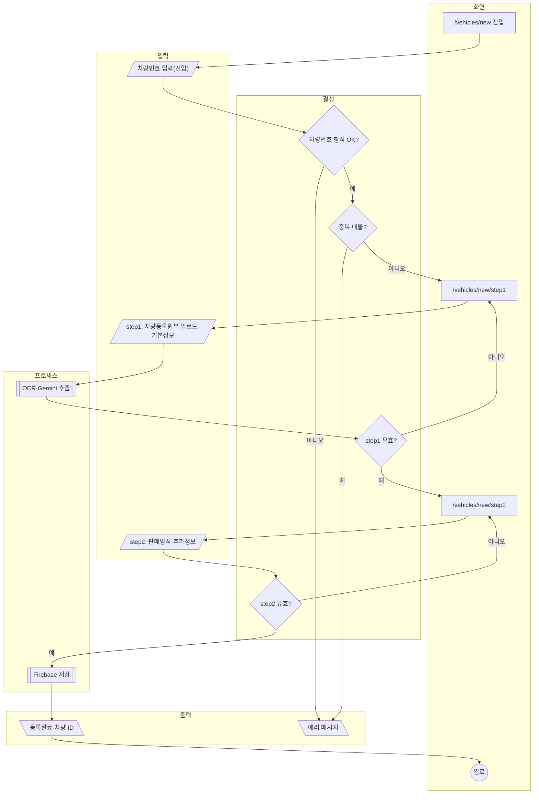
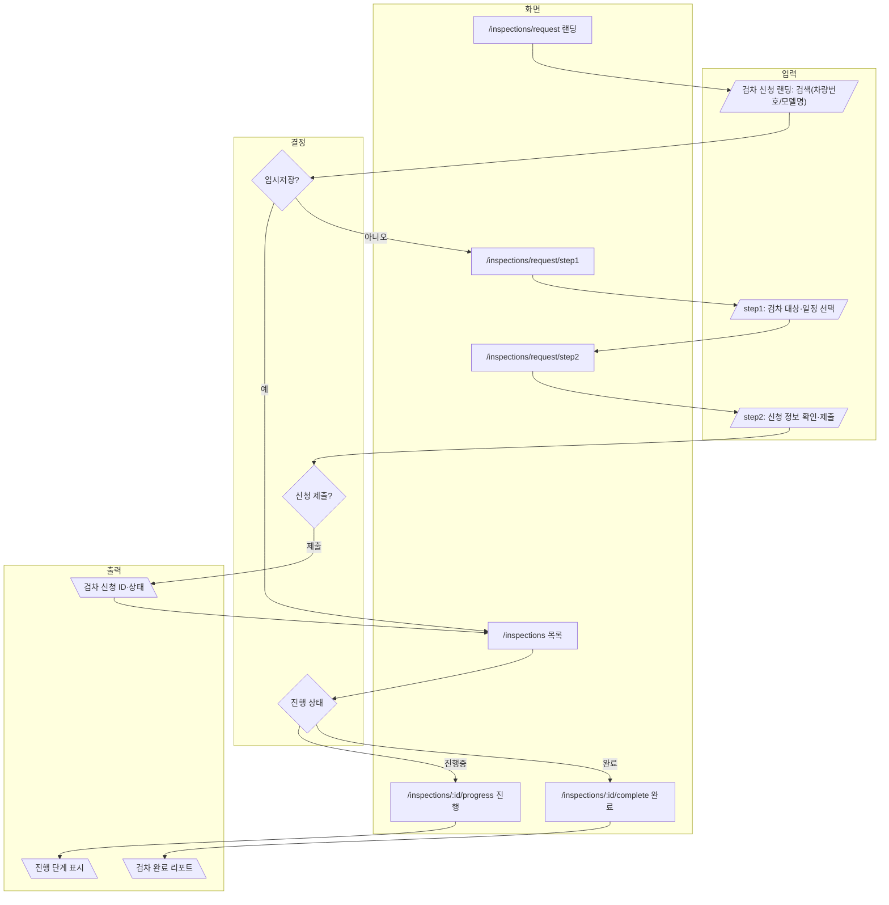
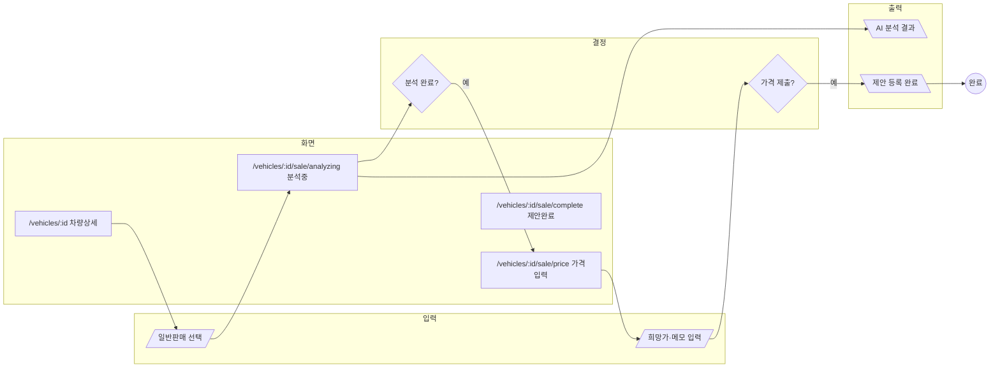
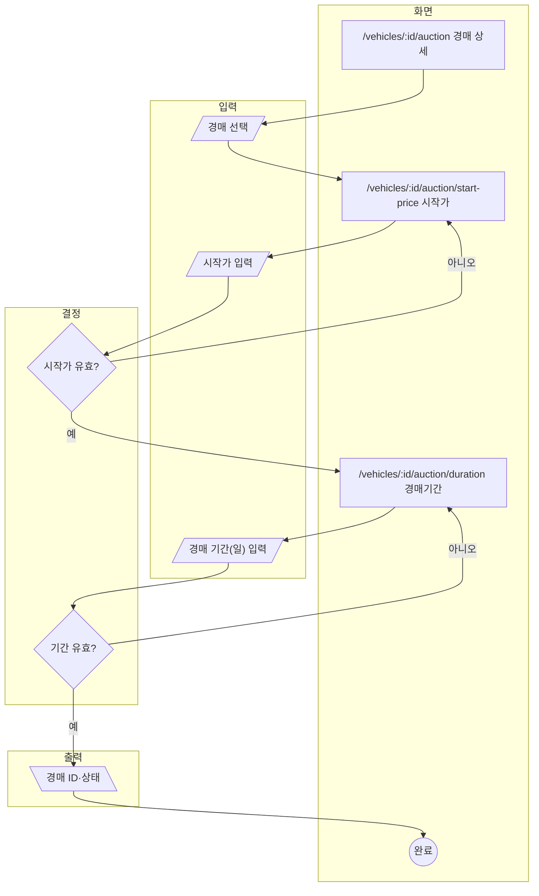
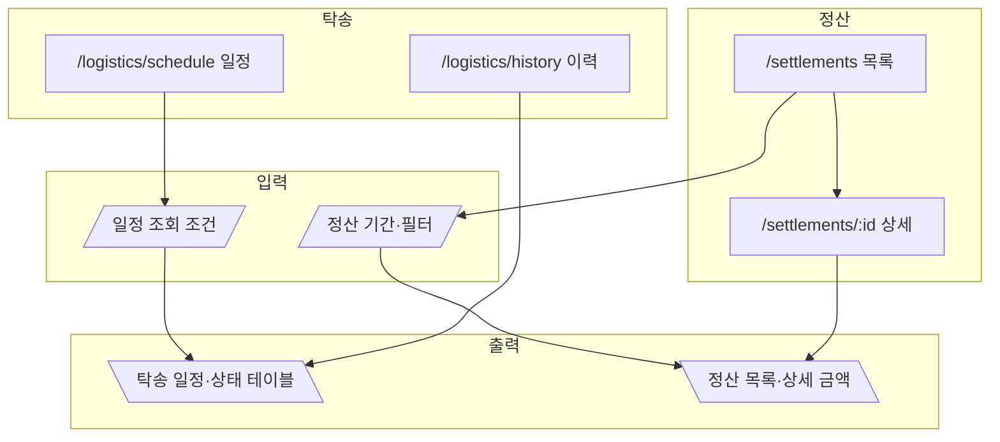
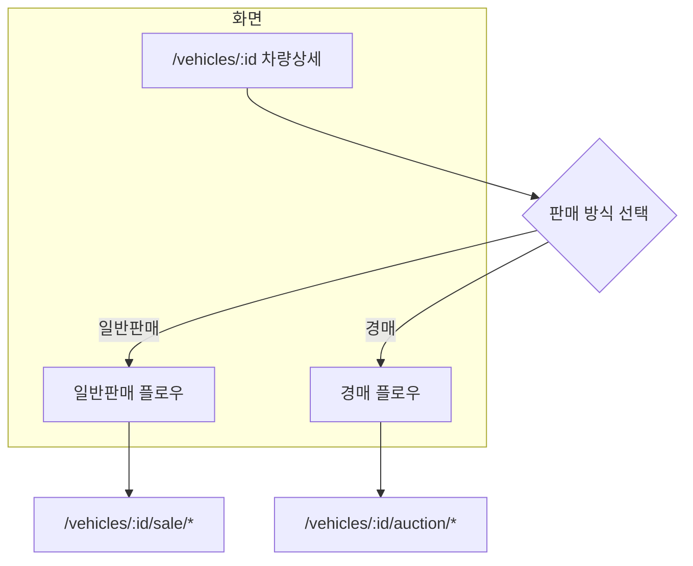

# ForwardMax (carivdealder) 스크린 플로우차트

**프로젝트**: B2B 중고차 수출 플랫폼  
**문서 목적**: 화면 전환·입력·출력·결정을 Mermaid 차트로 통일된 기호 체계로 표현

---

## 1. 공통 기호 체계 (인포그래픽 기준)

| 기호 | Mermaid 노드 | 의미 | 사용 예 |
|------|--------------|------|---------|
| **시작/종료** | `( )` rounded | 플로우 시작 또는 종료 | 진입점, 완료 화면 |
| **화면(스크린)** | `[ ]` rectangle | 사용자가 보는 페이지 | 라우트 단위 화면 |
| **결정** | `{ }` diamond | 조건 분기(예/아니오) | 검증, 선택, 승인 여부 |
| **입력** | `[/ /]` parallelogram-left | 사용자/시스템 입력 | 폼 입력, 업로드, API 요청 파라미터 |
| **출력** | `[\ \]` parallelogram-right | 시스템/화면 출력 | 저장 결과, API 응답, 표시 데이터 |
| **프로세스** | `[ ]` rectangle | 백그라운드 처리 | 검증, 저장, 연산 |
| **외부/서브** | `[[ ]]` subroutine | 외부 시스템·하위 플로우 | Firebase, Gemini OCR, 정산 배치 |

**플로우 방향**: 위→아래 또는 좌→우. 화살표에 라벨(`|레이블|`)로 입력/출력/조건을 명시.

---

## 2. 앱 전체 스크린 맵 (High-Level)

---

## 3. 랜딩·로그인 플로우 (입출력·결정 포함)

---

## 4. 회원가입 플로우 (스텝·입출력·결정)

---

## 5. 차량 등록 플로우 (OCR·입출력·결정)

---

## 6. 검차 신청 플로우 (입출력·결정)

---

## 7. 일반 판매 제안 플로우 (입출력·결정)

---

## 8. 경매 플로우 (입출력·결정)

---

## 9. 탁송·정산 플로우 (스크린 단위)

---

## 10. 차량 상세 → 판매방식 분기 (단일 결정 플로우)

---

## 11. 공통 기호 요약 (복사용 스니펫)

- **시작**: `(("시작"))`
- **종료**: `(("완료"))`
- **화면**: `["/path 화면명"]`
- **결정**: `{"조건?"}`
- **입력**: `[/"입력 설명"/]`
- **출력**: `[\"출력 설명"\]
- **프로세스**: `[["처리명"]]`

이 문서는 라우트·화면 단위로만 구성되어 있으며, 실제 API·상태(React Query 등)는 코드 기준으로 보완하면 됩니다.
