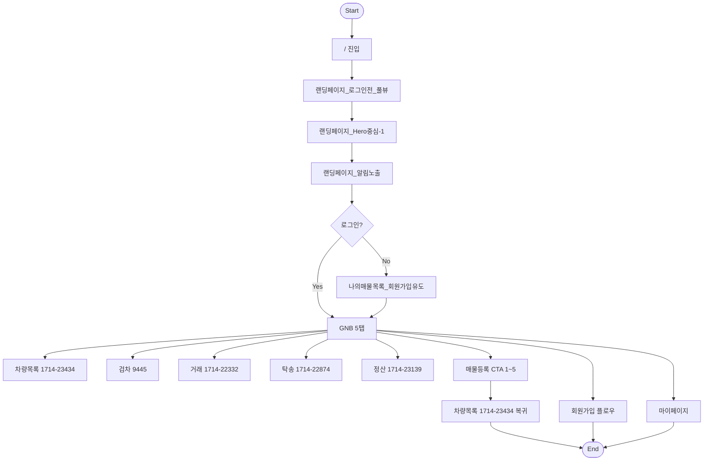
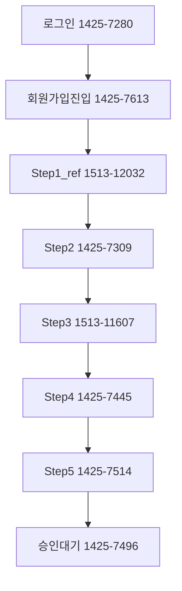
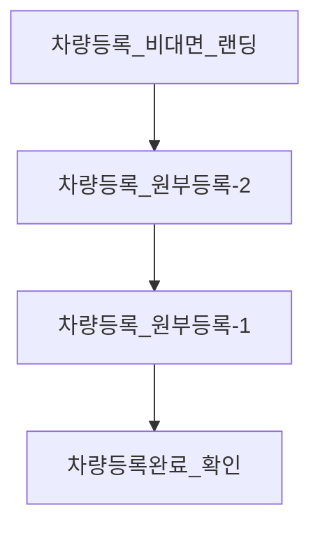
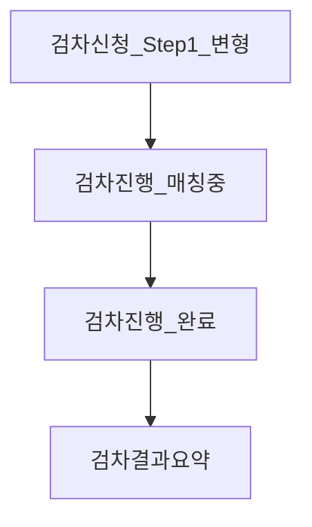

# IA 기능명세 (사이트맵 SSOT + I·P·O·E)

**목적**: 사용자 설정 사이트맵 위계를 SSOT로 한 IA 기능명세. 노드 명칭은 사이트맵 라벨만 사용하며, ERD/API는 아래 두 문서만 인용한다.

**ERD·API 참조 (유일 신뢰 문서)**  
- [CarivDealer_api_v1.md](../CarivDealer_api_v1.md)  
- [CarivDealer_API_ERD_Mapping.md](../CarivDealer_API_ERD_Mapping.md)

**참조 이미지 폴더**: [FIGMASCR0208](../../FIGMASCR0208/) — 사이트맵 위계에 따라 재구축됨(01_랜딩페이지 ~ 14_마이페이지). [INDEX.md](../../FIGMASCR0208/INDEX.md) 참고.

**Figma**: Domestic-Seller 1.0 — `fileKey` `4w3ft8RpGwoho5EtvNO9hQ`. 노드 URL: `https://www.figma.com/design/4w3ft8RpGwoho5EtvNO9hQ/Domestic-Seller-1.0?node-id={nodeId}` (nodeId는 FIGMASCR0208 파일명 기준, 하이픈 형식).

---

## 1. 개요

- **SSOT**: 사용자가 제시한 사이트맵(경로·노드 라벨·플로우). FIGMASCR0208 폴더는 참조용 이미지 경로만 제공.
- **기능 단위**: 랜딩, 회원가입 이전 GNB, GNB 5탭(차량목록/검차/거래/탁송/정산), 회원가입, 매물등록 CTA_1~5, 마이페이지. 각 기능에 **I(Input)·P(Process)·O(Output)·E(Exception)** 4블록 적용.
- **플로우**: 전역 플로우 1개 + 기능별 세부 플로우(Mermaid). 노드 ID는 공백/예약어 없음.

---

## 2. 전역 플로우

---

## 3. 사이트맵 계층 표

| 경로/탭 | nodeId | 노드(화면) 라벨 | 비고 |
|---------|--------|------------------|------|
| / 랜딩페이지 | 1368-37201, 1368-43715 | 랜딩페이지_로그인전_풀뷰 → 랜딩페이지_Hero중심-1 → 랜딩페이지_알림노출 | 순차 플로우 |
| 회원가입 이전 GNB | 1425-8153 | 나의매물목록_회원가입유도 | GNB 탭 클릭 시 비로그인 |
| GNB 차량목록 탭 | 1714-23434 | (탭 랜딩 컨테이너) | 사이드 필터: 전체(8153), 검차(8420), 판매거래(12046), 탁송(8636), 정산(8842) |
| GNB 검차 탭 | 1425-9445 | 검차요청내역_리스트_변형 | |
| GNB 거래 탭 | 1714-22332 | (탭 랜딩 컨테이너) | 리스팅 클릭 시 하단 상태 전환 |
| GNB 탁송 탭 | 1714-22874 | (탭 랜딩 컨테이너) | 동일 |
| GNB 정산 탭 | 1714-23139 | (탭 랜딩 컨테이너) | 동일 |
| / 회원가입 | 1425-7280, 1425-7613, 1513-12032, 1425-7309, 1513-11607, 1425-7445, 1425-7514, 1425-7496 | 로그인 → 회원가입진입 → Step1_ref~Step5 → 승인대기 | |
| 매물등록 CTA_1 | 1418-20498, 1418-20576 | 차량등록_비대면_랜딩 → 원부등록-2/-1 → 차량등록완료_확인 | |
| 매물등록 CTA_2 | 1444-8198, 1425-10137, 1425-10813, 1425-10285 | 검차신청_Step1_변형 → 검차진행_매칭중/완료 → 검차결과요약(변형) | 9445/9875 동일페이지에서 리스팅 클릭 시 상태 전환 |
| 매물등록 CTA_3 | 1418-20498, 1418-23705, 1418-23880, 1418-20576, 1418-24679, 1418-21690 | 판매방식선택 → 일반/경매 분기 → 시세분석중-1·시작가설정·판매전환완료-1·거래상세_변형/경매, 변형-1·변형-2(모달) | |
| 매물등록 CTA_4 | 1418-22630, 1418-25400, 1418-26827, 1418-27070, 1418-26325, 1418-26583, 1418-25219 | 목록뷰-1 → 새탁송예약_폼/주소검색/주소결과/폼-1/월선택/시간선택 → 기사배정_진행중 → 목록뷰-2 | |
| 매물등록 CTA_5 | 1418-27434, 1418-36405 | 정산현황_검차피드백-1·검차피드백 → 정산목록_정산필터카드뷰 | 종료 시 1714-23434 복귀 |
| 마이페이지 | 1418-36766, 1418-37804, 1418-37677/37170/37042, 1418-36901, 1418-37559, 1418-37298 | 내프로필 → 기본정보수정·딜러승인(반려/승인대기/승인완료)·사업자정보조회·내프로필-1·알림설정_변형·알림센터·알림센터-1 | 사이드바 = 페이지 전환 |

---

## 4. 기능별 명세 (I·P·O·E)

### 4.1 랜딩

| 구분 | 내용 |
|------|------|
| **I** | 진입: `/`. 전제: 없음. 입력: 스크롤/CTA 클릭. |
| **P** | 로그인전_풀뷰 표시 → Hero중심-1 → 알림노출(팝업 변형). API 없음(정적). |
| **O** | 화면: 랜딩 3단계. 라우트 `/`. |
| **E** | 알림 미노출 시 Hero중심-1에서 유지. |

**FSD**: `pages` / slice: `landing`.

**참조 이미지(전체 노드)**

| 노드(화면) | 스크린샷 | Figma 노드 |
|------------|----------|------------|
| 랜딩페이지_로그인전_풀뷰 | [§3.1_1368-37201_랜딩페이지_로그인전_풀뷰.png](../../FIGMASCR0208/01_랜딩페이지/§3.1_1368-37201_랜딩페이지_로그인전_풀뷰.png) | [1368-37201](https://www.figma.com/design/4w3ft8RpGwoho5EtvNO9hQ/Domestic-Seller-1.0?node-id=1368-37201) |
| 랜딩페이지_Hero중심-1 | [§3.1_1368-37201_랜딩페이지_Hero중심-1.png](../../FIGMASCR0208/01_랜딩페이지/§3.1_1368-37201_랜딩페이지_Hero중심-1.png) | [1368-37201](https://www.figma.com/design/4w3ft8RpGwoho5EtvNO9hQ/Domestic-Seller-1.0?node-id=1368-37201) |
| 랜딩페이지_알림노출 | [§3.1_1368-43715_랜딩페이지_알림노출.png](../../FIGMASCR0208/01_랜딩페이지/§3.1_1368-43715_랜딩페이지_알림노출.png) | [1368-43715](https://www.figma.com/design/4w3ft8RpGwoho5EtvNO9hQ/Domestic-Seller-1.0?node-id=1368-43715) |

**참조 API·ERD**

- **API**: [CarivDealer_api_v1.md](../CarivDealer_api_v1.md) 공통(응답 포맷·인증·Base URL).
- **ERD**: 해당 없음.

--- 

### 4.2 회원가입 이전 GNB

| 구분 | 내용 |
|------|------|
| **I** | 진입: GNB(차량목록·검차·거래·탁송·정산) 탭 클릭. 전제: 비로그인. |
| **P** | 인증 없음 감지 → 나의매물목록_회원가입유도 화면 표시. 선택: GET `/signup/status`(api_v1 §1)로 상태 확인 가능. |
| **O** | 화면: §3.7_1425-8153_나의매물목록_회원가입유도. |
| **E** | 로그인 시 GNB 5탭 목적지로 이동. |

**FSD**: `pages`(위젯 공유) — 비로그인 시 진입; GNB·사이드바는 `widgets`.

**참조 이미지(전체 노드)**

| 노드(화면) | 스크린샷 | Figma 노드 |
|------------|----------|------------|
| 나의매물목록_회원가입유도 | [§3.7_1425-8153_나의매물목록_회원가입유도.png](../../FIGMASCR0208/02_회원가입_이전_GNB/§3.7_1425-8153_나의매물목록_회원가입유도.png) | [1425-8153](https://www.figma.com/design/4w3ft8RpGwoho5EtvNO9hQ/Domestic-Seller-1.0?node-id=1425-8153) |

**참조 API·ERD**

- **API**: [CarivDealer_api_v1.md](../CarivDealer_api_v1.md) §1 GET `/signup/status`.
- **ERD**: 해당 기능 전용 ERD 인용 없음(회원가입 §4.8 참조).

---

### 4.3 GNB 차량목록 탭

| 구분 | 내용 |
|------|------|
| **I** | 진입: GNB "차량목록" 클릭. 전제: 로그인. 라우트: `/vehicles`(또는 동일). 쿼리: filter(전체/검차/판매거래/탁송/정산). |
| **P** | GET `/vehicles`(api_v1 §3) — `page`, `size`, `status`, `inspectionStatus`, `sort`. 또는 POST `/vehicles/search`(api_v1 §3). ERD: vehicle, CarivDealer_API_ERD_Mapping 차량 목록·필터. |
| **O** | 화면: 1714-23434 컨테이너. 사이드 필터별 1425-8153(전체), 1425-8420(검차), 1425-12046(판매거래), 1425-8636(탁송), 1425-8842(정산). 응답 `items[]`: vehicleId, vehicleNo, modelName, status, displayStatus, primaryCta 등(api_v1 §3.2). |
| **E** | `ok: false` 시 message 표시. 빈 목록 시 Empty 상태. |

**FSD**: `pages` / slice: `vehicle-list` (VehicleListPage); `widgets`: MainLandingSidebar, VehicleTable; `entities`: vehicle.

**참조 이미지(전체 노드)**

| 노드(화면) | 스크린샷 | Figma 노드 |
|------------|----------|------------|
| 나의매물목록_전체 | [§3.7_1425-8153_나의매물목록_전체.png](../../FIGMASCR0208/03_GNB_차량목록_탭/§3.7_1425-8153_나의매물목록_전체.png) | [1425-8153](https://www.figma.com/design/4w3ft8RpGwoho5EtvNO9hQ/Domestic-Seller-1.0?node-id=1425-8153) |
| 나의매물목록_검차필터_카드뷰 | [§3.7_1425-8420_나의매물목록_검차필터_카드뷰.png](../../FIGMASCR0208/03_GNB_차량목록_탭/§3.7_1425-8420_나의매물목록_검차필터_카드뷰.png) | [1425-8420](https://www.figma.com/design/4w3ft8RpGwoho5EtvNO9hQ/Domestic-Seller-1.0?node-id=1425-8420) |
| 나의매물목록_판매거래_탭 | [§3.7_1425-12046_나의매물목록_판매거래_탭.png](../../FIGMASCR0208/03_GNB_차량목록_탭/§3.7_1425-12046_나의매물목록_판매거래_탭.png) | [1425-12046](https://www.figma.com/design/4w3ft8RpGwoho5EtvNO9hQ/Domestic-Seller-1.0?node-id=1425-12046) |
| 나의매물목록_탁송필터_보정 | [§3.7_1425-8636_나의매물목록_탁송필터_보정.png](../../FIGMASCR0208/03_GNB_차량목록_탭/§3.7_1425-8636_나의매물목록_탁송필터_보정.png) | [1425-8636](https://www.figma.com/design/4w3ft8RpGwoho5EtvNO9hQ/Domestic-Seller-1.0?node-id=1425-8636) |
| 나의매물목록_정산 | [§3.7_1425-8842_나의매물목록_정산.png](../../FIGMASCR0208/03_GNB_차량목록_탭/§3.7_1425-8842_나의매물목록_정산.png) | [1425-8842](https://www.figma.com/design/4w3ft8RpGwoho5EtvNO9hQ/Domestic-Seller-1.0?node-id=1425-8842) |

**참조 API·ERD**

- **API**: [CarivDealer_api_v1.md](../CarivDealer_api_v1.md) §3 GET `/vehicles`, POST `/vehicles/search`, §3.2 등록매물 목록 `items[]` 필드(GET `/vehicles`).
- **ERD**: [CarivDealer_API_ERD_Mapping.md](../CarivDealer_API_ERD_Mapping.md) 테이블 vehicle, vehicle_file; §엔드포인트↔ERD 테이블 매핑; §차량 목록/일반 거래 관련 필터·정렬·상태 매핑; §UI 라벨↔vehicle.status/displayStatus/primaryCta; §필드 수준 매핑 - 차량·검차.

---

### 4.4 GNB 검차 탭

| 구분 | 내용 |
|------|------|
| **I** | 진입: GNB "검차" 클릭. 전제: 로그인. 라우트: `/inspections` 등. |
| **P** | 검차 목록: GET `/vehicles`(inspectionStatus) 또는 확장 시 검차 전용 REST(ERD_Mapping 검차 플로우). 리스팅 클릭 시 하단 상태(매칭/완료/결과) 전환. |
| **O** | 화면: §3.6_1425-9445_검차요청내역_리스트_변형. |
| **E** | 목록 API 미정의 시 GET `/vehicles`로 차량 기준 조회(ERD_Mapping §검차 TODO). |

**FSD**: `pages` / slice: `inspection` (InspectionListPage, InspectionHistoryPage); `features`: inspection/request-form; `entities`: inspection.

**참조 이미지(전체 노드)**

| 노드(화면) | 스크린샷 | Figma 노드 |
|------------|----------|------------|
| 검차요청내역_리스트_변형 | [§3.6_1425-9445_검차요청내역_리스트_변형.png](../../FIGMASCR0208/04_GNB_검차_탭/§3.6_1425-9445_검차요청내역_리스트_변형.png) | [1425-9445](https://www.figma.com/design/4w3ft8RpGwoho5EtvNO9hQ/Domestic-Seller-1.0?node-id=1425-9445) |

**참조 API·ERD**

- **API**: [CarivDealer_api_v1.md](../CarivDealer_api_v1.md) §3 GET `/vehicles`(inspectionStatus), §3.1 검차 신청 Request Body(POST `/vehicles/:id/inspections`); (확장) 검차 목록 전용 엔드포인트(§4·§5 검토).
- **ERD**: [CarivDealer_API_ERD_Mapping.md](../CarivDealer_API_ERD_Mapping.md) 테이블 inspection, inspection_place; §엔드포인트↔ERD; §검차 플로우 관련 필드/상태/열거; §엔티티별 화면·필드 매핑; §UI 라벨↔inspection.status; §추가/수정 필요 항목(TODO).

---

### 4.5 GNB 거래 탭 · 4.6 GNB 탁송 탭 · 4.7 GNB 정산 탭

| 구분 | 내용 |
|------|------|
| **I** | 진입: GNB "거래"/"탁송"/"정산" 클릭. 전제: 로그인. 컨테이너: 1714-22332, 1714-22874, 1714-23139. |
| **P** | 리스팅 데이터 로드 후 항목 클릭 시 하단 상세/상태 전환(상태 저장). 탁송·정산: CarivDealer_API_ERD_Mapping 물류/탁송·정산/매출 제안 참고. |
| **O** | 화면: 각 탭 랜딩 컨테이너. 05/06/07 폴더는 이미지 없음(컨테이너만). |
| **E** | API 확장 전까지 Mock 또는 기존 GET `/vehicles` 등 활용. |

**FSD**: `pages` — 거래: TradeListPage, TradeDetailPage; 탁송: LogisticsSchedulePage, LogisticsHistoryPage; 정산: SettlementListPage, SettlementDetailPage, SalesHistoryPage. `widgets`: MainLandingSidebar.

**참조 이미지(전체 노드)**  
해당 없음(05_GNB_거래_탭, 06_GNB_탁송_탭, 07_GNB_정산_탭 — 컨테이너 1714-22332, 1714-22874, 1714-23139만 존재, 이미지 파일 없음).

**참조 API·ERD**

- **API**: [CarivDealer_api_v1.md](../CarivDealer_api_v1.md) §3 GET `/vehicles`; §4 라우트↔API 매핑; §5 검토(탁송·정산·오퍼 확장 제안).
- **ERD**: [CarivDealer_API_ERD_Mapping.md](../CarivDealer_API_ERD_Mapping.md) §물류/탁송 플로우, §정산/매출 플로우, §오퍼/마이페이지 플로우(확장 제안).

---

### 4.8 회원가입

| 구분 | 내용 |
|------|------|
| **I** | 진입: 로그인(1425-7280) → 회원가입진입(1425-7613). 입력: Step1_ref~Step5 폼, 승인대기(1425-7496). API: POST `/auth/login`, `/auth/kakao/login`, `/auth/google/login`, GET `/signup/status`, POST `/auth/files`, PUT `/signup/dealer`, POST `/signup/dealer/submit`, PUT `/signup/settlement`(api_v1 §1·§2). |
| **P** | Step2: POST `/signup/dealer/business-number/verify` → PUT `/signup/dealer`. Step3: PUT `/signup/settlement`. ERD: seller_dealer, seller_dealer_address, seller_dealer_file, seller_dealer_pledge, seller_settlement_account(CarivDealer_API_ERD_Mapping 엔드포인트 매핑). |
| **O** | 화면: 로그인 → 회원가입진입 → Step1_ref~Step5 → 승인대기. 응답 nextStep·dealerVerificationStatus 반영. |
| **E** | `ok: false`, message 표시. 유효성 실패 시 필드 에러. |

**FSD**: `pages` / slice: `auth` (LoginPage, SignupEntryPage, SignupStep1Page~Step5Page, SignupPendingPage); `entities`: member, seller_docs.

**참조 이미지(전체 노드)**

| 노드(화면) | 스크린샷 | Figma 노드 |
|------------|----------|------------|
| 로그인 | [§3.2_1425-7280_로그인.png](../../FIGMASCR0208/08_회원가입/§3.2_1425-7280_로그인.png) | [1425-7280](https://www.figma.com/design/4w3ft8RpGwoho5EtvNO9hQ/Domestic-Seller-1.0?node-id=1425-7280) |
| 회원가입진입 | [§3.2_1425-7613_회원가입진입.png](../../FIGMASCR0208/08_회원가입/§3.2_1425-7613_회원가입진입.png) | [1425-7613](https://www.figma.com/design/4w3ft8RpGwoho5EtvNO9hQ/Domestic-Seller-1.0?node-id=1425-7613) |
| 회원가입_Step1_ref | [§3.2_1513-12032_회원가입_Step1_ref.png](../../FIGMASCR0208/08_회원가입/§3.2_1513-12032_회원가입_Step1_ref.png) | [1513-12032](https://www.figma.com/design/4w3ft8RpGwoho5EtvNO9hQ/Domestic-Seller-1.0?node-id=1513-12032) |
| 회원가입_Step2 | [§3.2_1425-7309_회원가입_Step2.png](../../FIGMASCR0208/08_회원가입/§3.2_1425-7309_회원가입_Step2.png) | [1425-7309](https://www.figma.com/design/4w3ft8RpGwoho5EtvNO9hQ/Domestic-Seller-1.0?node-id=1425-7309) |
| 회원가입_Step3 | [§3.2_1513-11607_회원가입_Step3.png](../../FIGMASCR0208/08_회원가입/§3.2_1513-11607_회원가입_Step3.png) | [1513-11607](https://www.figma.com/design/4w3ft8RpGwoho5EtvNO9hQ/Domestic-Seller-1.0?node-id=1513-11607) |
| 회원가입_Step4 | [§3.2_1425-7445_회원가입_Step4.png](../../FIGMASCR0208/08_회원가입/§3.2_1425-7445_회원가입_Step4.png) | [1425-7445](https://www.figma.com/design/4w3ft8RpGwoho5EtvNO9hQ/Domestic-Seller-1.0?node-id=1425-7445) |
| 회원가입_Step5 | [§3.2_1425-7514_회원가입_Step5.png](../../FIGMASCR0208/08_회원가입/§3.2_1425-7514_회원가입_Step5.png) | [1425-7514](https://www.figma.com/design/4w3ft8RpGwoho5EtvNO9hQ/Domestic-Seller-1.0?node-id=1425-7514) |
| 승인대기 | [§3.2_1425-7496_승인대기.png](../../FIGMASCR0208/08_회원가입/§3.2_1425-7496_승인대기.png) | [1425-7496](https://www.figma.com/design/4w3ft8RpGwoho5EtvNO9hQ/Domestic-Seller-1.0?node-id=1425-7496) |

**참조 API·ERD**

- **API**: [CarivDealer_api_v1.md](../CarivDealer_api_v1.md) §1 회원가입 전부(회원가입 표·§1.1 PUT `/signup/dealer` Request Body·§1.2 ERD와의 대응), §2 로그인 전부.
- **ERD**: [CarivDealer_API_ERD_Mapping.md](../CarivDealer_API_ERD_Mapping.md) §ERD 테이블·컬럼 목록(seller_user, seller_dealer, seller_dealer_address, seller_dealer_file, seller_dealer_pledge, seller_settlement_account, user_file, auth_refresh_token); §엔드포인트↔ERD 테이블 매핑; §필드 수준 매핑 - 회원가입·딜러; §API-only/DB-only/계산값; §불확실 항목 및 needs_domain_decision.

**세부 플로우**

---

### 4.9 매물등록 CTA_1 차량원부등록

| 구분 | 내용 |
|------|------|
| **I** | 진입: 헤더 "매물등록하기" 클릭. 라우트: `/vehicles/new` 등. 입력: 차량번호, 등록원부 파일. API: POST `/vehicle/files`(purpose=VEHICLE_REG_DOC), GET `/vehicles/lookup`, POST `/vehicles/ocr/parse`, POST `/vehicles`(action=DRAFT/SUBMIT)(api_v1 §3). |
| **P** | 비대면_랜딩 → 원부등록-2·원부등록-1(업로드·OCR) → 차량등록완료_확인. ERD: vehicle, vehicle_file(CarivDealer_API_ERD_Mapping). |
| **O** | 화면: §3.5_1418-20498_차량등록_비대면_랜딩 → 원부등록-2/-1 → §3.5_1418-20576_차량등록완료_확인. |
| **E** | lookup 중복 시 에러 메시지. OCR 실패 시 수동 입력. |

**FSD**: `pages` / slice: `vehicle` (VehicleRegisterEntryPage, VehicleRegisterStep1Page, VehicleRegistrationCompletePage); `features`: vehicle/register-form; `entities`: vehicle. (차량원부 다음→검차신청 직행, Step2 페이지 제거)

**참조 이미지(전체 노드)**

| 노드(화면) | 스크린샷 | Figma 노드 |
|------------|----------|------------|
| 차량등록_비대면_랜딩 | [§3.5_1418-20498_차량등록_비대면_랜딩.png](../../FIGMASCR0208/09_매물등록_CTA_1_차량원부등록/§3.5_1418-20498_차량등록_비대면_랜딩.png) | [1418-20498](https://www.figma.com/design/4w3ft8RpGwoho5EtvNO9hQ/Domestic-Seller-1.0?node-id=1418-20498) |
| 차량등록_원부등록-1 | [§3.5_1418-20498_차량등록_원부등록-1.png](../../FIGMASCR0208/09_매물등록_CTA_1_차량원부등록/§3.5_1418-20498_차량등록_원부등록-1.png) | [1418-20498](https://www.figma.com/design/4w3ft8RpGwoho5EtvNO9hQ/Domestic-Seller-1.0?node-id=1418-20498) |
| 차량등록_원부등록-2 | [§3.5_1418-20498_차량등록_원부등록-2.png](../../FIGMASCR0208/09_매물등록_CTA_1_차량원부등록/§3.5_1418-20498_차량등록_원부등록-2.png) | [1418-20498](https://www.figma.com/design/4w3ft8RpGwoho5EtvNO9hQ/Domestic-Seller-1.0?node-id=1418-20498) |
| 차량등록완료_확인 | [§3.5_1418-20576_차량등록완료_확인.png](../../FIGMASCR0208/09_매물등록_CTA_1_차량원부등록/§3.5_1418-20576_차량등록완료_확인.png) | [1418-20576](https://www.figma.com/design/4w3ft8RpGwoho5EtvNO9hQ/Domestic-Seller-1.0?node-id=1418-20576) |

**참조 API·ERD**

- **API**: [CarivDealer_api_v1.md](../CarivDealer_api_v1.md) §3 POST `/vehicle/files`(purpose=VEHICLE_REG_DOC), GET `/vehicles/lookup`, POST `/vehicles/ocr/parse`, POST `/vehicles`(action=DRAFT/SUBMIT).
- **ERD**: [CarivDealer_API_ERD_Mapping.md](../CarivDealer_API_ERD_Mapping.md) 테이블 vehicle, vehicle_file; §엔드포인트↔ERD; §필드 수준 매핑 - 차량·검차.

**세부 플로우**

---

### 4.10 매물등록 CTA_2 검차

| 구분 | 내용 |
|------|------|
| **I** | 진입: CTA_1 완료 후 이어서 또는 검차 탭 9445/9875에서 리스팅 클릭. 입력: 검차 장소·일정·결제. API: POST `/vehicles/:id/inspections`, GET `/vehicles/:id/inspections/latest`(api_v1 §3.1). |
| **P** | 검차신청_Step1_변형(1444-8198) → 검차진행_매칭중(10137)·완료(10813) → 검차결과요약(10285). ERD: inspection, inspection_place(CarivDealer_API_ERD_Mapping 검차 플로우). |
| **O** | 화면: §3.6 노드 순. 리스팅 클릭 시 하단 상태 전환. |
| **E** | inspection.status enum(REQUESTED, IN_PROGRESS, COMPLETED 등) 불일치 시 ERD_Mapping UI 라벨 매핑 참고. |

**FSD**: `pages` / slice: `inspection` (InspectionRequestStep1Page, InspectionRequestStep2Page, InspectionProgressPage, InspectionCompletePage); `features`: inspection/request-form; `entities`: inspection.

**참조 이미지(전체 노드)**

| 노드(화면) | 스크린샷 | Figma 노드 |
|------------|----------|------------|
| 검차신청_Step1_변형 | [§3.6_1444-8198_검차신청_Step1_변형.png](../../FIGMASCR0208/10_매물등록_CTA_2_검차/§3.6_1444-8198_검차신청_Step1_변형.png) | [1444-8198](https://www.figma.com/design/4w3ft8RpGwoho5EtvNO9hQ/Domestic-Seller-1.0?node-id=1444-8198) |
| 검차진행_매칭중 | [§3.6_1425-10137_검차진행_매칭중.png](../../FIGMASCR0208/10_매물등록_CTA_2_검차/§3.6_1425-10137_검차진행_매칭중.png) | [1425-10137](https://www.figma.com/design/4w3ft8RpGwoho5EtvNO9hQ/Domestic-Seller-1.0?node-id=1425-10137) |
| 검차진행_매칭중_변형 | [§3.6_1425-10137_검차진행_매칭중_변형.png](../../FIGMASCR0208/10_매물등록_CTA_2_검차/§3.6_1425-10137_검차진행_매칭중_변형.png) | [1425-10137](https://www.figma.com/design/4w3ft8RpGwoho5EtvNO9hQ/Domestic-Seller-1.0?node-id=1425-10137) |
| 검차진행_완료 | [§3.6_1425-10813_검차진행_완료.png](../../FIGMASCR0208/10_매물등록_CTA_2_검차/§3.6_1425-10813_검차진행_완료.png) | [1425-10813](https://www.figma.com/design/4w3ft8RpGwoho5EtvNO9hQ/Domestic-Seller-1.0?node-id=1425-10813) |
| 검차결과요약 | [§3.6_1425-10285_검차결과요약.png](../../FIGMASCR0208/10_매물등록_CTA_2_검차/§3.6_1425-10285_검차결과요약.png) | [1425-10285](https://www.figma.com/design/4w3ft8RpGwoho5EtvNO9hQ/Domestic-Seller-1.0?node-id=1425-10285) |
| 검차결과요약_변형 | [§3.6_1425-10285_검차결과요약_변형.png](../../FIGMASCR0208/10_매물등록_CTA_2_검차/§3.6_1425-10285_검차결과요약_변형.png) | [1425-10285](https://www.figma.com/design/4w3ft8RpGwoho5EtvNO9hQ/Domestic-Seller-1.0?node-id=1425-10285) |
| 검차요청내역_리스트 | [§3.6_1425-9445_검차요청내역_리스트.png](../../FIGMASCR0208/10_매물등록_CTA_2_검차/§3.6_1425-9445_검차요청내역_리스트.png) | [1425-9445](https://www.figma.com/design/4w3ft8RpGwoho5EtvNO9hQ/Domestic-Seller-1.0?node-id=1425-9445) |
| 검차요청내역_리스트_변형 | [§3.6_1425-9445_검차요청내역_리스트_변형.png](../../FIGMASCR0208/10_매물등록_CTA_2_검차/§3.6_1425-9445_검차요청내역_리스트_변형.png) | [1425-9445](https://www.figma.com/design/4w3ft8RpGwoho5EtvNO9hQ/Domestic-Seller-1.0?node-id=1425-9445) |
| 검차요청내역_카드뷰 | [§3.6_1425-9875_검차요청내역_카드뷰.png](../../FIGMASCR0208/10_매물등록_CTA_2_검차/§3.6_1425-9875_검차요청내역_카드뷰.png) | [1425-9875](https://www.figma.com/design/4w3ft8RpGwoho5EtvNO9hQ/Domestic-Seller-1.0?node-id=1425-9875) |

**참조 API·ERD**

- **API**: [CarivDealer_api_v1.md](../CarivDealer_api_v1.md) §3 POST `/vehicles/:id/inspections`, GET `/vehicles/:id/inspections/latest`; §3.1 검차 신청 Request Body.
- **ERD**: [CarivDealer_API_ERD_Mapping.md](../CarivDealer_API_ERD_Mapping.md) 테이블 inspection, inspection_place; §엔드포인트↔ERD; §검차 플로우 관련 필드/상태/열거; §엔티티별 화면·필드 매핑; §UI 라벨↔inspection.status; §추가/수정 TODO.

**세부 플로우**

---

### 4.11 매물등록 CTA_3 거래

| 구분 | 내용 |
|------|------|
| **I** | 진입: CTA_2 이후 또는 1714-22332 리스팅 클릭. 입력: 판매방식(일반/경매), 시세·시작가. API: GET `/vehicles/:id`. 탁송·경매 확장 시 ERD_Mapping 판매방식·경매 플로우. |
| **P** | 판매방식선택(1418-20498) → 일반: 시세분석중-1·시작가설정_보정·판매전환완료-1·거래상세_변형·거래상세_경매. 경매: 시세분석중-1·경매_시작가설정·경매시작가_값입력·판매전환완료-1·거래상세_경매-1. 예외: 거래상세_변형-1(차량삭제)·변형-2(임시저장) 모달. |
| **O** | 화면: §3.5 노드. |
| **E** | sale_mode 미저장 시 프론트 라우트만 반영(ERD_Mapping 판매방식 선택). |

**FSD**: `pages` / slice: `sale`, `auction` (GeneralSaleAnalyzingPage, GeneralSalePricePage, GeneralSaleCompletePage, AuctionStartPricePage, AuctionDurationPage, AuctionCompletePage, AuctionDetailPage, TradeDetailPage); `features`: auction/place-bid; `entities`: vehicle, trade, auction.

**참조 이미지(전체 노드)**

| 노드(화면) | 스크린샷 | Figma 노드 |
|------------|----------|------------|
| 차량등록진입_시세분석중-1 | [§3.5_1418-20498_차량등록진입_시세분석중-1.png](../../FIGMASCR0208/11_매물등록_CTA_3_거래/§3.5_1418-20498_차량등록진입_시세분석중-1.png) | [1418-20498](https://www.figma.com/design/4w3ft8RpGwoho5EtvNO9hQ/Domestic-Seller-1.0?node-id=1418-20498) |
| 판매방식선택 | [§3.5_1418-20498_판매방식선택.png](../../FIGMASCR0208/11_매물등록_CTA_3_거래/§3.5_1418-20498_판매방식선택.png) | [1418-20498](https://www.figma.com/design/4w3ft8RpGwoho5EtvNO9hQ/Domestic-Seller-1.0?node-id=1418-20498) |
| 판매전환완료-1 | [§3.5_1418-20576_판매전환완료-1.png](../../FIGMASCR0208/11_매물등록_CTA_3_거래/§3.5_1418-20576_판매전환완료-1.png) | [1418-20576](https://www.figma.com/design/4w3ft8RpGwoho5EtvNO9hQ/Domestic-Seller-1.0?node-id=1418-20576) |
| 거래상세_경매 | [§3.5_1418-21690_거래상세_경매.png](../../FIGMASCR0208/11_매물등록_CTA_3_거래/§3.5_1418-21690_거래상세_경매.png) | [1418-21690](https://www.figma.com/design/4w3ft8RpGwoho5EtvNO9hQ/Domestic-Seller-1.0?node-id=1418-21690) |
| 거래상세_경매-1 | [§3.5_1418-21690_거래상세_경매-1.png](../../FIGMASCR0208/11_매물등록_CTA_3_거래/§3.5_1418-21690_거래상세_경매-1.png) | [1418-21690](https://www.figma.com/design/4w3ft8RpGwoho5EtvNO9hQ/Domestic-Seller-1.0?node-id=1418-21690) |
| 경매_시작가설정 | [§3.5_1418-23705_경매_시작가설정.png](../../FIGMASCR0208/11_매물등록_CTA_3_거래/§3.5_1418-23705_경매_시작가설정.png) | [1418-23705](https://www.figma.com/design/4w3ft8RpGwoho5EtvNO9hQ/Domestic-Seller-1.0?node-id=1418-23705) |
| 경매_시작가설정_보정 | [§3.5_1418-23705_경매_시작가설정_보정.png](../../FIGMASCR0208/11_매물등록_CTA_3_거래/§3.5_1418-23705_경매_시작가설정_보정.png) | [1418-23705](https://www.figma.com/design/4w3ft8RpGwoho5EtvNO9hQ/Domestic-Seller-1.0?node-id=1418-23705) |
| 경매_시작가설정_보정-1 | [§3.5_1418-23705_경매_시작가설정_보정-1.png](../../FIGMASCR0208/11_매물등록_CTA_3_거래/§3.5_1418-23705_경매_시작가설정_보정-1.png) | [1418-23705](https://www.figma.com/design/4w3ft8RpGwoho5EtvNO9hQ/Domestic-Seller-1.0?node-id=1418-23705) |
| 경매시작가_값입력 | [§3.5_1418-23880_경매시작가_값입력.png](../../FIGMASCR0208/11_매물등록_CTA_3_거래/§3.5_1418-23880_경매시작가_값입력.png) | [1418-23880](https://www.figma.com/design/4w3ft8RpGwoho5EtvNO9hQ/Domestic-Seller-1.0?node-id=1418-23880) |
| 거래상세_변형 | [§3.5_1418-24679_거래상세_변형.png](../../FIGMASCR0208/11_매물등록_CTA_3_거래/§3.5_1418-24679_거래상세_변형.png) | [1418-24679](https://www.figma.com/design/4w3ft8RpGwoho5EtvNO9hQ/Domestic-Seller-1.0?node-id=1418-24679) |
| 거래상세_변형-1 | [§3.5_1418-24679_거래상세_변형-1.png](../../FIGMASCR0208/11_매물등록_CTA_3_거래/§3.5_1418-24679_거래상세_변형-1.png) | [1418-24679](https://www.figma.com/design/4w3ft8RpGwoho5EtvNO9hQ/Domestic-Seller-1.0?node-id=1418-24679) |
| 거래상세_변형-2 | [§3.5_1418-24679_거래상세_변형-2.png](../../FIGMASCR0208/11_매물등록_CTA_3_거래/§3.5_1418-24679_거래상세_변형-2.png) | [1418-24679](https://www.figma.com/design/4w3ft8RpGwoho5EtvNO9hQ/Domestic-Seller-1.0?node-id=1418-24679) |

**참조 API·ERD**

- **API**: [CarivDealer_api_v1.md](../CarivDealer_api_v1.md) §3 GET `/vehicles/:id`, PUT/PATCH/DELETE `/vehicles/:id`; §4·§5 경매/판매 확장 제안.
- **ERD**: [CarivDealer_API_ERD_Mapping.md](../CarivDealer_API_ERD_Mapping.md) §판매방식 선택 관련 필드/상태·엔드포인트; §경매 플로우 관련 필드/상태/엔드포인트.

---

### 4.12 매물등록 CTA_4 탁송

| 구분 | 내용 |
|------|------|
| **I** | 진입: CTA_3 이후 또는 1714-22874 리스팅 클릭. 입력: 주소(우편번호 검색)·일시(연·월·일·시간). API: CarivDealer_API_ERD_Mapping 물류/탁송 제안(GET/POST `/logistics/*`). |
| **P** | 판매_거래목록_목록뷰-1 → 새탁송예약_폼·주소검색·주소결과(모달) → 폼 복귀 → 폼-1(연도)·월선택·시간선택 → 탁송_기사배정_진행중 → 목록뷰-2. |
| **O** | 화면: §3.5·§3.10 노드. |
| **E** | logistics API 미구현 시 Mock. |

**FSD**: `pages` / slice: `logistics` (LogisticsSchedulePage, LogisticsHistoryPage); `entities`: logistics.

**참조 이미지(전체 노드)**

| 노드(화면) | 스크린샷 | Figma 노드 |
|------------|----------|------------|
| 판매_거래목록_목록뷰-1 | [§3.5_1418-22630_판매_거래목록_목록뷰-1.png](../../FIGMASCR0208/12_매물등록_CTA_4_탁송/§3.5_1418-22630_판매_거래목록_목록뷰-1.png) | [1418-22630](https://www.figma.com/design/4w3ft8RpGwoho5EtvNO9hQ/Domestic-Seller-1.0?node-id=1418-22630) |
| 판매_거래목록_목록뷰-2 | [§3.5_1418-22630_판매_거래목록_목록뷰-2.png](../../FIGMASCR0208/12_매물등록_CTA_4_탁송/§3.5_1418-22630_판매_거래목록_목록뷰-2.png) | [1418-22630](https://www.figma.com/design/4w3ft8RpGwoho5EtvNO9hQ/Domestic-Seller-1.0?node-id=1418-22630) |
| 새탁송예약_폼 | [§3.10_1418-25400_새탁송예약_폼.png](../../FIGMASCR0208/12_매물등록_CTA_4_탁송/§3.10_1418-25400_새탁송예약_폼.png) | [1418-25400](https://www.figma.com/design/4w3ft8RpGwoho5EtvNO9hQ/Domestic-Seller-1.0?node-id=1418-25400) |
| 새탁송예약_폼-1 | [§3.10_1418-25400_새탁송예약_폼-1.png](../../FIGMASCR0208/12_매물등록_CTA_4_탁송/§3.10_1418-25400_새탁송예약_폼-1.png) | [1418-25400](https://www.figma.com/design/4w3ft8RpGwoho5EtvNO9hQ/Domestic-Seller-1.0?node-id=1418-25400) |
| 새탁송예약_주소검색 | [§3.10_1418-26827_새탁송예약_주소검색.png](../../FIGMASCR0208/12_매물등록_CTA_4_탁송/§3.10_1418-26827_새탁송예약_주소검색.png) | [1418-26827](https://www.figma.com/design/4w3ft8RpGwoho5EtvNO9hQ/Domestic-Seller-1.0?node-id=1418-26827) |
| 새탁송예약_주소결과 | [§3.10_1418-27070_새탁송예약_주소결과.png](../../FIGMASCR0208/12_매물등록_CTA_4_탁송/§3.10_1418-27070_새탁송예약_주소결과.png) | [1418-27070](https://www.figma.com/design/4w3ft8RpGwoho5EtvNO9hQ/Domestic-Seller-1.0?node-id=1418-27070) |
| 새탁송예약_월선택 | [§3.10_1418-26325_새탁송예약_월선택.png](../../FIGMASCR0208/12_매물등록_CTA_4_탁송/§3.10_1418-26325_새탁송예약_월선택.png) | [1418-26325](https://www.figma.com/design/4w3ft8RpGwoho5EtvNO9hQ/Domestic-Seller-1.0?node-id=1418-26325) |
| 새탁송예약_월선택_변형 | [§3.10_1418-26325_새탁송예약_월선택_변형.png](../../FIGMASCR0208/12_매물등록_CTA_4_탁송/§3.10_1418-26325_새탁송예약_월선택_변형.png) | [1418-26325](https://www.figma.com/design/4w3ft8RpGwoho5EtvNO9hQ/Domestic-Seller-1.0?node-id=1418-26325) |
| 새탁송예약_시간선택 | [§3.10_1418-26583_새탁송예약_시간선택.png](../../FIGMASCR0208/12_매물등록_CTA_4_탁송/§3.10_1418-26583_새탁송예약_시간선택.png) | [1418-26583](https://www.figma.com/design/4w3ft8RpGwoho5EtvNO9hQ/Domestic-Seller-1.0?node-id=1418-26583) |
| 탁송_기사배정_진행중 | [§3.10_1418-25219_탁송_기사배정_진행중.png](../../FIGMASCR0208/12_매물등록_CTA_4_탁송/§3.10_1418-25219_탁송_기사배정_진행중.png) | [1418-25219](https://www.figma.com/design/4w3ft8RpGwoho5EtvNO9hQ/Domestic-Seller-1.0?node-id=1418-25219) |

**참조 API·ERD**

- **API**: [CarivDealer_api_v1.md](../CarivDealer_api_v1.md) §4·§5 탁송 확장 제안(라우트↔API, 검토 표).
- **ERD**: [CarivDealer_API_ERD_Mapping.md](../CarivDealer_API_ERD_Mapping.md) §물류/탁송 플로우 관련 필드/상태/엔드포인트.

---

### 4.13 매물등록 CTA_5 정산

| 구분 | 내용 |
|------|------|
| **I** | 진입: CTA_4 이후 또는 1714-23139 리스팅 클릭. API: CarivDealer_API_ERD_Mapping 정산/매출 제안(GET `/settlements`, GET `/sales/history`). |
| **P** | 정산현황_검차피드백-1·검차피드백 → 정산목록_정산필터카드뷰. 종료 시 1714-23434(차량목록) 복귀. |
| **O** | 화면: §3.11 노드. |
| **E** | 정산 API 미구현 시 Mock. |

**FSD**: `pages` / slice: `settlement` (SettlementListPage, SettlementDetailPage, SalesHistoryPage); `entities`: settlement.

**참조 이미지(전체 노드)**

| 노드(화면) | 스크린샷 | Figma 노드 |
|------------|----------|------------|
| 정산현황_검차피드백 | [§3.11_1418-27434_정산현황_검차피드백.png](../../FIGMASCR0208/13_매물등록_CTA_5_정산/§3.11_1418-27434_정산현황_검차피드백.png) | [1418-27434](https://www.figma.com/design/4w3ft8RpGwoho5EtvNO9hQ/Domestic-Seller-1.0?node-id=1418-27434) |
| 정산현황_검차피드백-1 | [§3.11_1418-27434_정산현황_검차피드백-1.png](../../FIGMASCR0208/13_매물등록_CTA_5_정산/§3.11_1418-27434_정산현황_검차피드백-1.png) | [1418-27434](https://www.figma.com/design/4w3ft8RpGwoho5EtvNO9hQ/Domestic-Seller-1.0?node-id=1418-27434) |
| 정산목록_정산필터카드뷰 | [§3.11_1418-36405_정산목록_정산필터카드뷰.png](../../FIGMASCR0208/13_매물등록_CTA_5_정산/§3.11_1418-36405_정산목록_정산필터카드뷰.png) | [1418-36405](https://www.figma.com/design/4w3ft8RpGwoho5EtvNO9hQ/Domestic-Seller-1.0?node-id=1418-36405) |

**참조 API·ERD**

- **API**: [CarivDealer_api_v1.md](../CarivDealer_api_v1.md) §4·§5 정산·매출 확장 제안.
- **ERD**: [CarivDealer_API_ERD_Mapping.md](../CarivDealer_API_ERD_Mapping.md) §정산/매출 플로우 관련 필드/상태/엔드포인트.

---

### 4.14 마이페이지

| 구분 | 내용 |
|------|------|
| **I** | 진입: GNB 상단 마이페이지. 라우트: `/mypage` 등. 전제: 로그인. API: CarivDealer_API_ERD_Mapping 오퍼/마이페이지 제안(GET `/me`, PATCH `/dealer/profile` 등). |
| **P** | 내프로필(36766) 랜딩. 사이드바 **페이지 전환**(필터 아님): 기본정보수정(37804), 딜러승인_반려(37677)/승인대기(37170)/승인완료(37042), 사업자정보조회(36901), 내프로필-1(비밀번호), 알림설정_변형(37559) → 알림센터(37298), 알림센터-1(고객지원/FAQ). |
| **O** | 화면: §3.8 노드. |
| **E** | 마이페이지 전용 API 미포함 시 api_v1 §5 확장 제안 참고. |

**FSD**: `pages` / slice: `mypage` (SettlementAccountPage 등); `widgets`: MypageSidebar; `entities`: member.

**참조 이미지(전체 노드)**

| 노드(화면) | 스크린샷 | Figma 노드 |
|------------|----------|------------|
| 내프로필 | [§3.8_1418-36766_내프로필.png](../../FIGMASCR0208/14_마이페이지/§3.8_1418-36766_내프로필.png) | [1418-36766](https://www.figma.com/design/4w3ft8RpGwoho5EtvNO9hQ/Domestic-Seller-1.0?node-id=1418-36766) |
| 내프로필-1 | [§3.8_1418-36766_내프로필-1.png](../../FIGMASCR0208/14_마이페이지/§3.8_1418-36766_내프로필-1.png) | [1418-36766](https://www.figma.com/design/4w3ft8RpGwoho5EtvNO9hQ/Domestic-Seller-1.0?node-id=1418-36766) |
| 기본정보수정 | [§3.8_1418-37804_기본정보수정.png](../../FIGMASCR0208/14_마이페이지/§3.8_1418-37804_기본정보수정.png) | [1418-37804](https://www.figma.com/design/4w3ft8RpGwoho5EtvNO9hQ/Domestic-Seller-1.0?node-id=1418-37804) |
| 딜러승인_반려 | [§3.8_1418-37677_딜러승인_반려.png](../../FIGMASCR0208/14_마이페이지/§3.8_1418-37677_딜러승인_반려.png) | [1418-37677](https://www.figma.com/design/4w3ft8RpGwoho5EtvNO9hQ/Domestic-Seller-1.0?node-id=1418-37677) |
| 딜러승인_승인대기 | [§3.8_1418-37170_딜러승인_승인대기.png](../../FIGMASCR0208/14_마이페이지/§3.8_1418-37170_딜러승인_승인대기.png) | [1418-37170](https://www.figma.com/design/4w3ft8RpGwoho5EtvNO9hQ/Domestic-Seller-1.0?node-id=1418-37170) |
| 딜러승인_승인완료 | [§3.8_1418-37042_딜러승인_승인완료.png](../../FIGMASCR0208/14_마이페이지/§3.8_1418-37042_딜러승인_승인완료.png) | [1418-37042](https://www.figma.com/design/4w3ft8RpGwoho5EtvNO9hQ/Domestic-Seller-1.0?node-id=1418-37042) |
| 사업자정보조회 | [§3.8_1418-36901_사업자정보조회.png](../../FIGMASCR0208/14_마이페이지/§3.8_1418-36901_사업자정보조회.png) | [1418-36901](https://www.figma.com/design/4w3ft8RpGwoho5EtvNO9hQ/Domestic-Seller-1.0?node-id=1418-36901) |
| 알림설정_변형 | [§3.8_1418-37559_알림설정_변형.png](../../FIGMASCR0208/14_마이페이지/§3.8_1418-37559_알림설정_변형.png) | [1418-37559](https://www.figma.com/design/4w3ft8RpGwoho5EtvNO9hQ/Domestic-Seller-1.0?node-id=1418-37559) |
| 알림센터 | [§3.8_1418-37298_알림센터.png](../../FIGMASCR0208/14_마이페이지/§3.8_1418-37298_알림센터.png) | [1418-37298](https://www.figma.com/design/4w3ft8RpGwoho5EtvNO9hQ/Domestic-Seller-1.0?node-id=1418-37298) |
| 알림센터-1 | [§3.8_1418-37298_알림센터-1.png](../../FIGMASCR0208/14_마이페이지/§3.8_1418-37298_알림센터-1.png) | [1418-37298](https://www.figma.com/design/4w3ft8RpGwoho5EtvNO9hQ/Domestic-Seller-1.0?node-id=1418-37298) |

**참조 API·ERD**

- **API**: [CarivDealer_api_v1.md](../CarivDealer_api_v1.md) §4·§5 오퍼·마이페이지 확장 제안.
- **ERD**: [CarivDealer_API_ERD_Mapping.md](../CarivDealer_API_ERD_Mapping.md) §오퍼/마이페이지 플로우 관련 필드/상태/엔드포인트.

---

## 5. Figma nodeId 정합성 (Verification 문서와의 불일치)

**기준**: 본 문서의 Figma 노드 URL은 **FIGMASCR0208 파일명에서 추출한 nodeId**를 사용함. [IA_FSD_COMPLETE_VERIFICATION_20260208.md](IA_FSD_COMPLETE_VERIFICATION_20260208.md)는 11섹션(§3.1~§3.11)·87프레임 기준으로 별도 nodeId·라우트를 나열함. 사이트맵(01~14 폴더)과 Verification의 **섹션/프레임 그룹핑이 다르므로** 아래 노드는 Verification에서 다른 섹션·이름으로 등장하거나, Figma 내 다른 프레임일 수 있음.

| IA §4 / FIGMASCR0208 (본 문서) | nodeId | Verification 문서 대응 | 비고 |
|--------------------------------|--------|------------------------|------|
| §4.3 차량목록 탭 (나의매물목록_전체 등) | 1425-8153, 8420, 12046, 8636, 8842 | §3.7 일반 판매 (1425:8153 등) | Verification은 "차량 목록"을 §3.4(1418:15487 등)로, "나의매물목록"을 §3.7로 구분. 동일 nodeId라도 Figma 내 다른 프레임일 수 있음. |
| §4.4 GNB 검차 탭 | 1425-9445 | §3.6 검차 (1425:9445) | 일치. |
| §4.1 랜딩 (Hero중심-1) | 1368-37201 | §3.1 랜딩 (1368:37201, 37364) | 37364는 본 문서 이미지 없음 — Figma 내 다른 프레임일 수 있음. |
| §4.10 검차 (10663 등) | — | §3.6 1425:10663 (픽업/이동중) | FIGMASCR0208에는 10663 PNG 없음. |
| §3.4 차량 목록 (Verification) | 1418-15487 등 13개 | 본 문서 §4.3은 1425-8153 계열 5개 | 사이트맵은 "GNB 차량목록 = 사이드 필터별 5뷰", Verification은 "차량 목록 13프레임" — 목록 구조 상이. |

**정리**: Figma URL은 **파일명 nodeId 기준**으로만 생성했으며, Verification과 불일치하는 경우 Figma에서 해당 node-id가 동일 화면을 가리키지 않을 수 있음. 이 경우 Figma 파일 내에서 동일 화면에 해당하는 프레임의 node-id를 확인해 교체하면 됨.

---

## 6. Mermaid 규칙

- 노드 ID: 공백·예약어(end, subgraph 등) 금지. 레이블 특수문자 시 쌍따옴표.
- flowchart TD/LR, Start/End, Input(평행사변형), Task, Server, Decision 일관 사용.
- 전역 플로우 §2, 세부 플로우는 기능별 1개(§4.8 회원가입 등).

---

## 7. 문서 이력

| 버전 | 일자 | 비고 |
|------|------|------|
| 1.0 | 2026-02-09 | 사이트맵 SSOT + I·P·O·E, FIGMASCR0208 재구축 반영, api_v1·ERD_Mapping만 참조 |
| 1.1 | 2026-02-09 | 안 B 확장: 참조 이미지 표에 스크린샷/Figma 노드 컬럼, §4.x별 FSD 레이어 매핑, §5 Verification 불일치 표 추가 |
