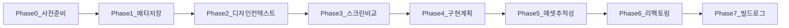

# Figma MCP 기반 페이지 디벨롭 워크플로 (Phase 0~7)

**목적**: 에이전트/개발자가 Figma SSOT로 페이지를 1:1 맞출 때 단계별로 따라갈 수 있는 요약.

---

## Phase 0: 사전 준비 (한 번만)

| 항목 | 내용 |
|------|------|
| **입력** | 구현할 페이지(노드) 결정 |
| **행동** | fileKey `4w3ft8RpGwoho5EtvNO9hQ` 고정. [NODE_TO_ROUTE_AND_FILE.md](NODE_TO_ROUTE_AND_FILE.md)에서 nodeId ↔ 라우트 ↔ FIGMASCR0208 경로 확인. MCP 반환물 저장 경로 규칙 확인: `mcp_outputs/{nodeId하이픈}/` |
| **산출물** | 작업 대상 nodeId 확정, mcp_outputs 하위 폴더명 확정 |

---

## Phase 1: 메타데이터 콜링·저장·정리

| 항목 | 내용 |
|------|------|
| **입력** | fileKey, nodeId(콜론 형식 예: `1418:24679`) |
| **행동** | 1) get_metadata 호출. 2) **응답 전문**을 `mcp_outputs/{nodeId하이픈}/metadata_raw.txt`에 저장. 3) [MCP_RESPONSE_CHECKLIST.md](MCP_RESPONSE_CHECKLIST.md)로 범주 A(노드 트리 XML), B(안내 문구) 수신 여부 체크. 4) 필요 시 XML만 추출해 별도 파일로 보관 |
| **산출물** | metadata_raw.txt, (선택) metadata_tree.xml |

---

## Phase 2: 디자인 컨텍스트 콜링·저장·매칭

| 항목 | 내용 |
|------|------|
| **입력** | fileKey, nodeId |
| **행동** | 1) get_design_context 호출. 2) **응답 전문**을 `mcp_outputs/{nodeId하이픈}/design_context_raw.txt`에 저장. 3) 범주 A~H 체크리스트로 수신 여부 점검. 4) 에셋 URL 목록(B) 파싱·정리(이후 Phase 5에서 사용). 5) **생성 코드(Component)** 에서 노드별 위치·크기 클래스(left, top, right, bottom, width, height) 추출. 6) 생성 코드의 **div 계층**(부모-자식) 구조 파악 |
| **산출물** | design_context_raw.txt, (선택) design_context_assets.json, (선택) 노드별 위치·크기 목록 메모 |

---

## Phase 3: 스크린 식별·이미지 비교

| 항목 | 내용 |
|------|------|
| **입력** | nodeId, NODE_TO_ROUTE_AND_FILE 매핑 |
| **행동** | 1) 해당 nodeId의 FIGMASCR0208 PNG 경로 확정(폴더 + 파일명 패턴). 2) get_screenshot 호출 시 (선택) `mcp_outputs/{nodeId하이픈}/screenshot.png` 저장. 3) MCP 스크린샷 vs FIGMASCR0208 PNG 비교(자동 diff 또는 체크리스트). 4) 불일치 시 **Figma(MCP) 기준**으로 구현한다고 기록 |
| **산출물** | 비교 결과 기록, 구현 기준 정책 확인 |

---

## Phase 4: 구현 계획 작성

| 항목 | 내용 |
|------|------|
| **입력** | Phase 1·2 산출물, NODE_TO_ROUTE_AND_FILE, [FSD_SPEC_BLUEPRINT](../figma/FSD_SPEC_BLUEPRINT.md) §2·§3 |
| **행동** | 1) `impl_plans/{nodeId하이픈}_구현계획.md` 작성. 2) 목표(노드·라우트), 변경 대상 파일, 의존성(라우트·위젯·z-index·공통 스타일·API) 사전 파악. 3) MCP 디자인 스타일 → 프로젝트 design-tokens 매핑. 4) **레이아웃 스펙**: metadata_raw.txt(또는 metadata_tree)와 design_context 생성 코드에서 노드 id별 (x, y, width, height) 테이블을 추출해 구현 계획서의 "레이아웃 스펙" 섹션에 반드시 넣는다. 5) 위험/주의사항 정리 |
| **산출물** | 노드별 구현 계획서(레이아웃 스펙 테이블 포함) |

---

## Phase 5: 에셋 전략·figma_image·추적성·컴포넌트 연동

| 항목 | 내용 |
|------|------|
| **입력** | design_context의 에셋 URL 목록, NODE_TO_ROUTE_AND_FILE·구현 계획서(적용 대상 컴포넌트) |
| **행동** | 1) `src/shared/figma_image/`(또는 프로젝트 규칙에 맞는 경로)에 에셋 다운로드·저장. 2) 네이밍 규칙 적용(예: `{nodeId하이픈}_{용도}_{이름}.png`). 3) **대상 컴포넌트**(예: LandingHeader, LandingPage)에서 해당 에셋을 import하고 JSX에 연동(검색 버튼·GNB 아이콘 등). 4) [FIGMA_ASSET_TRACEABILITY.md](FIGMA_ASSET_TRACEABILITY.md)에 로컬 파일명·원본 nodeId·용도·**실제 import한 파일 경로** 추가 |
| **산출물** | 공통 이미지 폴더, 대상 컴포넌트에 에셋 적용, FIGMA_ASSET_TRACEABILITY.md 갱신 |

---

## Phase 6: 리팩토링·리디자인 실행

| 항목 | 내용 |
|------|------|
| **입력** | 구현 계획서(레이아웃 스펙 포함), design_context_raw(위치·크기·div 계층), 프로젝트 스택·디자인 토큰 |
| **행동** | 1) 계획서의 **레이아웃 스펙** 테이블을 보고, 각 블록에 해당 노드의 x, y, width, height를 CSS(또는 design token)로 적용. 캔버스 기준이면 비율로 변환해도 되나 값은 테이블 기준. 2) design_context 생성 코드의 **div 계층**(부모-자식)을 유지해 같은 부모 안의 노드들은 같은 레이아웃 컨테이너에 두고, 부모의 위치·크기도 맞춤. 3) absolute 정책이 없으면 동일 수치 유지; flex/grid만 쓸 경우 left/top에 대응하는 간격·정렬로 동일 시각 결과를 내도록 적용. 4) JSDoc(공개 컴포넌트·훅·유틸), 파일 내부 주석(블록·의존성), 경로·의존성 명시. 5) **레이아웃 충실도 검증**: 주요 노드의 left, top, width, height가 구현에 반영되었는지 체크리스트로 확인. 누락/불일치 시 수정 후 Phase 7로 진행 |
| **산출물** | 수정된 소스, 주석·문서 반영, (선택) 레이아웃 검증 체크리스트 결과 |

---

## Phase 7: 빌드·검증·로그

| 항목 | 내용 |
|------|------|
| **입력** | 수정된 코드베이스 |
| **행동** | 1) `npm run dev` / `npm run build` 실행·검증. 2) [figMCP.MD](figMCP.MD)에 6하원칙(누가, 무엇을, 언제, 어디서, 왜, 어떻게) 항목 추가 |
| **산출물** | 빌드 성공 여부, figMCP.MD 로그 누적 |

---

## 워크플로 다이어그램

---

*문서 버전: 1.0 | 최종 업데이트: 2025-02-10*
