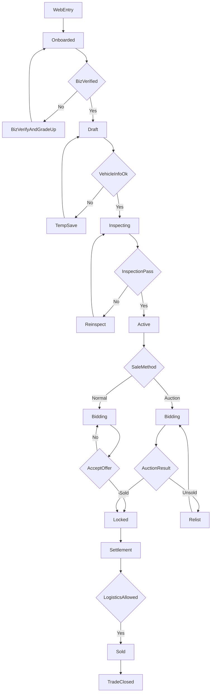

## ForwardMax 딜러 플랫폼 니즈 SSOT

**문서명**: ForwardMax 딜러 플랫폼 니즈 SSOT(단일 진실)  
**버전**: v1.0 (Frozen)  
**상태**: SSOT 확정  
**작성일**: 2025-12-23  
**최종 업데이트**: 2025-12-23  
**검증 기준일**: 2025-12-23  
**검증 상태**: 완료(부록 D 기준)  
**작성자**: (자동 생성)  
**검증 환경**: Windows 10 (win32 10.0.26200), Workspace `C:\fowardmax`  

---

## 0. SSOT 선언(가장 중요한 규칙)

- 본 문서는 **딜러 중심 플랫폼 니즈(요구·정책·목표치·플로우)의 SSOT**이다.
- 다른 문서/도표/슬라이드/대화 내용이 본 문서와 충돌할 경우, **본 문서의 정의를 우선**한다.
- 변경이 필요하면 반드시 **부록 C(충돌/갭 로그)**에 근거를 남긴 후 본문을 업데이트한다.
- **v1.0은 2025-12-23 기준 동결(Frozen)**이며, 변경이 생기면 v1.1+로 버전업하고 변경 근거를 남긴다.

---

## 0.1 근거 자료(입력 소스)

### 0.1.1 1차(코어)

- `C:\fowardmax\기술설계 기능및 목표치.md`
- `C:\fowardmax\중고차 거래 플랫폼 세부 플로우 및 BM 구조 .md`
- `C:\fowardmax\FLOW\*.png` (총 9개)

### 0.1.2 2차(보강/충돌 검출)

- `C:\fowardmax\통합설계명세서_1.md`
- `C:\fowardmax\기술설계서.md`
- `C:\fowardmax\웹앱환경분석데스크리서치.md`
- `C:\fowardmax\와이어프레임_작업_가이드라인.md`
- `C:\fowardmax\통합_PRD.md`

---

## 1. 범위(스코프)

### 1.1 포함(딜러 중심 플랫폼)

- **딜러 온보딩/인증**: “거래에 적합한 딜러만 진입”을 위한 사업자 인증/등급/권한 제어
- **차량 등록(자산화) + 임시 저장**: VIN 기반 중복 방지, 허위 매물 차단, 검차 데이터 결합을 위한 식별 정보
- **검차(필수)**: 평가사 배정/검차 수행/결과 업로드, **검차 결과 수정 불가(증거화)**
- **판매**: 일반 판매(제안→수락→바이어 구매 의사 재확인), 경매(기간/자동 낙찰, 유찰 관리)
- **정산/환전/송금 확인(플랫폼 주도)**: 계약 이후 “잔금→송금→환전 확인”을 플랫폼이 관리
- **탁송/인계(거래 종료 선언)**: 금전 절차 완료 이후에만 탁송 신청 가능, 인계 확인서/차키/서류 인계로 책임 종료

### 1.2 제외(본 SSOT에서는 다루지 않음)

- 해외 바이어용 웹(검색/구매 UX) 상세
- 문서 자동화 SaaS 상세(단, ‘딜러가 안 하게 만들어야 하는 일’ 관점에서만 참조)

---

## 2. 한 문장 정의(비전) + 코어골

### 2.1 한 문장 정의

딜러가 **원래 하던 일을 바꾸지 않고**, “검차 기반 신뢰”와 “부가세 환급 9.09%”를 중심으로 **플랫폼이 거래·서류·정산·물류의 부담과 리스크를 대신 책임지는** 딜러 중심 거래 운영체제.

### 2.2 코어골(최우선 목적)

- **딜러의 일을 늘리지 않는다**: 입력·단계가 늘수록 딜러는 이탈한다.
- **검차로 ‘증거’를 만든다**: 거래 분쟁의 기준점을 확보한다(수정 불가).
- **돈 흐름을 플랫폼이 끝까지 관리한다**: 잔금/송금/환전 확인 후에만 탁송으로 넘어간다.
- **“여기까지 오면 끝이다”를 만든다**: 탁송+인계 서류로 책임 경계를 확정한다.

---

## 3. 니즈(설계 철학) — “무엇을 더 하게 할 것인가”가 아니라 “무엇을 덜 하게 할 것인가”

### 3.1 딜러 인간 이해(행동 가정)

- 딜러는 중고차 거래 실무자이며, **새로운 업무 부담을 싫어한다**.
- 딜러는 “감성적 UX”보다 **짧고 명확하고 한 번에 끝나는 구조**를 선호한다.
- 딜러의 채택 트리거는 **명확한 금전적 이익**이며(부가세 환급 9.09%), 그 이익이 **리스크/서류/정산 불안**으로 상쇄되면 잔류하지 않는다.

### 3.2 금지 사항(SSOT 금지 규칙)

- “딜러가 원래 하던 일”에 **추가 입력/추가 확인/추가 설득**을 얹는 기능은 기본적으로 금지(필요 시 ‘왜 예외인지’ 근거 필요).
- 검차 결과는 딜러가 수정할 수 없다(수정 가능해지는 순간 ‘증거’가 아니라 ‘의견’이 됨).
- 탁송은 “계약만 됐으니 일단 보내자”가 아니다. **모든 금전 절차 완료 후에만** 가능해야 한다.

---

## 4. 비즈니스 모델(BM) — 딜러 유입 동기와 플랫폼 가치

### 4.1 딜러 유입 동기(핵심)

- **부가세 환급 9.09%**는 실질적인 유입 동기다.
- 단, 환급만으로는 부족하며, 플랫폼은 환급을 “미끼”로 쓰는 게 아니라 **환급을 받기 위한 전 과정(리스크/서류/정산/물류)을 대신 책임지는 구조**여야 한다.

### 4.2 플랫폼 수익원(니즈 관점)

- 서류 대행비
- 거래 수수료

---

## 5. 역할(Actor) 정의(딜러 중심)

- **딜러(판매자)**: 최소 입력, 검차 신청, 판매 방식 선택, 제안 수락, 인계 확인
- **플랫폼(운영/시스템)**: 딜러 인증, 평가사 배정, 마켓 노출/매칭, 계약/서류 생성, 잔금/송금/환전 확인, 탁송 조건 제어, 분쟁 최소화 정책 집행
- **평가사**: 검차 수행(사진/영상/성능 점검), 결과 업로드
- **탁송 기사**: 배차/탁송 수행, 인계(차키/서류) 확인
- **(참조) 관세사/포워더/세무**: 딜러 니즈(“내가 안 한다”)를 충족시키는 외부 역할로 흐름에 존재

---

## 6. 상태 모델(표준) + 마스터 플로우

### 6.1 시스템 상태(8단계)

| 단계 | 상태 키 | 한국어 의미 | 핵심 완료조건 |
|---:|---|---|---|
| 1 | Onboarded | 온보딩 완료 | 딜러 인증(사업자/권한) 완료 |
| 2 | Draft | 매물 등록(초안) | 차량 최소 식별 정보 저장 + 검차 신청 가능 |
| 3 | Inspecting | 검차/검증 중 | 평가사 배정 + 검차 진행/검증 |
| 4 | Active | 판매 가능(노출 활성화) | 검차 완료, 판매 방식 선택/노출 설정 |
| 5 | Bidding | 매칭/제안/입찰 | 바이어의 제안/입찰 수집·매칭 진행 |
| 6 | Locked | 계약/서류 | 계약 확정 + 필수 서류 생성/확정 |
| 7 | Settlement | 금전절차/정산 진행 | 잔금 입금 확인 → 송금 확인 → 환전 확인 (및 정산 계산/송금 포함 가능) |
| 8 | Sold | 거래 종료 | 인계(서류/차키/확인) 완료 + 정산 완료(필요 시 딜러 입금 포함) |

> 주의: 코어 문서에서 말하는 “임시/검차 중/검차 완료/판매 중”은 UI 표기이며, 위 상태키와 1:1 일치가 아닐 수 있다(부록 B 참고).

### 6.2 마스터 플로우 요약(딜러 관점)

회원가입/인증(Onboarded) → 차량 등록/임시(Draft) → 검차 신청/배정/수행(Inspecting) → 판매 가능 전환/판매방식 선택(Active) → 제안/입찰/매칭(Bidding) → 계약/서류(Locked) → 잔금/송금/환전 확인(Settlement) → (그때만) 탁송 예약/배차/인계 → 거래 종료(Sold)

### 6.3 마스터 플로우 다이어그램(병합본)

---

## 7. 플로우별 “Must/Should/Could” 니즈(요구사항)

### 7.1 회원가입/인증(딜러)

- **Must**
  - 사업자 인증은 필수(플랫폼이 거래 주체를 대신 보증하는 전제)
  - 인증 상태(심사 중/승인/반려)를 명확히 표시
  - 인증 완료 시 자동 권한 부여(차량 업로드/검차 신청 가능)
  - 재인증/수정 요청 기능
- **Should**
  - “한 번만 하면 끝난다” 인식이 생기도록 UX/정책 설계
  - 입력은 최소화(딜러 이탈 방지)
- **Could**
  - KYC/AML 확장은 ‘사기/부정사용’이 실제로 발생하는 지점 중심으로 단계적 적용

### 7.2 차량 등록(자산화) + 임시 저장

- **Must**
  - 차량 등록은 판매용 소개가 아니라 “식별/추적/검증” 목적
  - 최소 필드: VIN(차대번호), 차량번호, 제조사, 모델, 연식, 주행거리
  - VIN 기반 중복 등록 방지
  - 임시 저장(중단/복귀 가능한 구조)
- **Should**
  - 허위 매물 차단(식별 정보 + 검차 데이터 결합 전제)
  - 압류/저당 등 리스크 요인 조회/표시(딜러 입력 부담 최소화 전제)
- **Could**
  - 차량 상세 정보 확장(옵션/이미지 각도 등)은 “딜러 입력 부담”과 맞교환이므로 단계적

### 7.3 검차(필수)

- **Must**
  - 검차 없이는 판매 단계 진입 불가(검증되지 않은 거래 차단)
  - 평가사 배정 + 일정 조율
  - 검차 결과 **수정 불가**
- **Should**
  - 딜러가 검차 비용을 부담(“좋은 차를 팔 의지가 있는 딜러” 필터)
- **Could**
  - 검차 결과 기반 분쟁/환불 판정 룰(증거 활용) 정교화

### 7.4 판매(일반/경매)

- **Must**
  - 판매 방식 선택 UI(일반/경매)
  - 일반 판매: 제안(바이어)→수락(딜러)→구매 의사 재확인(바이어)
  - 경매: 기간 설정→자동 낙찰(유찰 관리 포함)
  - 상태 표기(UI): 임시/검차 중/검차 완료/판매 중/판매 완료
- **Should**
  - 노쇼/변심을 구조적으로 줄이는 절차(재확인 등)
- **Could**
  - 판매 방식 변경 정책(변경 시 상태/재검차 필요 여부)

### 7.5 정산/환전/송금 확인 → 탁송(거래 종료)

- **Must**
  - 계약 이후 “잔금 입금 확인 → 송금 확인 → 환전 확인”을 플랫폼이 관리
  - 탁송 신청은 **모든 금전 절차 완료 후**에만 가능
  - 탁송 일정 조율 및 배차 확정(확정 후 변경 제한)
  - 차량 상태 동일 확인서 + 차키/서류 인계로 책임 종료
- **Should**
  - 탁송 지연/누락 방지(리마인드/예외 처리/위약금 등)
- **Could**
  - “탁송 10분 후 정산 완료” 같은 정산 알림 UX(신뢰 강화)

---

## 8. 목표치(성공 조건)

### 8.1 인증(딜러)

- 인증 완료율은 높되, **허위·부적합 딜러 유입률 최소화**
- 인증 완료 이후 이탈률 최소화
- “한 번만 하면 끝난다” 인식 형성

### 8.2 검차/거래

- 검차 완료 차량 비율 증가
- 검차 이후 거래 성사율 유의미한 상승
- 상태 관련 클레임 감소

### 8.3 판매 운영

- 판매 지연 차량 최소화
- 유찰률 관리
- 판매 방식별 거래 성사율 분석 가능

### 8.4 탁송/종료

- 거래 종료 이후 분쟁 최소화
- 탁송 지연 및 누락 방지
- “여기까지 오면 끝이다”라는 명확한 인식 제공

---

## 9. 오픈 이슈(결정 필요사항)

- **인증 입력 범위(최소 vs 확장)**: 코어 니즈는 ‘최소 입력’을 요구하나, 일부 FLOW에는 KYC/AML 등 확장 입력이 포함됨
- **판매 방식 변경 정책**: 변경 가능 여부, 변경 시 상태 변화/재검차 필요 여부
- **Bidding 단계 범위**: 공개 입찰 vs 제안(오퍼) 수집 vs 하이브리드(둘 다 지원)
- **유찰 처리 기본값**: 유찰 시 자동 재경매/가격 조정/일반 판매 전환 중 무엇을 기본으로 둘지
- **정산 완료 정의**: ‘금전 확인(Settlement)’과 ‘딜러 최종 입금/거래 종료(Sold)’의 경계 정의
- **수수료/패널티 정책**: 정산에 반영되는 수수료/검차비 환급/패널티(위약금 포함) 기준
- **필수 서류 범위/책임**: 말소증 등 필수 서류의 범위/제출 주체/검증 책임/미이행 페널티
- **인계 승인 방식**: 확인서/사진/PIN/타임스탬프 등 ‘책임 이관’ 정의 및 증거 정책
- **6-Day 타임라인**: 기준 시점, 단계별 SLA, 예외 처리(지연/반려/버퍼) 정의
- **탁송 예외/위약금**: 연락 두절/서류 미준비/주소 오류 등 예외 시 비용/위약금 정책

---

## 부록 A. FLOW 이미지 전사(요약본)

### A-1. `FLOW\image copy 3.png` — 플로우 구조 요약

- 웹 진입(비회원) → 회원가입/인증 → (분기) 사업자 인증 여부 → 업로드/검차 신청 → 평가사 배정/검차 → 마켓 노출/매칭 → (분기) 제안 수락 → 계약/서류 → 바이어 결제 확인 → 송금/환전 확인 → 탁송/완료

### A-2. `FLOW\image.png` — 참여자별 전체 프로세스(스윔레인)

- 딜러 축: 회원가입 → 매물 등록(차량 기본 등록/압류·저당 확인/판매방식 선택) → 차량 검사 → 차량 판매(계약금/잔금 확인) → 정산 및 탁송(배차/보험/인계/보관소/최종검수)
- 평가사: 검차 수행
- 탁송 기사: 배차/탁송
- 참조: 수출 말소/수출신고필증 관련 서류(관세사/포워더/컨테이너) 흐름 존재

### A-3. `FLOW\image copy 2.png` — 기본 플로우(스테이지)

- 1~8단계 스테이지(회원가입/매물등록/검증/노출/매칭/계약/정산/탁송)

### A-4. `FLOW\image copy 4.png` — 회원가입 및 인증

- 회원가입/인증 → (분기) 사업자 인증 완료 여부
- 미완료: 사업자등록증 업로드 → OCR/진위 확인 → (분기) 성공 여부
- 입력 항목군: 기본 계정/사업자/매매업 인증/정산 계좌/KYC/약관 동의

### A-5. `FLOW\image copy 5.png` — 업로드 및 검차 신청

- 차량 기본 정보 입력(임시 가능) → 검차 신청 → 평가사 배정 → 검차 수행 → 결과 업로드

### A-6. `FLOW\image copy 6.png` — 차량 상세페이지 구성

- 사진/영상/기본정보/거래정보/옵션(대규모) 등 고밀도 구성

### A-7. `FLOW\image copy 7.png` — 업로드 상태 및 판매 프로세스

- 판매 방식(일반/경매) 선택
- 일반: 제안 수락(딜러) → 최종 확인(바이어) → 계약
- 경매: 낙찰/유찰 → 계약
- 계약 후: 잔금 입금 확인 → 송금 확인 → 환전 확인(이후 탁송 신청 가능)

### A-8. `FLOW\image copy 8.png` — 탁송 플로우

- 탁송 신청/예약 → 희망 시간 선택 → 배차 조율/확정 → 리마인드 → 탁송/인계 → 정산 완료 알림
- 예외 메모: 차량 준비/키·서류/연락/주소 오류 → 위약금/재방문 비용 등 정책 후보

### A-9. `FLOW\image copy.png` — 화면 구조 스케치

- 딜러: 검사 신청/매물 등록/거래/서류/탁송 중심 화면 묶음(초안)

---

## 부록 B. 용어/상태 표준(SSOT 기준)

### B-1. 용어

- **검차**: 차량 상태를 ‘증거’로 만들기 위한 평가사 수행 점검(본 문서의 표준 용어). ‘검사’는 동의어로만 취급.
- **임시 저장**: 차량 등록 과정의 중단/복귀 기능(딜러 이탈 방지 목적).
- **일반 판매**: 바이어 제안 → 딜러 수락 → 바이어 최종 구매 의사 재확인.
- **경매**: 기간 내 최고가 낙찰, 유찰 가능.
- **금전 절차**: (최소) 잔금 입금 확인 → 송금 확인 → 환전 확인.
- **탁송**: 물류 단계이면서 거래 종료 선언(인계 확인서/차키/서류 인계).

### B-2. UI 상태(간소화) ↔ 시스템 상태(8단계) 매핑

| UI 표기(간소화) | 대응 시스템 상태 | 비고 |
|---|---|---|
| 임시 | Draft | 임시 저장 포함 |
| 검차 중 | Inspecting | 평가사 배정/검차 진행 |
| 검차 완료 | Active | 판매 가능 전환 |
| 판매 중 | Bidding 또는 Active | 판매 방식/노출 여부에 따라 변동 |
| 판매 완료 | Locked/Settlement/Sold | ‘판매’의 정의(계약/정산/탁송 포함 여부)에 따라 분해 필요 |

---

## 부록 C. 2차 문서 정합성 검증(Align/Extend/Conflict)

### C-0. 검증 방법/기준

- **검증 방법**: 2차 문서 4개(`통합설계명세서_1.md`, `기술설계서.md`, `웹앱환경분석데스크리서치.md`, `통합_PRD.md`)를 대상으로 키워드 검색 후 해당 섹션을 원문 확인하여 SSOT와 비교(2025-12-23).
- **분류 정의**
  - **Align**: SSOT와 동일하거나 SSOT를 보강(충돌 없음)
  - **Extend**: SSOT에 없는 추가 요구/상세(채택 여부 결정 필요)
  - **Conflict**: SSOT와 충돌(SSOT 우선, 오픈 이슈로 격상/정의 보정 필요)

### C-1. 정합성 결과(요약 테이블)

| ID | 항목 | 분류 | SSOT 영향/조치(현재) | 근거(2차 문서) |
|---|---|---|---|---|
| C-001 | Settlement 단계 의미 정의(D-001) | Extend | 본문 **9절 ‘정산 완료 정의’**로 유지. 옵션(계산 시작 vs 송금 완료 vs 전체 프로세스)을 SSOT 결정안으로 채택 후보. | `통합설계명세서_1.md` 16.2(D-001) / `통합_PRD.md` 부록 C |
| C-002 | Bidding 단계 범위 정의(D-002) | Extend | 본문 **9절에 ‘Bidding 단계 범위’ 오픈 이슈 추가 완료**(공개 입찰 vs 제안 수집 vs 하이브리드). | `통합설계명세서_1.md` 16.2(D-002) |
| C-003 | Sold 상태 기준(탁송/인계 vs 정산 송금 완료) | Conflict | 본문 6절의 Sold 정의를 **‘거래 종료(인계+정산 완료 포함)’로 보정**하여 충돌 완화. 단 경계/트리거는 9절 오픈 이슈로 유지. | `통합설계명세서_1.md` 9.1 단계 14(정산 송금 후 Sold) / `통합_PRD.md` 8.2 |
| C-004 | 말소증 업로드(OCR/검증) 단계 | Extend | SSOT 본문에는 “서류 위임”만 존재 → **Locked 이후 필수 서류(예: 말소증) 수집/검증을 플랫폼이 책임**(딜러 부담 최소)으로 확장 후보. | `통합설계명세서_1.md` 9.1 단계 10 / `통합_PRD.md` 단계 9 |
| C-005 | 인계 승인: 6자리 PIN + 타임스탬프(책임 이관) | Extend | 본문 7.5에 “인계 확인서/차키/서류”는 있으나 승인 메커니즘 미정 → **PIN/타임스탬프는 ‘분쟁 최소화’ 관점의 보강 후보**. | `통합설계명세서_1.md` 9.1 단계 13 / `통합_PRD.md` 단계 12 |
| C-006 | 정산 속도 KPI(바이어 결제 확인→딜러 입금 6일) | Extend | 본문 8절 KPI가 정성적 중심 → **정산 KPI(6일) 추가는 선택 적용**(코어 문서에는 미등장). | `통합설계명세서_1.md` KPI-004 / `통합_PRD.md` KPI-004 |
| C-007 | 탁송 리스크(파손/사고)와 보험 의무화 | Extend | 본문 7.5에 탁송 예외/위약금만 존재 → **보험/인계 시점 증거(사진) 의무화는 보강 후보**. | `통합설계명세서_1.md` 리스크 섹션 |
| C-008 | 문서 자동화(DMS) 상세(문서 분류/OCR/자동생성/공유) | Extend(범위 밖 상세) | 본문 1.2에서 SaaS 상세는 제외. 단 “딜러가 안 하게 만들어야 하는 일”로서 **서류 위임 니즈는 Align**. | `기술설계서.md` “문서 자동화 플랫폼” |
| C-009 | 바이어 웹(AI 검색/경매/즉시구매) 상세 | Extend(범위 밖) | 본문 1.2(제외)로 처리. 딜러 SSOT에는 **참조만**. | `기술설계서.md` / `통합_PRD.md` 6.2 |
| C-010 | 시장/환경 분석(PESTEL/STP/수출 대상국) | Align(배경) | SSOT 목적(딜러 니즈)과 직접 충돌 없음. **배경 문서로만 유지**. | `웹앱환경분석데스크리서치.md` |
| C-011 | RBAC 매트릭스(D-003) | Extend | SSOT의 Actor 정의는 단순. 구현 전 **권한 매트릭스 확정 필요**(오픈 이슈 후보). | `통합설계명세서_1.md` 16.2(D-003) |
| C-012 | 수수료/패널티 정책(D-005) | Extend | 본문 4절 수익원만 있고 산정/패널티 미정 → **정산/신뢰에 직결**이므로 오픈 이슈 후보. | `통합설계명세서_1.md` 16.2(D-005) |
| C-013 | 재시도/장애/에러핸들링 정책(D-010) | Extend | 본문 비기능 요구 미정 → 운영 안정성 니즈로 확장 후보. | `통합설계명세서_1.md` 16.2(D-010) |

---

## 부록 D. SSOT QA 체크리스트(검증 완료 기준)

### D-0. 검증 범위

- **포함**
  - `C:\fowardmax\*.md` 총 7개
  - `C:\fowardmax\FLOW\*.png` 총 9개
- **제외**
  - PDF/DOCX/HWPX 등 비-MD 산출물(요약/근거 참조용)

### D-1. 완료 기준 및 결과

| 검증 항목 | 완료 기준 | 검증 방법(재현 가능) | 결과 |
|---|---|---|---|
| 입력 파일 수(MD) | MD 파일 수가 문서에 명시된 값과 일치 | `glob_file_search("*.md")` + PowerShell `Get-ChildItem -Filter *.md -Recurse | Measure-Object` 교차 검증 | 완료(7) |
| 입력 파일 수(FLOW) | FLOW 이미지 수가 문서에 명시된 값과 일치 | `glob_file_search("FLOW/*.png")` + `list_dir("FLOW")` 교차 검증 | 완료(9) |
| 한글/표기 무결성 | 한글이 깨지지 않고 읽히며, 파일이 UTF-8로 저장됨 | 파일 원문 `read_file`로 확인(표기 정상) | 완료 |
| 패치/이스케이프 잔여물 | `\\n`, `*** End Patch` 등 잔여 문자열이 없음 | `grep("\\\\n|\\*\\*\\* End Patch")` | 완료 |
| 용어 표준 | ‘검차’를 표준 용어로 사용하고(예외는 동의어/이미지 전사) 혼용이 의도적으로 관리됨 | `부록 B` 및 전체 본문 검색으로 확인 | 완료 |
| 플로우-정책 정합 | “금전 절차 완료 후 탁송” 등 코어 정책이 플로우/요구사항에 일관되게 반영 | 본문 1/2/7/9절 + 부록 A 플로우 교차 확인 | 완료 |
| 2차 문서 충돌 관리 | 2차 문서의 확장/충돌 사항이 표로 정리되고 SSOT 조치가 명시됨 | 부록 C(Align/Extend/Conflict) 테이블 확인 | 완료 |

